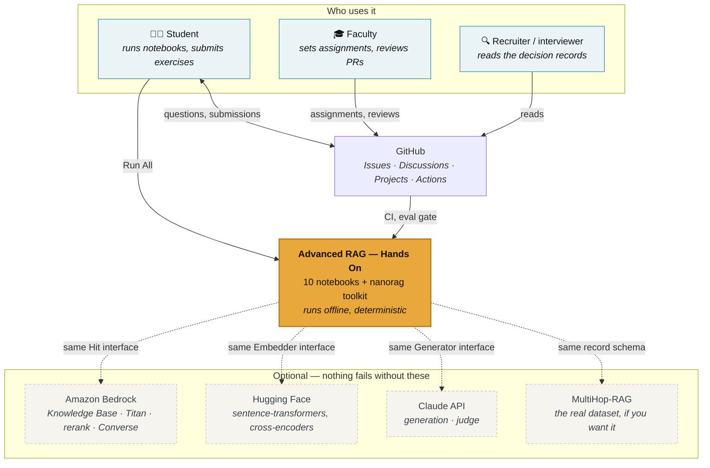
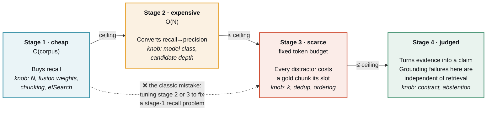
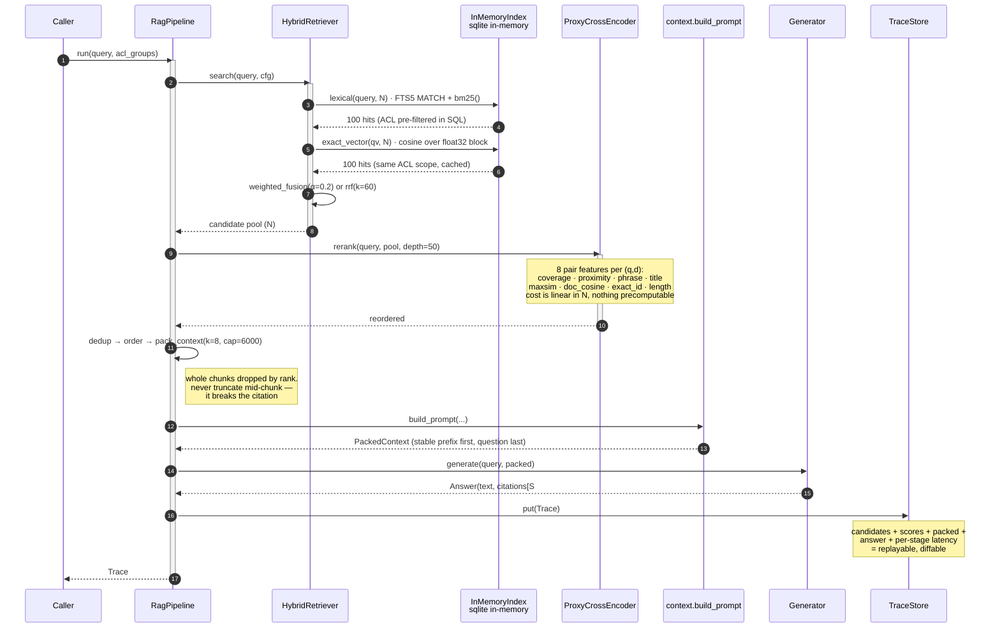
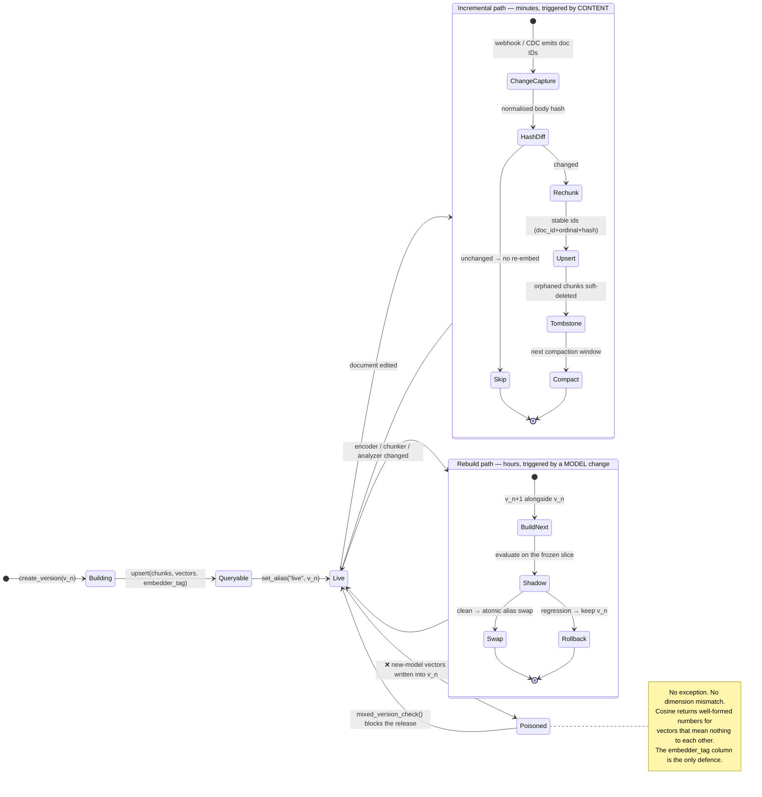
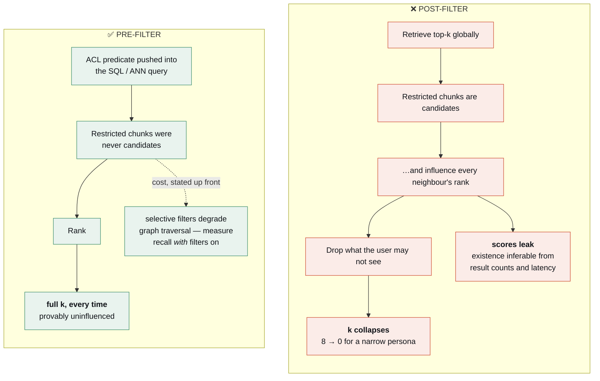
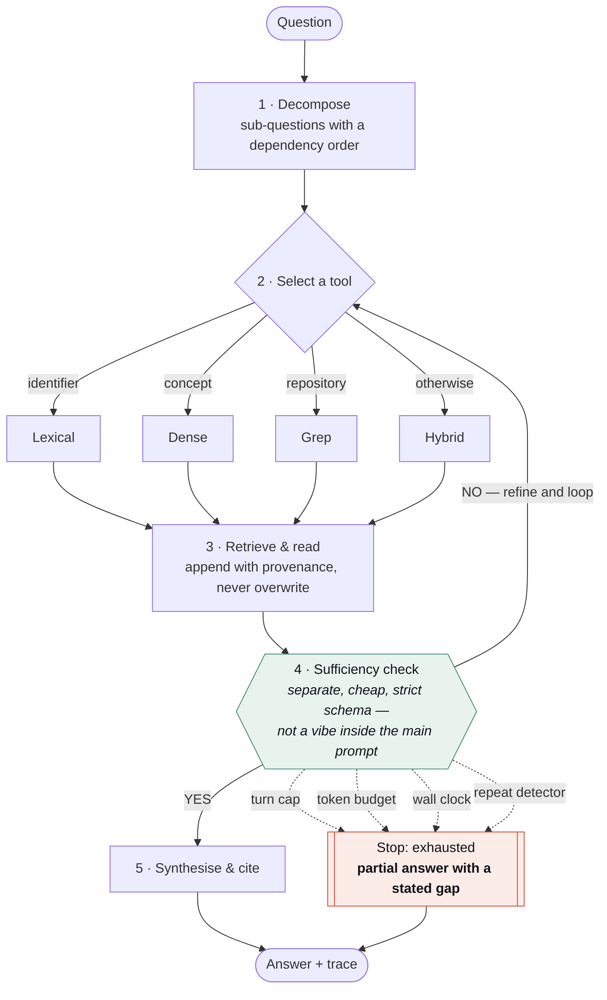
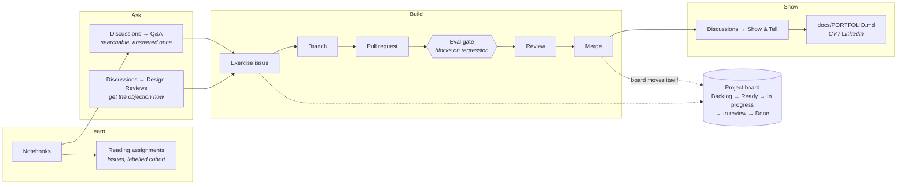

<div align="center">

# nanorag

**The whole retrieval stack — BM25, dense, ANN, fusion, reranking, evaluation — with no vector database, no framework, and no API key. It runs in memory, in about ten seconds.**

[](https://github.com/akash-coded/nanorag/actions/workflows/ci.yml)
[](https://github.com/akash-coded/nanorag/actions/workflows/notebooks.yml)
[](https://github.com/akash-coded/nanorag/actions/workflows/eval-regression.yml)
[](pyproject.toml)
[](LICENSE)
[](../../discussions)

[Quick start](#quick-start) · [Architecture](#architecture) · [Curriculum](docs/CURRICULUM.md) · [Exercises](docs/EXERCISES.md) · [Interview prep](docs/INTERVIEW-PREP.md) · [Put it on your CV](docs/PORTFOLIO.md)

</div>

---

## What this is

Ten Jupyter notebooks and a ~6,800-line toolkit that implement the whole retrieval stack —
BM25 over a real inverted index, dense retrieval, an approximate-nearest-neighbour graph you
can watch lose recall, hybrid fusion, a reranker you *fit and then verify*, context packing
under a hard token budget, an LLM judge you calibrate with Cohen's κ, prompt-cache economics,
and an agentic search loop scored on its trace rather than its answer.

There is **no dataset to download, no API key to set, and no service to start.** The entire
retrieval stack lives inside `sqlite3.connect(":memory:")` and disappears when you stop the
kernel. Press **Run All**; that is the whole procedure.

The *nano* is the **stack**, not the scope: numpy, matplotlib and the standard library, and
nothing else is required to run any of it. Every component you would normally import — the
inverted index, the embedder, the ANN graph, the fusion, the reranker, the judge, the cost
model — is implemented here, in readable Python, because the point is to see the mechanism
rather than configure it.

Everything has a documented upgrade path to a real stack — Amazon Bedrock Knowledge Bases,
Titan embeddings, Bedrock rerank, a model judge — and swapping any of them changes the
retriever, **not** the harness, the metrics, or the eval set. That property is the lesson.

> **This repository is also a working example of how a delivery team operates.** Issues with
> acceptance criteria, a board that moves itself, a PR template that demands a measurement,
> an evaluation gate that blocks a merge on a metric regression, ADRs for the decisions that
> were hard, and Discussions used the way a good internal Stack Overflow gets used.

---

## Quick start

```bash
git clone https://github.com/akash-coded/nanorag.git
cd nanorag
make setup          # or: pip install -e ".[dev]"
make lab            # opens JupyterLab → start with 00_start_here.ipynb
```

Prefer to see it work in one line first?

```python
import nanorag
bundle, index, pipe = nanorag.quickstart(**nanorag.TUNED)
trace = pipe.run("Which organization acquired Tessera Analytics?")

print(trace.answer)                 # a cited answer
print(trace.stage_ms)               # per-stage latency
print(len(trace.candidates), "→", len(trace.packed))   # the recall funnel, measured
```

```
corpus     484 documents · 2,430 chunks (structural)
index      in-memory sqlite · FTS5 lexical + lsa@1.0:d96 vectors
eval set   243 questions (36 frozen)
pipeline   N=100 · fusion=weighted (alpha=0.2) · rerank=cross · k=8
ready in   615 ms
```

| Make target | What it does |
|---|---|
| `make setup` | Install runtime + dev dependencies |
| `make lab` | Launch JupyterLab on the notebooks |
| `make test` | Fast unit tests (no notebook execution) |
| `make notebooks` | Execute all ten notebooks headlessly, report timings |
| `make eval` | Run the release-gate evaluation and print the scorecard |
| `make strip` | Strip notebook outputs before committing |
| `make lint` / `make fmt` | Ruff check / autofix |

---

## The ten notebooks

| # | Notebook | What you build and measure | Runtime |
|---|---|---|---|
| 00 | [Start here](notebooks/00_start_here.ipynb) | The toolkit, the corpus, one query end to end | 3 s |
| 01 | [Retrieval & evaluation foundations](notebooks/01_retrieval_and_evaluation_foundations.ipynb) | The four-stage pipeline; the recall ceiling; the fault-isolation tree executed over a failure sample | 51 s |
| 02 | [MultiHop-RAG use case](notebooks/02_multihop_rag_use_case.ipynb) | Question types and their levers; manufacturing an eval set from an unlabelled corpus | 18 s |
| 03 | [RAG system design](notebooks/03_rag_system_design.ipynb) | Seven chunking strategies measured; incremental + blue/green freshness; permission-aware retrieval | 57 s |
| 04 | [Retrieval methods & reranking](notebooks/04_retrieval_methods_and_reranking.ipynb) | BM25 from scratch; the analyzer trap; ANN recall curves; fusion; a reranker you fit and verify | 78 s |
| 05 | [LLM context design](notebooks/05_llm_context_design.ipynb) | Token budgets with caps; provenance; sizing `k` on a frontier; position sensitivity | 69 s |
| 06 | [Evaluation approaches](notebooks/06_evaluation_approaches.ipynb) | Layered scorecards; judge calibration; bias probes; the release gate executed | 64 s |
| 07 | [Cost & token optimisation](notebooks/07_cost_and_token_optimization.ipynb) | Four token categories; four ways to break a prompt cache, priced; unit economics | 67 s |
| 08 | [Agentic search](notebooks/08_agentic_search_and_evaluation.ipynb) | The loop; stop conditions fired on purpose; escalation; scoring the trace | 21 s |
| 09 | [Capstone build](notebooks/09_capstone_build.ipynb) | The build brief end to end, scored against a rubric, with a decision record | 135 s |

Each notebook runs the same rhythm: **a flowchart of what the code is about to do → the code →
the measured result → a summary diagram → a decision tree → that tree read back as a table.**
Sections close with failure signatures reproduced on real queries, the interview questions a
panel actually asks, and a checkpoint that re-derives its own answers.

---

## Architecture

### Context — who touches this, and what it touches



### High-level design — four planes, two SLAs

Everything above the query path is a batch job with a deploy step. Everything on the query
path has a p95. The control plane is what lets you change either one without guessing.

```mermaid
flowchart LR
    subgraph IDX["🏗 INDEX PATH — offline, versioned, has a deploy"]
        direction LR
        SRC[Sources<br/>docs · tickets · code] --> NORM[Parse &amp; normalise<br/>layout · tables · OCR]
        NORM --> CH[Chunk &amp; enrich<br/>7 strategies · heading path · ACL]
        CH --> EMB[Embed<br/>batched · version pinned]
        EMB --> PUB[Publish<br/>blue/green alias swap]
    end

    subgraph ST["💾 STORES — sqlite3 :memory:"]
        direction TB
        VEC[("Vector table<br/>+ NSW graph")]
        LEX[("FTS5 inverted index<br/>tokenchars underscore+dash")]
        DOC[("Chunk store<br/>text · provenance")]
        MET[("Metadata + ACL<br/>filters · tenancy")]
    end

    subgraph QRY["⚡ QUERY PATH — online, p95, every request"]
        direction LR
        Q[Query] --> RT[Route &amp; rewrite]
        RT --> HR["Hybrid retrieve<br/>N≈100"]
        HR --> FU["Fuse<br/>RRF or weighted α"]
        FU --> RR["Rerank<br/>→50"]
        RR --> PK["Pack<br/>k=8 · 6k token cap"]
        PK --> GEN[Generate]
        GEN --> VF[Verify &amp; cite]
    end

    subgraph CTL["🎛 CONTROL PLANE — how you change either path on purpose"]
        direction LR
        TR[("Trace store<br/>scores · context · latency")] --> EV[Eval harness<br/>retrieval · answer · judge]
        EV --> GT{{Release gate<br/>blocks the deploy}}
        GT --> FB[Feedback<br/>failures rejoin the eval set]
    end

    PUB --> ST
    ST --> HR
    ST --> FU
    VF --> TR
    FB -.->|new regression cases| EV
    GT -.->|blocks| PUB

    classDef idx fill:#EAF4F7,stroke:#2F8CA3,color:#101318
    classDef sto fill:#EFEDFB,stroke:#6C5CE0,color:#101318
    classDef qry fill:#FBF1E2,stroke:#E9A83C,color:#101318
    classDef ctl fill:#E9F3EE,stroke:#3F8F6E,color:#101318
    class SRC,NORM,CH,EMB,PUB idx
    class VEC,LEX,DOC,MET sto
    class Q,RT,HR,FU,RR,PK,GEN,VF qry
    class TR,EV,GT,FB ctl
```



### The mental model everything else hangs off

**The pipeline is a recall budget spent on precision.** Stage one buys recall cheaply; stage
two converts recall into precision; stage three packs a scarce token budget; stage four turns
evidence into a claim. *Nothing downstream can recover a document the first stage never
returned* — and `tests/test_retrieval.py::test_reranking_can_never_exceed_the_first_stage_ceiling`
asserts it on every commit.



### Low-level design — the query path, call by call



### Index lifecycle — the state machine that prevents the classic outage



### Permission-aware retrieval — why post-filtering is the leak



`tests/test_retrieval.py` asserts both halves: no persona ever receives a chunk outside its
groups, and post-filtering measurably collapses `k` while pre-filtering does not.

### The agentic loop — and where it goes wrong



**Five things that go wrong, and the defence for each** — all measured in
[notebook 08](notebooks/08_agentic_search_and_evaluation.ipynb):

| Failure | Looks like | Defence |
|---|---|---|
| Query drift | By turn four the agent searches for something adjacent | Re-anchor on the original question text every turn |
| Evidence bloat | Working evidence exceeds the budget; earliest (often best) results get dropped | Cumulative token cap; carry a compacted summary between turns |
| Tool thrash | The same query re-issued to three tools | Deduplicate issued queries; repeat detector ends the loop |
| Premature confidence | Sufficiency passes on partial evidence → a one-hop answer, full confidence | Score stop-decision precision/recall against human judgment |
| Cost blowout | One hard question costs 40× a normal one | Turn cap + cumulative token cap; watch the tail, not the mean |

---

## What is real, and what is a stand-in

A curriculum that quietly simulates its results teaches nothing you can defend in a design
review. Notebook 00 prints this inventory at runtime.

| Component | Status | What it actually is | Production swap |
|---|---|---|---|
| Lexical retrieval | **Real** | SQLite FTS5 — a genuine inverted index, SQLite's own BM25 | — |
| Vector search (exact) | **Real** | Brute-force cosine over stored `float32`; recall 1.0 by construction | — |
| Approximate search | **Real** | Navigable small-world graph with long-range links; `efSearch` genuinely trades recall for visits | HNSW / IVF-PQ / managed index |
| Embeddings | **Real, but weak** | LSA (TF-IDF → truncated SVD), fitted on documents | `SentenceTransformersEmbedder`, `BedrockEmbedder` |
| Reranker | **Real, but small** | Logistic regression over 8 query–passage pair features, fitted on the dev slice | `cross-encoder/ms-marco…`, Bedrock rerank |
| Late interaction | **Real** | MaxSim over token vectors in the encoder's term space | ColBERT |
| Generation | **Real, but extractive** | Selects and cites supporting sentences; faithful by construction, cannot *derive* a comparison | `BedrockGenerator`, `AnthropicGenerator` |
| Hallucination | **Fault injection** | `UngroundedGenerator` — a fixture so the judge has something real to catch | — |
| LLM judge | **Real, heuristic** | Span-level support checking; deterministic and free | `BedrockJudge`, same rubrics |
| Costs & latency | **Modelled** | Arithmetic with clearly-labelled illustrative rates | Real provider usage counters |

**Read the third column before quoting any absolute number outside the room.** The
measurement discipline transfers; the values do not.

---

## Three results that contradict the expected answer

These are the parts worth your attention, and they are reported rather than tuned away.

<table>
<tr><th>Finding</th><th>Why it happens</th><th>When the expected result returns</th></tr>
<tr>
<td><b>Equal-weight RRF does not beat BM25 alone</b> here; weighted fusion at α=0.2 does.</td>
<td>RRF gives both legs the same vote, and the offline dense leg is a fifty-year-old method that is genuinely weaker on this corpus. Fusing strong with weak at equal weight moves you toward the weak one.</td>
<td>With a modern encoder the balance shifts and α moves up. The <i>procedure</i> — default to RRF, then measure once you have a labelled set — does not change.</td>
</tr>
<tr>
<td><b>Comparison-question starvation does not reproduce.</b></td>
<td>The corpus is balanced by construction: every company has the same number of quarters, so the prevalence ratio between two compared entities is ≈1.</td>
<td>On a client corpus where one product line has 10,000 tickets and another has 200, the same question shape starves — in the direction the prevalence ratio predicts.</td>
</tr>
<tr>
<td><b>No retrieval-score threshold separates answerable from unanswerable</b> (best F1 0.38).</td>
<td>Null questions name real entities in the corpus's own vocabulary; answerable ones paraphrase. The unanswerable questions are <i>lexically closer</i> to the corpus.</td>
<td>Never, by this route. Abstention is an entailment question and entailment needs a reader — a prompt contract, a sufficiency call, and a judged null set.</td>
</tr>
</table>

A decision matrix names a mechanism you should go and test. **The test is allowed to come back
negative**, and saying so is the difference between a result and a story.

---

## Connecting Amazon Bedrock

Nothing runs against AWS by default and nothing needs to.

```bash
export AWS_REGION=us-east-1
export BEDROCK_KB_ID=XXXXXXXXXX
export BEDROCK_MODEL_ID=anthropic.claude-sonnet-4-5-20250929-v1:0
export BEDROCK_EMBED_MODEL_ID=amazon.titan-embed-text-v2:0
export BEDROCK_RERANK_MODEL_ARN=arn:aws:bedrock:...:rerank-model/amazon.rerank-v1:0   # optional
```

```python
from nanorag.bedrock import BedrockConfig, preflight, BedrockKnowledgeBaseRetriever

preflight()                              # read-only: reports config, makes NO AWS calls
kb = BedrockKnowledgeBaseRetriever()     # returns the same Hit records as the local index
hits = kb.search("Which organization acquired Tessera Analytics?", n=25)
```

Credentials come from the ordinary boto3 chain. **Nothing in this repository reads or stores a
key.** `nanorag.bedrock.LOCAL_TO_AWS` maps every local component to its managed equivalent and
names what changes when you move — see [docs/ARCHITECTURE.md](docs/ARCHITECTURE.md#local--aws).

---

## How this repository is run

This is the part most teaching repos skip, and the part interviewers actually ask about.



| Surface | Used for | Guide |
|---|---|---|
| **Discussions** | Questions, design reviews, show & tell, announcements, polls | [docs/DISCUSSIONS-GUIDE.md](docs/DISCUSSIONS-GUIDE.md) |
| **Issues** | Tracked work with an owner and acceptance criteria | [templates](.github/ISSUE_TEMPLATE) |
| **Projects** | Delivery board with phase, effort, cohort and risk fields | [docs/PROJECT-BOARD.md](docs/PROJECT-BOARD.md) |
| **Actions** | CI, notebook execution, the eval gate, Pages, board automation | [.github/workflows](.github/workflows) |
| **ADRs** | Decisions that were genuinely hard, with the alternative that lost | [docs/adr](docs/adr) |

> **House rule, enforced by the PR template and the eval gate:** any change that could move a
> number ships with the number — before, after, delta, and a 95% interval. A delta inside the
> noise band is not a result.

---

## Where to go next

| If you are… | Start here |
|---|---|
| Working through the course | [notebooks/00_start_here.ipynb](notebooks/00_start_here.ipynb), then [docs/EXERCISES.md](docs/EXERCISES.md) |
| Preparing for an AI-engineer interview | [docs/INTERVIEW-PREP.md](docs/INTERVIEW-PREP.md) — 18 questions with full answers |
| Deciding what to build next | [docs/EXTENSION-POINTS.md](docs/EXTENSION-POINTS.md) — 20 techniques with hypotheses and seams |
| Wanting to understand the code | [docs/ARCHITECTURE.md](docs/ARCHITECTURE.md) — HLD, LLD, every seam |
| Putting this on a CV or LinkedIn | [docs/PORTFOLIO.md](docs/PORTFOLIO.md) |
| Contributing | [CONTRIBUTING.md](CONTRIBUTING.md) |
| Reading the papers behind it | [docs/READING-LIST.md](docs/READING-LIST.md) |

---

## Four sentences to carry out of the room

1. **Nothing downstream can recover a document the first stage never returned.**
2. **Index-time compute is paid once; query-time compute is paid forever.**
3. **An average is not a result until you have seen the slices underneath it.**
4. **Build the measurement before the improvement, every single time.**

---

<div align="center">
<sub>Ten notebooks, one toolkit, no API keys.<br/>
Apache-2.0. Corpus and eval set are synthetic and generated from a fact graph — no client data.</sub>
</div>
