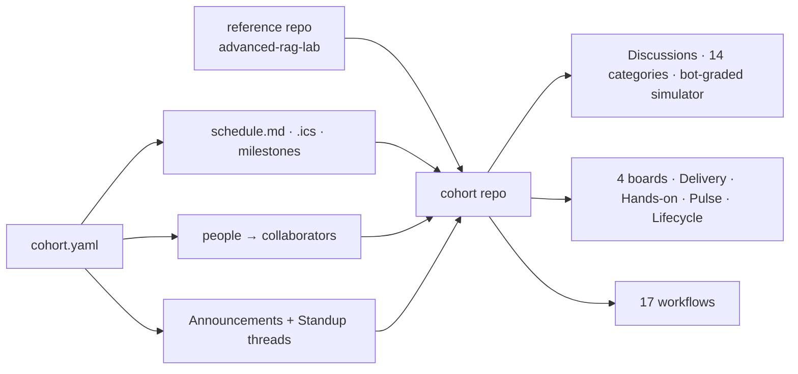

# Cohort kit

Everything needed to stand up and run one FDE Academy cohort repository, end to end, from a
fresh Claude Code session. Built from what it took to build this repository, including the
parts that went wrong.

| Piece | What it is | Read it when |
|---|---|---|
| [`PLAYBOOK.md`](PLAYBOOK.md) | What the human does, step by step, with URLs, and what "done" looks like at each step | First, before anything |
| [`skills/cohort-repo-setup/`](skills/cohort-repo-setup/SKILL.md) | The Claude Code skill: order of operations, the traps, verification, and nine reference pages | Install it; a new session reads it |
| [`prompts/`](prompts/) | Five prompts to paste: kickoff, re-provision, seed a week, Monday ops, close | Each occasion |
| [`cohort.example.yaml`](cohort.example.yaml) | The one file that parametrises a cohort | Copy to `cohort.yaml`, fill in |
| [`cohort-kit/scripts/cohort_schedule.py`](scripts/cohort_schedule.py) | `cohort.yaml` to schedule page, `.ics` calendar, milestones | Day zero, and when dates change |
| [`cohort-kit/scripts/unanswered_questions.py`](scripts/unanswered_questions.py) + [`templates/workflows/unanswered-questions.yml`](templates/workflows/unanswered-questions.yml) | The doubt mechanism's alert half: one tracking issue assigned to instructors | Copy the workflow into `.github/workflows/` |
| [`templates/`](templates/) | `CLAUDE.md` memory, README block, resources tree, study guide, session notes | Seeding weeks |
| [`memory/user-CLAUDE.snippet.md`](memory/user-CLAUDE.snippet.md) | Lines to paste into `~/.claude/CLAUDE.md` so every session carries the house rules | Once per machine |
| [`IDEAS.md`](IDEAS.md) | Twenty-five ideas, ranked, with mechanism, cost and why not yet | Planning the next cohort |

## Install the skill

```bash
cp -r cohort-kit/skills/cohort-repo-setup ~/.claude/skills/        # personal, every project
# or, per project:
mkdir -p .claude/skills && cp -r cohort-kit/skills/cohort-repo-setup .claude/skills/
```

Or upload `cohort-repo-setup.zip` (built with `skill-creator`'s `package_skill.py`) to
claude.ai skills so it syncs everywhere.

## The shape of a cohort



## What is verified and what is not

Everything in `skills/cohort-repo-setup/references/` describes behaviour observed on
`fde-academy-lab/advanced-rag-lab` up to 2026-09-02. Two things in the kit have not run
against a live repository from the session that wrote them, because this session cannot reach
GraphQL: the harvest in `unanswered_questions.py` and the `--milestones` path in
`cohort_schedule.py`. Their pure parts are tested in `tests/test_cohort_kit.py`; the first
cohort's day zero is where the live paths get verified, and `PLAYBOOK.md` says so at the step.
