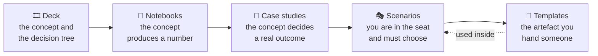

# Concepts and case studies

The taught material, four studies of retrieval systems meeting reality, a full engagement walked
end to end, and the four templates an FDE produces repeatedly.

| | What | Start with |
|---|---|---|
| 🎞 | [**The deck**](deck/) — 97 slides of decision trees, matrices, HLDs and budgets | [How to view it](deck/README.md) |
| 📕 | [**Case studies**](case-studies/) — three published, one our own | [CS-03, the failure taxonomy](case-studies/CS-03-seven-failure-points.md) |
| 🎭 | [**Scenarios**](scenarios/) — full engagements inside Client Zero | [SC-01](scenarios/SC-01-incident-search.md) |
| 📄 | [**Templates**](templates/) — PRD, ADR-lite, PDLC, dissection | [Why these four](templates/README.md) |

## How the four fit together

**Deck** for the map. **Notebook** for the mechanism, because a concept you have not seen produce
a number is a concept you cannot defend. **Case study** for the consequence at a company that is
not you. **Scenario** for the practice, with incomplete information and a decision to make.
**Templates** for the thing you actually hand over.

## Suggested path

| If you have | Read |
|---|---|
| 20 minutes | [CS-03](case-studies/CS-03-seven-failure-points.md) — the seven failure points and the decision tree that locates one |
| An hour | CS-03, then [CS-04](case-studies/CS-04-our-own-negative-results.md) — three results that went the wrong way, and the shape they share |
| An afternoon | [SC-01](scenarios/SC-01-incident-search.md) end to end, stopping at each stage to decide before reading on |
| A week | All four case studies, the scenario, then run the exercise at the foot of each against Client Zero |

## The standard everything here is held to

**Every number is attributed.** Figures from a company or a paper are as published, with the
citation at the top of the file. Figures from this repository link to the notebook cell that
produces them. Nothing is estimated, inferred or reconstructed from memory — a plausible
fabricated number is worse than none, because it teaches a reader to trust the *shape* of a claim
rather than its provenance.

**Every intervention names its precondition.** A published result is evidence about a corpus, not
a law about retrieval. Each case study says which property of *their* corpus made the technique
work, so you can check whether you have it before spending a quarter.

**The system fails in the middle.** A scenario where everything works teaches that competent
execution produces success, which is false and a bad thing to believe before your first
engagement.

## Where this sits

| Elsewhere in the repository | For |
|---|---|
| [`notebooks/`](../notebooks/) | Running it and watching the number move |
| [`docs/03-exercises/`](../docs/03-exercises/) | Graded work, submitted through Discussions |
| [`docs/01-architecture/adr/`](../docs/01-architecture/adr/) | Our own decisions, in full ADR format |
| [`interview-bank/`](../interview-bank/) | Turning all of it into ninety-second answers |
