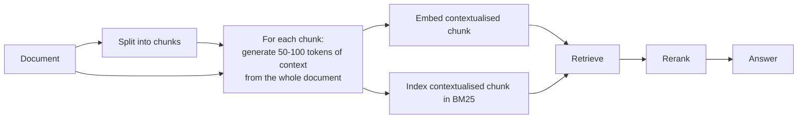

# CS-01 · Contextual Retrieval — fixing the chunk that lost its context

> **Source.** Anthropic, *Introducing Contextual Retrieval* (September 2024).
> <https://www.anthropic.com/engineering/contextual-retrieval>
> All figures below are as published. Nothing here is inferred.

**Read this for:** an intervention at the chunking seam that produced a large, measured gain —
and a cost model that decides whether you can afford it.

---

## 1 · The situation

A chunk is retrieved alone and read alone. Split a document into 800-token pieces and a chunk
that says

> "The company's revenue grew by 3% over the previous quarter."

has lost the two facts that make it findable: **which company**, and **which quarter**. A query
naming either will not match it well, and a query naming both will match it worse than a chunk
that happens to repeat the words.

This is not a retrieval bug. It is information destroyed at index time, and nothing downstream
recovers it.

## 2 · The approach

Before embedding, prepend a short chunk-specific context generated from the **whole document**:

> "This chunk is from an SEC filing on ACME Corp's performance in Q2 2023; the previous quarter's
> revenue was $314 million. The company's revenue grew by 3% over the previous quarter."

Two variants, applied together:

- **Contextual Embeddings** — embed the contextualised chunk.
- **Contextual BM25** — index the contextualised chunk lexically as well.

## 3 · What it moved

Metric is **1 − recall@20** — the share of relevant documents that fail to reach the top 20.
Lower is better.

| Configuration | Failure rate | Reduction vs baseline |
|---|---|---|
| Baseline (embeddings + BM25) | 5.7% | — |
| \+ Contextual Embeddings | 3.7% | ~35% |
| \+ Contextual Embeddings **and** Contextual BM25 | 2.9% | **49%** |
| \+ reranking | 1.9% | **67%** |

Tested across codebases, fiction, arXiv papers and science papers, with more than one embedding
model.

## 4 · Solution dissection — why each piece earns its place

| Piece | What it fixes | What it costs |
|---|---|---|
| Context generation | The chunk no longer depends on its neighbours to be interpretable | One generation call **per chunk** at index time |
| Contextual **embeddings** | Semantic match now sees the entity and the period | Nothing at query time |
| Contextual **BM25** | Lexical match sees them too — an exact identifier in the context becomes findable | Larger index |
| Reranking | Reorders a wider candidate list using a better-informed scorer | Latency on every query |

The reranker contributes the last 1.0 point (2.9% → 1.9%) and is the only piece that costs
**query-time** latency. The other three are paid once. That asymmetry is the design lesson.

## 5 · The cost model, which decides adoption

Published: assuming 800-token chunks, 8k-token documents, 50-token instructions and 100 tokens of
context per chunk, generating the contextualised chunks costs **$1.02 per million document
tokens**, one time.

Work the consequence for a real corpus:

| Corpus | One-time index cost | Recurring |
|---|---|---|
| 10M tokens (~2k documents) | ~$10 | Zero, until documents change |
| 1B tokens (~200k documents) | ~$1,020 | Every changed document, re-contextualised |

**The number that decides it is not the total — it is the freshness SLA.** The cost scales with
*chunks changed*, not documents. A nightly rebuild pays it once a night. An hourly SLA pays it
per changed chunk, every hour, and that is where it stops being affordable.

## 6 · ADR-lite — would we adopt this?

**Context.** Chunks in our corpus lose their entity and period at split time.

**Decision.** Adopt contextual embeddings and contextual BM25 at the chunking seam. Defer
reranking to a separate decision, because it is the only piece with query-time cost.

**Consequences.**
*Good* — a large measured reduction in retrieval failure, paid once at index time.
*Bad* — index build time rises with a generation call per chunk; changing the chunker now costs a
full re-contextualisation, not just a re-split.
*Watch* — the incremental path. If the freshness SLA is sub-daily, model this before committing.

**What would change this decision.** A corpus whose chunks are already self-contained. See §7.

## 7 · Does it transfer? Test it before believing it

We ran the equivalent intervention on Client Zero and **it did not pay**: 2.4× storage, 3.1×
index build time, recall change inside the noise band.

The mechanism is a missing precondition, not a failure of the technique. Anthropic's corpora
contain chunks that are genuinely ambiguous alone. Client Zero is generated to write
self-contained passages, so the entity is already named in nearly every chunk and there is nothing
for the added context to disambiguate.

**The honest statement:** contextual chunking cannot help on a corpus whose chunks are already
self-contained. Which tells you exactly where it *does* pay — long documents with heavy anaphora
and entity elision.

> **The transferable habit.** Before adopting any published intervention, name the property of
> *their* corpus that made it work, then check whether *your* corpus has it. A published number is
> evidence about a corpus, not a law about retrieval.

## 8 · Work it yourself

1. Measure **anaphora density** on your corpus: the share of chunks whose first sentence contains
   a pronoun or a bare definite reference with no antecedent inside the chunk. That number
   predicts whether this technique can help you.
2. Run the `contextual` strategy in [notebook `01`](../../notebooks/01_retrieval_and_evaluation_foundations.ipynb)
   and reproduce the negative result.
3. Then construct a corpus where it *would* help, and demonstrate it. That is
   [EX-04](../../docs/03-exercises/briefs/EX-04-chunking-boundary-damage.md) extended.
