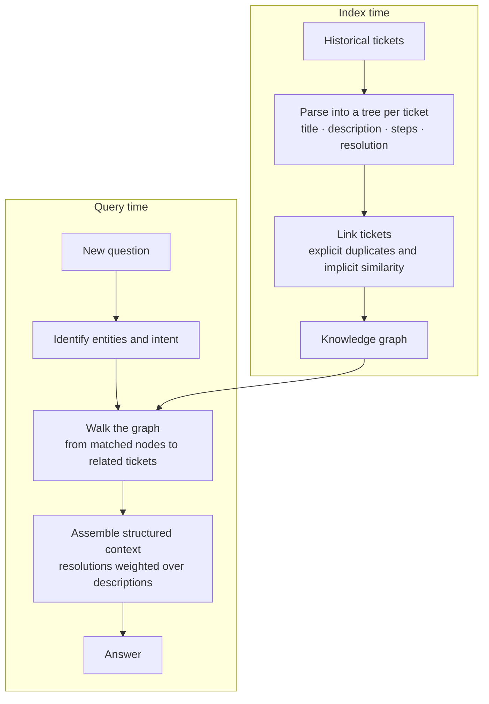

# CS-02 · When the documents have structure and you throw it away

> **Source.** Xu et al., *Retrieval-Augmented Generation with Knowledge Graphs for Customer
> Service Question Answering*, SIGIR 2024 (LinkedIn). arXiv:2404.17723 ·
> <https://dl.acm.org/doi/10.1145/3626772.3661370>
> Figures below are as reported by the authors.

**Read this for:** a case where the win came from *representation*, not from a better retriever —
and a reported business metric, which is rare.

---

## 1 · The situation

A customer-service corpus of historical support tickets. Each ticket has structure a human reads
without noticing: a title, a description, a series of steps, a resolution, a priority — and
relationships to *other* tickets, because the same issue recurs and duplicates get linked.

Standard RAG flattens all of it. A ticket becomes text, the text gets chunked, and two things are
destroyed at once:

- **Intra-issue structure.** The resolution is no longer distinguishable from the description, so
  a chunk containing a failed attempt looks like a chunk containing the fix.
- **Inter-issue relations.** "This is a duplicate of TICKET-4471" becomes a string. The link is
  gone.

## 2 · The approach

Build a knowledge graph from the historical tickets, and retrieve over the graph.

The tree per ticket preserves the intra-issue structure; the links preserve the inter-issue
relations. Retrieval becomes a graph walk rather than a top-k over flattened chunks.

## 3 · What it moved

| Metric | Change |
|---|---|
| MRR | **+77.6%** |
| BLEU | **+0.32** |
| Median issue resolution time | **−28.6%**, over roughly six months in production |

The third row is the one to notice. Most published RAG work reports retrieval or generation
metrics. This reports a **business outcome measured over months of real usage**, which is a much
harder thing to claim and a much more persuasive one.

## 4 · Solution dissection

| Piece | What it fixes | What it costs |
|---|---|---|
| Tree per ticket | A resolution is no longer indistinguishable from a failed attempt | A parser that must handle real, messy tickets |
| Explicit links | Duplicate chains become traversable rather than textual | Link extraction, and its errors compound along a walk |
| Implicit links | Related-but-unlinked tickets become reachable | A similarity threshold — a tuned parameter that drifts |
| Graph walk retrieval | Context is assembled by relationship, not by score | A retriever nobody on the team has debugged before |

**The uncomfortable line is the last one.** A graph retriever fails differently from a top-k
retriever, and the on-call engineer's intuitions do not transfer. That is a real cost and it does
not appear in any metric.

## 5 · ADR-lite — graph retrieval

**Context.** Our corpus has strong document structure and explicit inter-document relations.

**Decision.** Adopt graph retrieval **only if** both preconditions hold and can be measured:
(a) documents have parseable internal structure whose parts have different retrieval value, and
(b) inter-document links exist and are reasonably accurate.

**Consequences.**
*Good* — retrieval that uses information a flat index discards.
*Bad* — a parser to maintain, a link-quality problem that is now a retrieval-quality problem, and
a failure mode the team has no intuition for.
*Watch* — link precision. A wrong link is worse than a missing one, because a walk follows it.

**What would change this decision.** Unstructured documents, or structure that does not
correlate with retrieval value. Prose with headings is not the same as a ticket with a resolution
field.

## 6 · The trap this case study sets

The obvious lesson — "use a knowledge graph" — is the wrong one, and reaching for GraphRAG
because this paper exists is the most common way to waste a quarter.

**The real lesson is one step up:** *look at what your document format already tells you, and
check whether your pipeline is throwing it away.*

Often the answer is cheaper than a graph:

| Structure you have | Cheap intervention |
|---|---|
| Headings | Structural chunking, and index the heading as a field |
| A resolution or answer field | Index it separately and weight it — BM25F-style |
| Dates or versions | Metadata filters, so the right document is not the wrong version |
| Explicit duplicate links | Deduplicate at index time, or collapse at rank time |
| Author or team | A field that a query router can use |

Each of those is hours of work. A graph is a quarter. Do the cheap ones first, measure, and let
the residual failure justify the graph.

## 7 · Work it yourself

1. Take Client Zero's incident reports and list the structure a human uses when reading one.
2. Check which of it survives into the index. In this repository, the answer is *the heading and
   nothing else* — that is a real gap, not a simplification.
3. Add one field to the FTS5 schema, weight it, and measure. See
   [`raglab/store.py`](../../raglab/store.py) and the seam table in
   [`docs/01-architecture/seams.md`](../../docs/01-architecture/seams.md).
