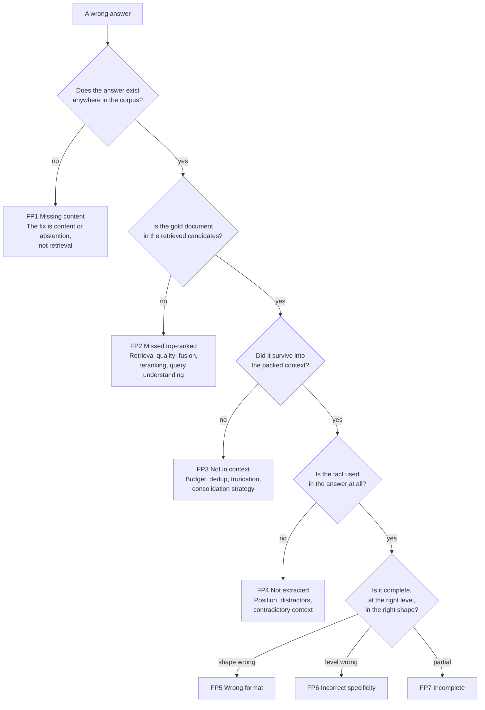

# CS-03 · Seven failure points, and why "the RAG is broken" is never a diagnosis

> **Source.** Barnett, Kurniawan, Thudumu, Brannelly & Abdelrazek, *Seven Failure Points When
> Engineering a Retrieval Augmented Generation System*, CAIN 2024. arXiv:2401.05856 ·
> <https://dl.acm.org/doi/10.1145/3644815.3644945>
> An experience report drawn from three RAG systems in separate domains — research, education
> and biomedical.

**Read this for:** the taxonomy that turns a vague complaint into a locatable defect. This is the
most immediately useful case study in the folder, because it is what you reach for on day one of
an engagement when someone says the system is wrong.

---

## 1 · Why a taxonomy matters more than a fix

"The answers are wrong" is not actionable. Seven different defects produce it, they live in
different components, and the fixes have nothing in common. A team without a taxonomy debugs by
guessing, and guessing usually lands on prompt engineering because it is the cheapest thing to
try.

## 2 · The seven

The split that matters: **FP1–FP3 are retrieval-side, FP4–FP7 are generation-side.** No amount of
prompt work fixes the first three, and no amount of retrieval work fixes the last four.

| # | Failure point | What happened |
|---|---|---|
| **FP1** | Missing content | The question cannot be answered from the corpus at all |
| **FP2** | Missed the top-ranked documents | The answer is in a document that did not rank high enough to be returned |
| **FP3** | Not in context — consolidation limits | The document was retrieved, but did not survive into the context sent to the model |
| **FP4** | Not extracted | The answer was in the context and the model did not use it |
| **FP5** | Wrong format | The question asked for a particular shape — a table, a list — and the output ignored it |
| **FP6** | Incorrect specificity | Answered, but too general or too specific for what was asked |
| **FP7** | Incomplete | Correct as far as it goes, and missing information that was in the context |

## 3 · Turning it into a diagnostic you can run

The taxonomy is only useful if you can locate a given failure in it quickly. This is the
procedure, and it is cheap enough to run on twenty queries by hand.

**Each branch is a question you can answer from a trace**, which is the argument for recording
candidates, packed context and provenance on every query. Without a trace you cannot distinguish
FP2 from FP3, and those have completely different fixes.

## 4 · Which metric sees which failure

The reason a green dashboard coexists with unhappy users is that most dashboards watch two of
these seven.

| Failure | Caught by | Invisible to |
|---|---|---|
| FP1 Missing content | Abstention recall, coverage analysis | Every retrieval metric — the system is behaving correctly |
| FP2 Missed top-ranked | Recall@k, nDCG | Answer accuracy alone |
| FP3 Not in context | **Full-chain recall**, context precision | Per-piece recall — it rises while this fails |
| FP4 Not extracted | Answer accuracy *conditioned on* correct retrieval | Any retrieval metric |
| FP5 Wrong format | Format validators, structured-output checks | Semantic similarity scoring |
| FP6 Incorrect specificity | Human or rubric judging | Exact-match and overlap metrics |
| FP7 Incomplete | Full-chain recall paired with answer completeness | Any single-answer correctness metric |

> **The one number that splits the taxonomy in half:** answer accuracy *conditioned on* correct
> retrieval. High means retrieval is your bottleneck and generation work is wasted. Low means you
> can fix retrieval forever and nothing improves.

## 5 · Solution dissection — the fixes do not transfer across the line

| Failure | The fix | The wrong fix that gets tried first |
|---|---|---|
| FP1 | Add content, or **abstain honestly** | Prompt engineering, which produces a confident wrong answer instead of a refusal |
| FP2 | Fusion weighting, reranking, query rewriting | Increasing k, which raises recall and drowns the context |
| FP3 | Budget, deduplicate, order by volatility, compress | Bigger context window, which trades money for FP4 |
| FP4 | Fewer distractors, position, explicit instruction to cite | More retrieval, which adds distractors |
| FP5 | Structured output with schema validation | Asking more firmly in the prompt |
| FP6 | Query understanding; ask what level is wanted | Longer answers |
| FP7 | Full-chain measurement, then multi-step retrieval | Assuming the model is lazy |

The pattern in the right-hand column: **almost every wrong fix makes a different failure point
worse.** Increasing k to fix FP2 causes FP3 and FP4. That is why the taxonomy matters — it stops
you trading one failure for another and calling it progress.

## 6 · ADR-lite — tracing as a precondition

**Context.** Six of the seven failure points can only be distinguished with a record of what was
retrieved and what was packed.

**Decision.** Every query writes a trace: candidates with scores, the packed context with
provenance, the index version and the model version. Before any retrieval tuning begins.

**Consequences.**
*Good* — a wrong answer becomes locatable in minutes instead of arguable for a week.
*Bad* — storage, and a retention policy that is a legal question in some domains.
*Watch* — trace content. Query text may carry personal data; a 40-day retention window is a
decision somebody has to make deliberately.

**What would change this decision.** Nothing. This is the cheapest high-value thing in a RAG
system and the most commonly skipped.

## 7 · How this maps onto Client Zero

Every one of the seven is reproducible here, on purpose:

| Failure | Where to see it |
|---|---|
| FP1 | The 36 unanswerable questions. `abstention_recall` is 0.0000 — we fail this one |
| FP2 | The identifier slice with the default tokenizer: 0.81 → 0.34 |
| FP3 | The k sweep in [EX-07](../../docs/03-exercises/) — answer correctness peaks at k=8 while recall keeps rising |
| FP4 | Position sensitivity, notebook `05` |
| FP5 | Citation format enforcement in the prompt assembly |
| FP6 | The temporal slice — right document, wrong quarter |
| FP7 | Full-chain recall 0.4686 against per-piece 0.7645. This gap *is* FP7, quantified |

## 8 · Work it yourself

Take twenty failing queries from any system you have access to and classify each into FP1–FP7
using the decision tree in §3. Then count.

The distribution is the finding. Most teams expect FP4 and find FP2 and FP3, which means the
quarter they were about to spend on prompt engineering would have bought nothing.
