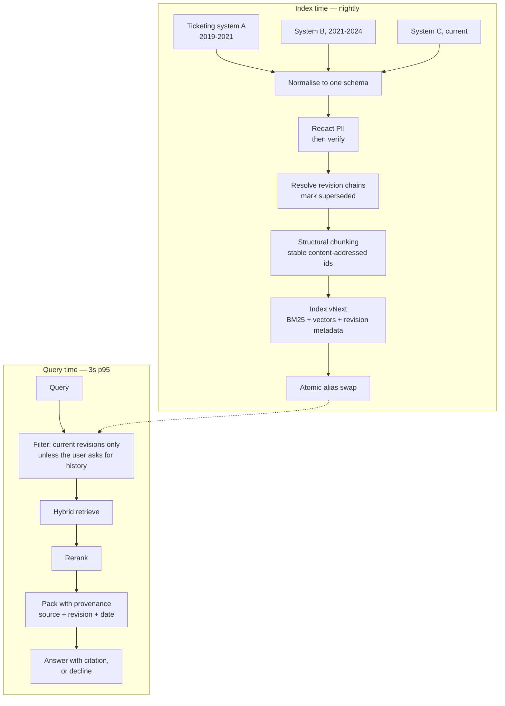

# SC-01 · Meridian Logistics — the incident search that worked in the pilot

**Type** Full engagement walkthrough · **Phase** P1–P7 · **Reading time** 25 min
**Client Zero business unit** Logistics · **Fictional** — see [client-zero.md](../../docs/00-orientation/client-zero.md)

A complete engagement, from the sentence the client said to the postmortem. Every artefact an FDE
produces appears in the order it is actually produced, and the system fails in the middle,
because that is what happens.

---

## Stage 0 · The sentence

> "Our on-call engineers waste hours searching old incidents. Can you build something that just
> answers them?"
> — VP Engineering, Meridian Logistics, week 1

Three things are already wrong with that sentence as a brief, and finding them is the job.

| What was said | What it assumes | The question that tests it |
|---|---|---|
| "waste hours searching" | The bottleneck is search | How long does an on-call engineer actually spend, and doing what? |
| "old incidents" | The corpus is incident reports | Is the answer *in* the incidents, or in someone's head? |
| "just answers them" | A generated answer is wanted | Would they trust a generated answer at 3am, or do they want the incident? |

## Stage 1 · Discovery

Six questions, and the answers that changed the design.

| Question | Answer | What it changed |
|---|---|---|
| Corpus size and shape? | ~40k incident reports, 6 years, three ticketing systems over that period | Three schemas, not one. Migration artefacts everywhere |
| Who reads it? | On-call engineers, during an incident | Latency matters more than completeness. A slow right answer is a wrong answer |
| Freshness? | "Yesterday's incidents should be searchable" | Nightly is fine. Saves an entire incremental pipeline in v1 |
| Permissions? | Everything visible to engineering; two dozen reports contain customer PII | Not an ACL problem. A **redaction** problem, which is different |
| Cost of a wrong answer? | An engineer follows a wrong runbook step during an outage | High. Citation is mandatory; abstention is preferable to a guess |
| What exists today? | Ticketing system full-text search, "which nobody uses" | Ask **why** nobody uses it. This turned out to be the whole engagement |

### The finding that reframed the project

Nobody used the existing search because **it returned the wrong version**. Meridian revises
runbooks after each incident, and the search returned whichever revision matched best lexically —
usually the oldest, because it had been referenced most.

The client had described a *search quality* problem. The actual problem was **temporal
correctness**, and no amount of retrieval quality fixes it.

> **The transferable move.** When a client says an existing system is unused, the reason is the
> requirement. Ask before designing a replacement, or you will faithfully rebuild the same
> failure with better embeddings.

## Stage 2 · PRD (abridged)

> Full template: [`../templates/prd.md`](../templates/prd.md)

**Problem.** On-call engineers cannot reliably find the *current* resolution for a recurring
incident class. Existing search returns superseded runbook revisions with no indication that they
are superseded.

**Users.** On-call engineers (primary, ~40, during incidents). Incident reviewers (secondary,
non-urgent).

**In scope.** Retrieval over incident reports and runbooks; version-correct results; citation to
source and revision; abstention when no confident answer exists.

**Out of scope for v1.** Generated remediation steps. Chat. Anything that writes to the ticketing
system. *Each of these was requested and each was deferred with a reason recorded.*

**Acceptance criteria** — the section that makes this a PRD rather than a wish:

| # | Criterion | How it is measured |
|---|---|---|
| AC1 | For any query about a versioned runbook, the current revision ranks above superseded ones | Version-correctness rate on a 60-query slice built from real revisions |
| AC2 | Every answer cites source and revision date | Automated check on 100% of responses |
| AC3 | p95 end-to-end under 3s | Load test at 5× expected peak |
| AC4 | The system declines rather than guessing when evidence is thin | Abstention precision on 30 deliberately unanswerable queries |
| AC5 | No customer PII in any returned passage | Redaction check on the full corpus, plus a spot audit |

**Explicit non-goal.** Answer quality on questions the corpus cannot answer. AC4 covers the
behaviour; improving the corpus is a separate engagement.

## Stage 3 · Architecture

**The load-bearing decision is the filter, not the retriever.** Everything else is standard; the
filter is what addresses the problem the client actually had.

## Stage 4 · The ADR-lites

> Template: [`../templates/adr-lite.md`](../templates/adr-lite.md)

### ADR-L1 · Supersession is a filter, not a ranking signal

**Context.** Superseded runbook revisions must not be returned as current.
**Options.** (a) Boost current revisions in ranking. (b) Filter superseded ones out by default.
**Decision.** Filter.
**Why.** A boost is a *probability* that the wrong revision is suppressed. During an outage that
is not good enough — a superseded step followed once is a worse outcome than a missing result.
Filtering makes it impossible rather than unlikely.
**Consequence.** Users who genuinely want history need an explicit affordance, so "show
superseded" became a v1 feature rather than a v2 one.
**Would change if.** Supersession metadata proved unreliable. A filter on bad data hides correct
answers, which is worse than a boost on bad data. *This mattered later — see Stage 6.*

### ADR-L2 · Redact at ingest, verify separately

**Context.** ~24 known reports contain customer PII; the true number is unknown.
**Decision.** Redact during normalisation, and run an independent verification pass over the
redacted corpus rather than trusting the redactor.
**Why.** A redactor that silently misses a pattern produces a corpus that looks clean. The
verification pass exists to disagree with the redactor.
**Consequence.** Two components to maintain, deliberately not sharing code — shared code would
share the blind spot.

### ADR-L3 · Nightly rebuild, no incremental path in v1

**Context.** Freshness requirement is next-day.
**Decision.** Full nightly rebuild behind a blue/green alias. No CDC.
**Why.** The incremental path costs a fortnight and buys nothing the client asked for. The alias
swap gives rollback, which they *will* need.
**Consequence.** At ~200k documents this stops fitting the window. Documented as the trigger for
a v2 conversation, with the number attached.

## Stage 5 · PDLC — how it actually ran

| Phase | Weeks | Exit criterion | What actually happened |
|---|---|---|---|
| Discovery | 1 | Six questions answered, assumptions written down | The "why is it unused" question reframed the project |
| Definition | 2 | PRD with measurable acceptance criteria | AC1 was rewritten twice before it was measurable |
| Eval set | 2–3 | 180 queries, 15% frozen | Built from real search logs, not imagined questions |
| Baseline | 3 | Untuned number, declared before measuring | BM25 alone. Version-correctness 0.31 |
| Build | 4–7 | AC1–AC5 met on dev | Met on dev in week 6 |
| Hardening | 8 | Load test, rollback drill, runbook | Rollback drill found the alias was not actually atomic |
| Pilot | 9–10 | 10 engineers, real incidents | Worked |
| Production | 11 | All 40 engineers | **Failed. See Stage 6** |

**Note the eval set is built in week 2**, before the baseline and long before the build. A team
that builds first and evaluates later has no way to know whether week 7 was better than week 3.

## Stage 6 · What failed in production

Pilot: version-correctness 0.94, engineers positive. Production, week 11: complaints within two
days that results were "missing obvious things".

### The investigation

Twenty complaint queries, run by hand, before instrumenting anything.

**The pattern:** every failing query concerned an incident class from **2019–2021** — the oldest
ticketing system.

**The cause:** system A had no supersession field. During normalisation, absent supersession was
mapped to `superseded = NULL`. The filter was `WHERE superseded IS NOT TRUE`, which in SQL
three-valued logic **excludes NULL**. Six years of the oldest incidents were filtered out of every
query.

**Why the pilot missed it:** the pilot cohort was ten engineers on the newest services. Their
incidents were all in system C. The corpus was fine and the *pilot population* was not
representative.

### Locating it in the taxonomy

This is **FP3 — not in context** ([CS-03](../case-studies/CS-03-seven-failure-points.md)). The
documents existed and were retrievable; a consolidation step removed them. Diagnosing it as FP2
would have sent a week into retrieval tuning that could not have helped.

### The fixes, in order

1. **Immediate** — `superseded IS NOT TRUE` → `COALESCE(superseded, FALSE) = FALSE`. Ten minutes.
2. **Structural** — normalisation now *fails loudly* on a field it cannot map, rather than
   emitting NULL. The bug was possible because a missing field was indistinguishable from a
   field meaning "not superseded".
3. **Process** — the eval set gained a slice per source system, with per-slice thresholds. The
   aggregate had not moved enough to alert.
4. **Recorded** — ADR-L1's "would change if" said filters on unreliable metadata hide correct
   answers. That was written down and not acted on. The lesson is not that the ADR was wrong; it
   is that a recorded risk with no owner and no check is a note, not a control.

## Stage 7 · Solution dissection

| Decision | Right call? | Why |
|---|---|---|
| Filter rather than boost | **Yes** | Correct for the stakes, and the failure was in the *data*, not the strategy |
| Nightly rebuild, no CDC | **Yes** | Bought a fortnight; the alias swap made the incident recoverable in minutes |
| Redaction verified separately | **Yes** | Never fired, and would have been the worst possible failure |
| Structural chunking | Neutral | Would probably have scored the same either way. Not measured, which is its own small failure |
| Pilot with ten engineers | **No** | Not stratified by source system. The single most expensive decision in the engagement |
| Aggregate-only alerting | **No** | Would not have caught a whole source system disappearing |

**The two "no" rows share a root cause:** both assumed the population was uniform. The corpus had
three sub-corpora with different schemas, and neither the pilot nor the monitoring was stratified
by the thing that actually varied.

## Stage 8 · What an FDE takes from this

1. **When an existing system is unused, the reason is the requirement.**
2. **Stratify the pilot by whatever varies in the corpus.** A pilot that is not representative is
   a demonstration, not a test.
3. **NULL is not FALSE.** Three-valued logic in a filter is a silent data-loss bug, and it is
   invisible in aggregates.
4. **A recorded risk with no owner is a note.** ADR-L1 named this exact failure and nobody was
   assigned to check it.
5. **The taxonomy saves a week.** FP3 rather than FP2 pointed at consolidation, not retrieval.

## Exercises

1. Write AC1 so it is measurable without reading the rest of the PRD. Most first attempts are
   not.
2. Design the eval slice that would have caught the NULL bug before production, and say how many
   queries it needs.
3. Rewrite ADR-L1 so its "would change if" clause has an owner and a check attached.
4. The client now asks for generated remediation steps — explicitly out of scope in v1. Write the
   two-paragraph response that neither refuses nor commits.
