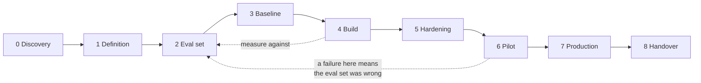

# Template · Product development lifecycle for an AI engagement

The standard lifecycle assumes you can specify the thing, then build it, then check it. Retrieval
and generation work does not behave that way: **you cannot specify quality, you can only measure
it**, and the measurement has to exist before the build or you have no way to know whether week
seven beat week three.

So the ordering differs from a normal PDLC in exactly one place, and it is the place that matters.

---

## The phases

| # | Phase | Exit criterion | Typical duration |
|---|---|---|---|
| 0 | **Discovery** | Six questions answered; assumptions written down for the ones deflected | 1 week |
| 1 | **Definition** | PRD with acceptance criteria a stranger could measure | 1 week |
| 2 | **Evaluation set** | Labelled queries, stratified, 15% frozen | 1–2 weeks |
| 3 | **Baseline** | An untuned number, **declared before it is measured** | 2 days |
| 4 | **Build** | Acceptance criteria met on dev | 3–5 weeks |
| 5 | **Hardening** | Load test, rollback drill, runbook, per-slice alerting | 1 week |
| 6 | **Pilot** | Real users, **stratified by whatever varies in the corpus** | 2 weeks |
| 7 | **Production** | Full rollout with the alerting from phase 5 live | 1 week |
| 8 | **Handover** | Their team can rebuild the index and move the baseline | 1 week |

## The one ordering that is not negotiable

**Phase 2 before phase 4.** The evaluation set exists before the build.

Teams routinely invert this because the eval set feels like overhead and the build feels like
progress. The cost of inverting it is that every subsequent improvement is unfalsifiable — you
have a system that is different from last week and no way to say whether it is better.

**Phase 3 also matters more than its two days suggest.** Declaring the baseline *before* measuring
is what stops the baseline becoming "the second-best configuration I found", which is the most
common self-deception in applied retrieval work.

## What each phase produces

| Phase | Artefact | Who reads it later |
|---|---|---|
| Discovery | Six answers, and the assumptions for what was deflected | You, when a requirement is disputed in week 19 |
| Definition | PRD with acceptance criteria | The person who signs off |
| Eval set | Labelled queries with a stratification and a frozen slice | Everyone, forever. This outlives the engagement |
| Baseline | One number and a configuration | Every future comparison |
| Build | The system, plus ADR-lites for contested choices | The team who inherits it |
| Hardening | Runbook, rollback drill result, alert thresholds | The on-call engineer at 3am |
| Pilot | Findings, and the corpus strata that were represented | You, when production fails differently |
| Production | The incident you did not expect | The dissection |
| Handover | Their team running it without you | The client, in month four |

## Where engagements actually fail

Ranked by what goes wrong in practice, not by phase importance:

1. **Phase 6, unrepresentative pilot.** Users chosen by availability rather than stratified by
   what varies. Everything passes and production fails differently. This is
   [SC-01](../scenarios/SC-01-incident-search.md).
2. **Phase 2 skipped or rushed.** An eval set built from imagined questions rather than real
   traffic. The number improves while users get angrier.
3. **Phase 1 criteria not measurable.** "Accurate answers" passes review and cannot be tested, so
   sign-off becomes an opinion.
4. **Phase 8 never happens.** The client cannot rebuild the index, so the engagement never ends —
   which reads as success for a quarter and as a dependency thereafter.

## The client conversation each phase requires

An FDE runs both tracks, so each phase has a conversation as well as a deliverable:

| Phase | The conversation |
|---|---|
| Discovery | "Why is the existing system unused?" — the answer is usually the requirement |
| Definition | "What should it do when it does not know?" — a product decision, not a technical one |
| Eval set | "Can we have 200 real queries from your logs?" — the highest-value ask in the engagement |
| Baseline | "Here is what it does untuned" — sets expectations before anyone is invested |
| Build | Weekly, with a number each time |
| Hardening | "Who gets paged, and what do they do?" |
| Pilot | "Who are the ten users, and what do they have in common?" — the question that catches the sampling error |
| Production | The one where you deliver bad news well |
| Handover | "Show me you can move the baseline without us" |

## Adapting it

Compress phases, never reorder them. A four-week engagement is a one-day discovery, a one-page
PRD, fifty eval queries and a two-week build — but the eval set still precedes the build, and the
baseline is still declared before it is measured.
