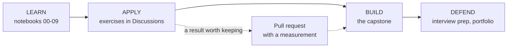

# Client Zero

Every forward-deployed engineer has a first engagement. This is a synthetic one, built so you
can make every mistake that matters before you make them somewhere they cost money.

## The engagement

**Meridian Group** is a mid-market holding company. Twenty-four operating subsidiaries across
logistics, insurance, payments and health services. Six quarters of accumulated documentation:
incident reports, quarterly reviews, policy notes, analyst commentary, internal glossaries.

484 documents. 2,430 chunks. Nobody has ever been able to find anything in them.

You have been deployed. The brief, as briefs actually arrive:

> "We have all this documentation and our people can't find answers in it. Can you put an AI
> search thing on it? How long would that take?"

That is the whole brief. Everything else in this repository is the work of turning it into
something you can build, measure and defend.

## Why Client Zero is synthetic, and why that is a feature

Three properties that no real client engagement can give you, and all three matter more than
realism:

**Gold evidence is true by construction.** The corpus is generated from a fact graph, so the
system *knows* which documents carry which facts. There is no annotator, so there is no
annotation-error floor under any number. When a metric moves, the system changed — not the
labelling. On a real engagement your ceiling is your annotator's accuracy and you usually cannot
measure it.

**Nothing is under NDA.** You can publish every number, post every failure in a public thread,
and put the whole thing on your CV. Try that with a real client corpus.

**The failure modes are built in on purpose.** The lexical gap, identifier misses, two-hop
chains, near-duplicate distractors, ACL-restricted documents, unanswerable questions — each is in
the corpus because the curriculum needs to teach it, not because it happened to be there.

The honest cost: some real-world effects cannot be measured on Client Zero, and where that
happens this repository says so rather than pretending. Two of the three headline findings are
exactly that — an effect that does not reproduce because the corpus lacks the precondition. See
[start-here.md](start-here.md).

## The shape of the engagement

Eight phases, and they follow the shape a real deployment takes rather than a syllabus.

| Phase | What Client Zero asks for | What you actually have to do first |
|---|---|---|
| **P0** Harness | "Can you show us something?" | Make it run on one machine, in seconds, with no credentials |
| **P1** Baseline | "Is it good?" | Decide what "good" means, and declare a baseline before you see the numbers |
| **P2** Retrieval | "Make it better" | Establish that a change is a change and not noise |
| **P3** Context | "It gives long rambling answers" | Budget the context and attach provenance to every block |
| **P4** Evaluation | "How do we know it works?" | Build the judge, then calibrate the judge |
| **P5** Cost | "What is this going to cost us?" | Four token categories, and the cache rule that decides most of it |
| **P6** Agentic | "It can't answer the hard ones" | Prove the hard ones are actually multi-hop before building a loop |
| **P7** Hardening | "Legal has questions" | Permissions, index versions, rollback, audit |

Each phase is a milestone on the board. Each exercise is a work item on the engagement.

## Client Zero's inconvenient properties

A real client's document estate is not clean, and neither is this one. These are deliberate.

| Property | Where it bites |
|---|---|
| Identifiers everywhere — `ERR_CONN_RESET`, `SVC-4471` | Default tokenisation shreds them; identifier-slice recall drops 0.81 → 0.34 |
| Questions that need two documents | Per-piece recall 0.7645, per-question 0.4686. The gap is the whole multi-hop problem |
| Documents restricted to some roles | Post-filtering collapses the result count for exactly the most restricted users |
| Quarterly revisions of the same policy | The right document is often the wrong version |
| Questions with no answer in the corpus | 36 of them. If you never test abstention you have not measured the failure that costs money |
| Vocabulary drift between subsidiaries | Logistics says "consignment", insurance says "claim item". Glossary documents bridge them |

## What Client Zero is not

It is **not a benchmark**. Numbers from this corpus describe this corpus. Quoting
`evidence_recall 0.7645` as though it says something about retrieval in general would be a
category error, and the repository is careful to say which findings are corpus-specific.

It is **not a simulation of a specific company**. Meridian Group and its subsidiaries are
generated from a fact graph. Any resemblance to a real organisation is a coincidence of the name
generator.

It is **not easy**. Answer correctness is 0.4115. A corpus where everything works is a corpus
that teaches nothing.

## Working the engagement

**Learn** — read a notebook, run it, watch the number move. Ten sections, about ten minutes of
compute for all of them.

**Apply** — each exercise is a thread. Post your approach before your code, submit with an
interval, review a peer before asking for a review. See
[exercise-workflow.md](../10-community/exercise-workflow.md).

**Build** — the capstone is a change to Client Zero's system that you propose, measure and
defend. Four changes is typical. Two of them being inside the noise band is also typical, and
saying so is the point.

**Defend** — [interview prep](../06-interview-prep/) and [career](../07-career/). The
engagement is the thing you talk about, and the three findings are what make it worth
listening to.
