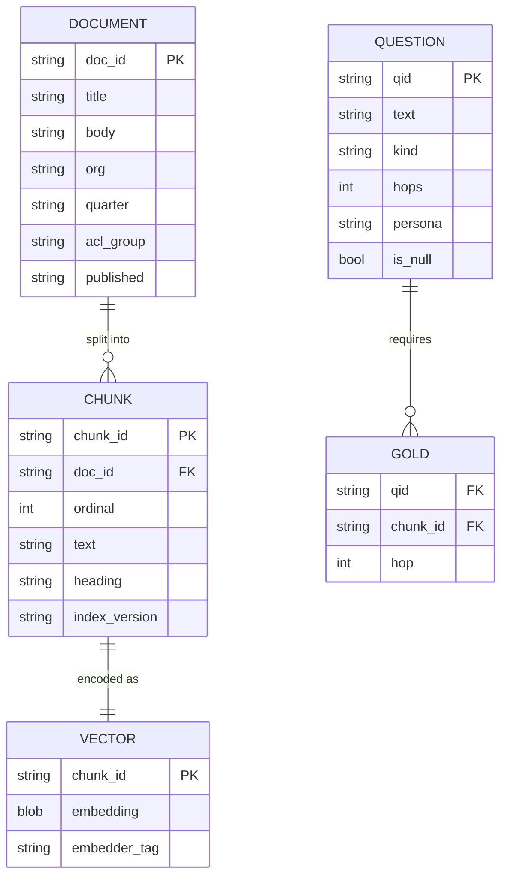

# Data model

Everything lives in one in-memory SQLite database created per session. Nothing persists, which
is the point: an experiment that cannot be re-run from scratch in ten seconds is an experiment
whose result nobody will check.

## Entities



## The chunk id, and why it is shaped that way

```
chunk_id = f"{doc_id}:{ordinal}:{sha1(text)[:10]}"
```

Three components, each load-bearing:

- **`doc_id`** — provenance. A citation must resolve to a source document.
- **`ordinal`** — position. Needed to reassemble neighbours for parent-document retrieval, and
  to say "the third section" in a trace.
- **`sha1(text)[:10]`** — content address. This is the one that matters operationally.

Because the id contains a content hash, **an unchanged chunk keeps its id across a rebuild**.
That is what makes an incremental update an *upsert* rather than a delete-then-insert. Without
it, re-ingesting a document with one edited paragraph re-keys every chunk in it, the old rows
are orphaned rather than replaced, and the orphans stay retrievable — you serve the previous
version of a document forever, with no error anywhere.

The consequence for chunking strategies: any change to the chunker changes chunk text, changes
ids, and therefore forces a full reindex. That is not a bug, it is the cost of chunking being a
real decision, and it belongs in the ADR.

## The FTS5 table

```sql
CREATE VIRTUAL TABLE IF NOT EXISTS chunks_fts USING fts5(
    text, title, heading,
    chunk_id UNINDEXED, index_version UNINDEXED,
    tokenize = "unicode61 remove_diacritics 2 tokenchars '_-'"
);
```

`tokenchars '_-'` is not a detail. The default `unicode61` tokenizer splits `ERR_CONN_RESET`
into `err` / `conn` / `reset`, all three of which appear in nearly every incident report in this
corpus. The identifier does not merely fail to match — it matches *everything*, and BM25's IDF
rates all three components as low-information. A high-precision query becomes a high-recall one.

Measured cost of getting this wrong: identifier-slice recall 0.81 → **0.34**, while the overall
average moved only 5 points — small enough to pass review. That is issue #1, and it is the
argument for slice-level alerting.

## Index versions and aliases

| Concept | Purpose |
|---|---|
| `index_version` | Immutable label for one build (`v1`, `v2`). Includes the embedder tag and the analyzer configuration |
| `alias` | Mutable pointer, `live → v2`. Swapping it is atomic |
| Tombstone | A deletion marker, so a purge is a filter rather than a rebuild |

Rollback is a pointer change, not a rebuild. That design decision paid for itself the first time
a tokenizer change had to be reverted.

**A live index containing more than one `embedder_tag` is a defect that fails loudly**, because
cosine similarity across two embedding spaces is meaningless *and silent* — you get plausible
numbers and degraded results with no error. `tests/` asserts this.

## Permissions

`acl_group` is a column on `DOCUMENT`, and retrieval **pre-filters** on it: the candidate set is
constrained before scoring, not after.

Post-filtering fails two ways, both tested:

- **k-collapse.** Ask for 10, get 10, filter to 2. Result count then depends on the user's
  permissions, and the most restricted users get the emptiest search.
- **Score leak.** Scores and corpus statistics derived from documents a user cannot read let
  them infer those documents exist and roughly what they say.

Permissions are evaluated at query time against the source of truth rather than baked in at
ingest, because permissions change far more often than documents do — and an index that caches
them serves a revoked user their old access until the next reindex.

## What this model deliberately omits

| Omitted | Why | Where it would go |
|---|---|---|
| Document versions over time | The corpus is a snapshot per quarter | A `valid_from` / `valid_to` pair on `DOCUMENT` |
| Per-user relevance feedback | No users | A `CLICK` table joined to `QUESTION` |
| Multi-tenancy beyond ACL groups | One tenant | A `tenant_id` on every table, in the primary key |
| Cross-encoder score caching | Corpus is small enough | `(query_hash, chunk_id) -> score` with the model tag |

Each omission is a place the model would have to grow for production, and naming them is more
useful than pretending the model is complete.
