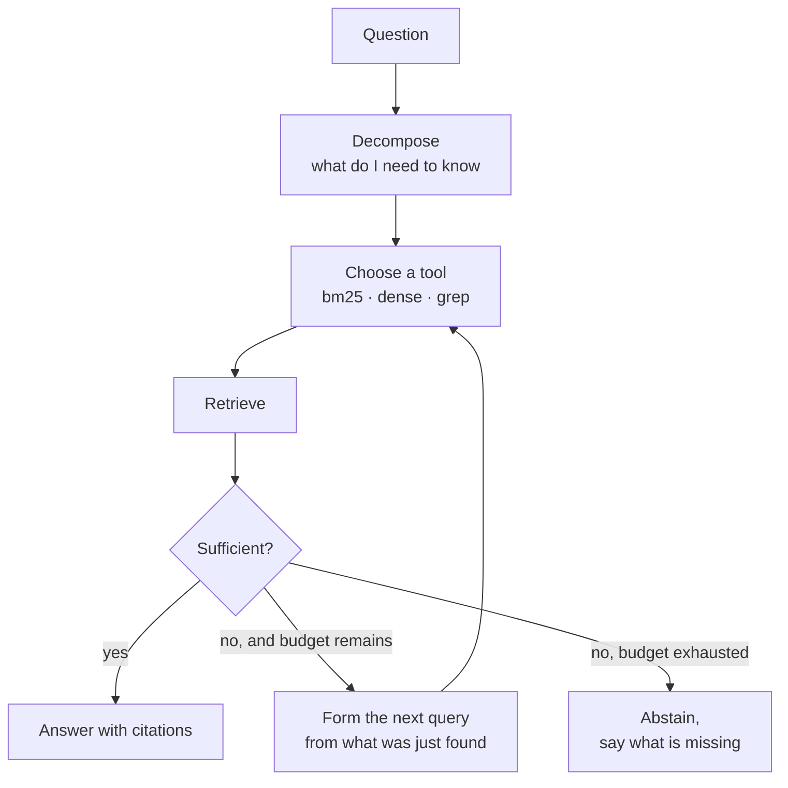

# LLD · `agent.py`

The multi-step loop. Exists because single-shot retrieval has a structural ceiling on multi-hop
questions — not a quality ceiling that tuning fixes.

## Why it exists, stated as a number

Evidence recall 0.7645, full-chain recall 0.4686. Widening candidates from 20 to 200 moves hop-1
recall 0.88 → 0.94 and hop-2 recall 0.54 → 0.55.

You cannot retrieve hop-2 evidence with a query that lacks hop-2's vocabulary. Hop-2 evidence
resembles the *answer to hop 1*, and no amount of k or n changes that. The fix is architectural:
retrieve, read, form a new query from what you found, retrieve again.

## Contract

```python
def run(question: str, budget: AgentBudget) -> Trace
```

```python
@dataclass
class AgentBudget:
    max_steps: int = 4
    max_tokens: int = 8000
    max_seconds: float = 20.0
```

Every field is a **hard stop**. An agent whose budget is advisory is an agent that occasionally
does not terminate, and "occasionally" is enough.

## The loop



## Stop conditions, and the one that matters

Four, checked in order:

1. **Sufficiency** — the retrieved evidence supports an answer.
2. **Budget** — steps, tokens or seconds exhausted.
3. **No progress** — the last step retrieved nothing not already held.
4. **Repetition** — the same query has been issued before.

Conditions 3 and 4 are the ones that actually fire in practice. An agent that cannot answer tends
to loop on near-identical queries rather than diverging, so "no new evidence" is a far better
termination signal than any confidence score.

**The fallback when a stop check is unavailable is *stop*, not *continue*.** If sufficiency is a
model call and the provider is down, an agent that falls through to "keep going" is an unbounded
loop with a bill attached.

## The sufficiency check

Currently a heuristic over retrieval scores, and it is **known to be the weakest part of the
module**.

The reason is the abstention finding: a score heuristic measures **similarity** — does the
evidence look like the question — while sufficiency is about **entailment** — does the evidence
support an answer. Those come apart exactly where it matters. Null questions in this corpus name
real entities in the corpus's own vocabulary while genuine questions paraphrase, so the
unanswerable ones score *higher* on similarity. The heuristic does not have low accuracy; it has
the wrong sign.

A banded design is the tracked improvement: model call only when the heuristic is uncertain,
with band boundaries measured rather than guessed. Very high score with cross-leg agreement —
stop. Very low — abstain. The middle 20% is where a model call earns its cost. Issue #10.

## Trace scoring

The agent is scored on its **trace**, not only its answer.

| Signal | What it catches |
|---|---|
| Evidence retention | Evidence found at step 1 and dropped by step 3 |
| Step justification | Whether each query follows from the previous result |
| Stop appropriateness | Stopped with enough, or stopped early, or ran on |
| Escalation rate | How often it abstains, and whether that tracks genuine unanswerability |

Answer-only scoring cannot see an agent that reaches the right answer through three wrong turns,
and such an agent will not keep reaching it.

## Complexity and cost

Cost multiplies by step count. A 4-step agent is roughly 4× the retrieval and 4× the generation
of a single-shot run, plus the sufficiency checks.

That is the argument for **routing rather than replacing**: measure the multi-hop fraction of
real traffic, send only those queries through the loop. At 12% multi-hop you get the capability
at roughly an eighth of the cost.

## Failure modes

| Symptom | Cause |
|---|---|
| Loops until budget exhausted on easy questions | Sufficiency check too strict, or reading similarity as entailment |
| Answers confidently on unanswerable questions | Sufficiency check too loose — the current default behaviour |
| Right answer, incoherent trace | Got lucky. Trace scoring exists to catch this |
| Cost 4× the estimate | Estimated on single-shot; every step pays retrieval *and* generation |

## What would change this design

**A working sufficiency signal.** Everything else here is sound and this one component sets the
ceiling. An entailment-based check would change the loop from "run until budget" to "run until
done", which is the whole difference between an agent and a retry loop.

**Parallel branches.** The loop is strictly sequential. A question with two independent hops
could issue both at once, halving latency at the same token cost. Not implemented, and it
complicates the trace, which is why it is not free.
