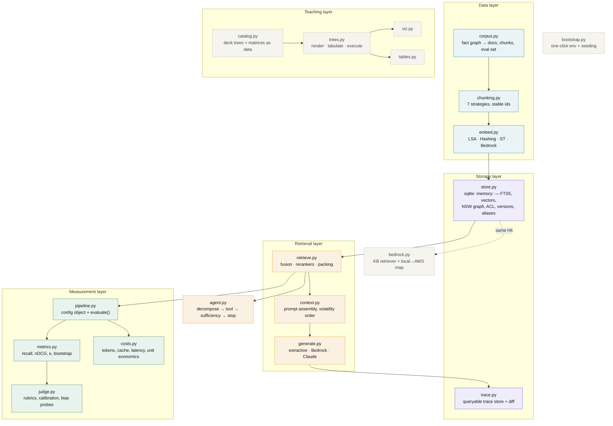
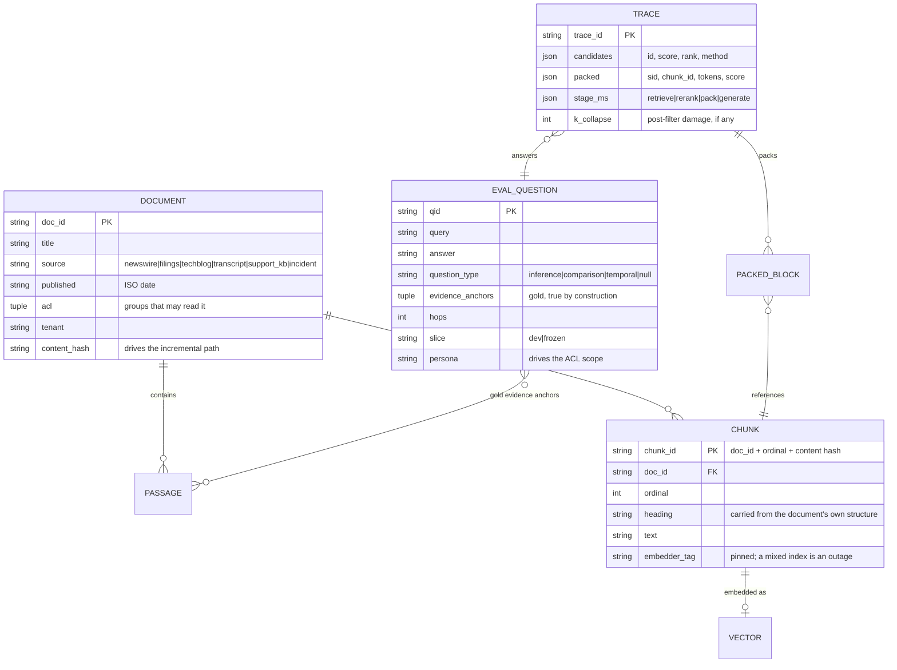
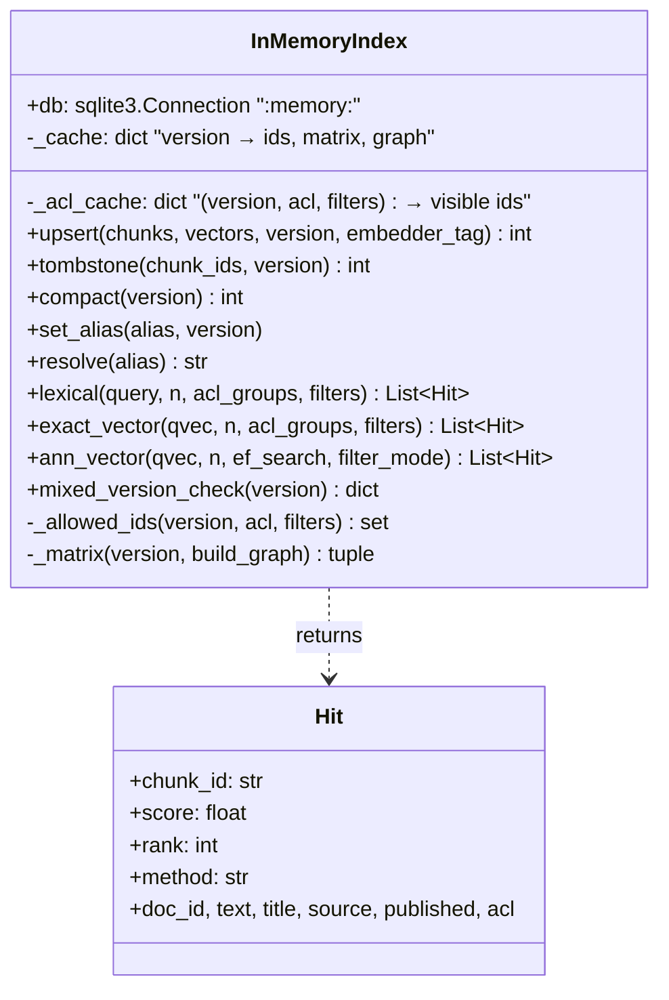
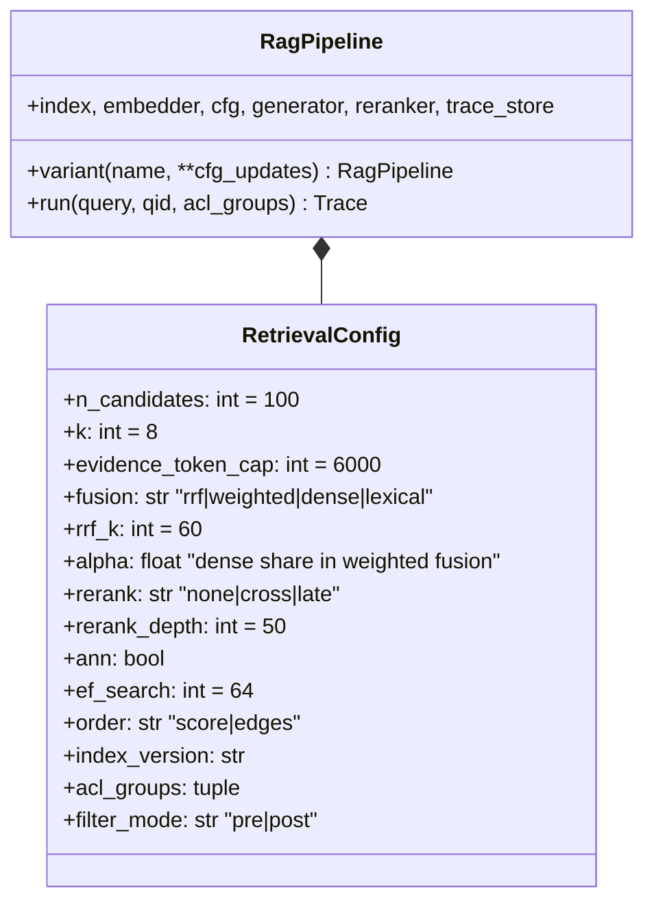
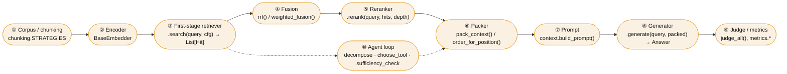

# Architecture

> **Audience:** anyone about to change `nanorag/`, and anyone who wants to explain this system
> in an interview. Read [the README's architecture section](../../README.md#architecture) first for
> the context and HLD diagrams; this document is the level below that.

## Contents

- [Design principles](#design-principles)
- [Module map](#module-map)
- [Data model](#data-model)
- [Component detail (LLD)](#component-detail-lld)
- [The seams — where to plug things in](#the-seams--where-to-plug-things-in)
- [Local → AWS](#local--aws)
- [Performance notes](#performance-notes)
- [Invariants the tests enforce](#invariants-the-tests-enforce)

---

## Design principles

Five decisions shape everything else. Each has an [ADR](adr/) with the alternative that lost.

| # | Principle | Consequence you will feel |
|---|---|---|
| 1 | **Everything runs offline and deterministically** | Two runs produce identical numbers, so a delta is a real delta. Non-determinism would make the whole measurement curriculum untellable. |
| 2 | **Concepts in notebooks, infrastructure in the package** | You read BM25 in notebook 04, not in a library you are asked to trust. But you do not re-implement SQLite. |
| 3 | **Swapping a backend must not change the harness** | `Hit`, `Embedder`, `Generator` and `Reranker` are the only interfaces that matter. Bedrock plugs into all four. |
| 4 | **Gold labels are true by construction** | The corpus is generated from a fact graph, so there is no annotation-error floor under any number. |
| 5 | **A measurement without an interval is an anecdote** | `paired_bootstrap` is in the critical path of the PR template and the CI gate, not an optional extra. |

---

## Module map

| Module | Lines | Responsibility | Do not put here |
|---|---:|---|---|
| `corpus.py` | 1,220 | Fact graph, document rendering, chunk/eval schemas, MultiHop-RAG loader | Retrieval logic |
| `chunking.py` | 288 | Seven strategies; stable chunk ids; token estimation | Anything that needs an index |
| `embed.py` | 305 | Encoder implementations behind one interface; `EmbedderInfo` version pinning | Similarity search |
| `store.py` | 444 | SQLite schema, FTS5 lexical, exact + ANN vector search, ACL scoping, versions/aliases/tombstones | Ranking policy |
| `retrieve.py` | 617 | Fusion, rerankers, pair features, dedup, ordering, packing | Prompt strings |
| `context.py` | 178 | Prompt assembly, budget slices, provenance blocks | Model calls |
| `generate.py` | 247 | Readers behind one interface + the fault-injection fixture | Scoring |
| `metrics.py` | 283 | Every metric, plus κ and the paired bootstrap | Anything that runs a pipeline |
| `judge.py` | 271 | Rubrics as artefacts, calibration, bias probes | Retrieval metrics |
| `pipeline.py` | 190 | The config object, `run()`, `evaluate()` | New metrics |
| `agent.py` | 279 | Decomposition, tool choice, sufficiency, stop conditions, trace scoring | Single-shot logic |
| `costs.py` | 206 | Token categories, prompt cache, latency model, unit economics | Real provider calls |
| `trace.py` | 142 | Trace record, trace store, `diff_traces` | Analysis |
| `catalog.py` | 640 | The deck's trees and matrices as executable data | Behaviour |
| `bedrock.py` | 249 | KB retriever, preflight, local→AWS mapping | Offline logic |

---

## Data model

**Why `chunk_id = doc_id + ordinal + content hash.`** An unchanged chunk keeps its id across a
re-chunk and needs no new vector; a changed one gets a new id an upsert can write over.
Delete-then-insert orphans rows; upsert-then-tombstone does not. This single choice is what
makes the incremental freshness path cheap — see [ADR-0004](adr/0004-stable-chunk-ids.md).

---

## Component detail (LLD)

### `store.InMemoryIndex`

Three implementation details worth knowing before you change this file:

1. **`tokenchars '_-'` on the FTS5 table is load-bearing.** The default `unicode61` tokenizer
   splits `ERR_CONN_RESET` into `err` / `conn` / `reset`, which appear in every incident
   report — so the one query lexical retrieval should win outright silently becomes its worst
   case. Notebook 04 §4.3 measures it.
2. **The k-NN graph has long-range links.** A pure k-NN graph is a lattice of tight
   neighbourhoods with no shortcuts; greedy search walks into the nearest cluster and cannot
   leave, so recall collapses as the corpus grows even though every edge is correct. Four
   random links per node (Kleinberg's construction, which HNSW's upper layers provide)
   restore the logarithmic hop count.
3. **The ACL set is cached, and the cache is cleared on every write.** Re-deriving the visible
   set per query costs more than the vector search it supports. The `_acl_cache` clear on
   `upsert` / `tombstone` / `compact` is the correctness half of that optimisation.

### `retrieve.ProxyCrossEncoder`

Eight features that only a *pair* can produce, then logistic regression. It is far weaker
than a trained transformer and architecturally the same animal: it scores the pair, nothing is
precomputable, cost is linear in `N`, and batching rather than looping is what keeps latency
in the tens of milliseconds.

| Feature | What it measures | Why a bi-encoder cannot produce it |
|---|---|---|
| `coverage` | Query-term coverage, BM25-style length-normalised | Needs both sides |
| `proximity` | Tightness of the window containing matched terms | Needs the query's terms |
| `phrase` | Longest contiguous query n-gram appearing verbatim | Needs the query |
| `title` | Overlap with title + heading path | Needs the query |
| `maxsim` | Mean over query tokens of best-matching passage token | **The key one** — a bi-encoder compresses the passage before it has seen the query |
| `doc_cosine` | Whole-passage similarity in latent space | This one a bi-encoder *can* produce |
| `exact_id` | An identifier matched literally | Needs the query |
| `length` | Log passage length | Lets the model learn its own length prior |

`fit()` is plain gradient-descent logistic regression, deliberately small enough to read. The
interesting part is not the optimiser — it is that **the training set must come from questions
the frozen slice does not contain**, or the number you report at the end is a memory rather
than a result.

### `pipeline.RagPipeline`

`variant()` is the whole ergonomics of the curriculum: *change one thing, re-run, write down
the delta.* It returns a copy with some knobs changed and shares the index, the encoder and
the trace store, so a sweep costs nothing but the evaluation itself.

---

## The seams — where to plug things in

Every extension in [EXTENSION-POINTS.md](../09-research/extension-points.md) attaches at exactly one of
these. If your idea does not fit one, it is probably two ideas.

| Seam | Interface to implement | Example already in the repo |
|---|---|---|
| ① Chunking | `fn(documents, **params) -> list[Chunk]`, registered in `STRATEGIES` | `chunking.contextual` |
| ② Encoder | `fit`, `encode_documents`, `encode_queries`, `.info: EmbedderInfo` | `BedrockEmbedder` |
| ③ Retriever | `.search(query, n, cfg) -> list[Hit]` | `GrepRetriever`, `BedrockKnowledgeBaseRetriever` |
| ④ Fusion | `fn(list_of_hit_lists, **kw) -> list[Hit]` | `rrf`, `weighted_fusion` |
| ⑤ Reranker | `.rerank(query, hits, depth) -> list[Hit]` | `LateInteractionReranker`, `BedrockReranker` |
| ⑥ Packer | `fn(hits, k, token_cap, ...) -> (list[Hit], int)` | `pack_context`, notebook 02's `quota_pack` |
| ⑦ Prompt | `build_prompt(...) -> PackedContext` | volatility-ordered default |
| ⑧ Generator | `.generate(query, packed) -> Answer` | `BedrockGenerator`, `UngroundedGenerator` |
| ⑨ Judge | `.judge_all(question, answer, packed) -> dict[str, Verdict]` | `BedrockJudge` |
| ⑩ Agent | `decompose`, `choose_tool`, `sufficiency_check` | rule-based defaults |

---

## Local → AWS

`nanorag.bedrock.LOCAL_TO_AWS` holds this mapping in code so it stays honest.

| Local | Managed equivalent | What changes when you move |
|---|---|---|
| `chunking.*` | Knowledge Base chunking strategy | `FIXED_SIZE` / `HIERARCHICAL` / `SEMANTIC` / `NONE`, set at ingest. `HIERARCHICAL` **is** parent-document retrieval. Changing it is a full re-ingest. |
| SQLite FTS5 | The KB's vector store with `overrideSearchType: HYBRID` | You no longer tune BM25 directly. Measure before assuming equivalence. |
| `InMemoryIndex` vectors | OpenSearch Serverless / Aurora pgvector / Pinecone / Redis | Mostly an ops and residency decision, not a recall one |
| `LsaEmbedder` | `amazon.titan-embed-text-v2:0`, `cohere.embed-*` | Set on the KB at creation; changing it is a full re-ingest |
| `ProxyCrossEncoder` | `amazon.rerank-v1:0`, `cohere.rerank-v3-5:0` | `rerankingConfiguration` on the retrieve call; priced per document |
| `build_prompt` + generator | `retrieve_and_generate`, or `Converse` with your own prompt | **Keep your own packing if citations matter.** You cannot debug a context you did not assemble. |
| `acl_groups` pre-filter | `retrievalConfiguration.filter` | Same rule: pre-filter, never post-filter |
| `HeuristicJudge` | Converse with a judge model, or Bedrock Evaluations | Pin the model and rubric version; do not judge with the generator's family |
| `TraceStore` | CloudWatch + model invocation logging + your own store | Retrieved text in traces inherits the corpus's compliance boundary |

---

## Performance notes

Two optimisations account for most of the speed, and both were found by profiling rather than
by guessing. They are worth reading because the *shape* of both problems recurs constantly.

| Problem | Symptom | Fix | Effect |
|---|---|---|---|
| `resolve_gold` re-normalised all 2,430 chunk texts **per question** | Evaluation dominated by `re.sub` | Memoise normalised chunk text keyed on list identity | Full eval 40 s → **9.7 s** |
| `exact_vector` fetched every row's full record to answer "which are visible?" | The ACL check cost more than the vector search | Cache the visible-id *set* per (version, ACL, filters); fetch only the rows actually returned | ~4.6× on the hot path |

Both are the same mistake in different costumes: **doing per-item work for a question whose
answer only changes on a write.**

---

## Invariants the tests enforce

`tests/` is not decoration. These are the properties a reviewer should not have to re-check.

| Invariant | Test |
|---|---|
| Reranking can never exceed the first-stage ceiling | `test_reranking_can_never_exceed_the_first_stage_ceiling` |
| ANN recall rises monotonically with `efSearch` and reaches ≥0.9 | `test_ann_recall_rises_monotonically_with_ef_search` |
| No persona ever receives a chunk outside its groups | `test_no_persona_ever_receives_a_chunk_outside_its_groups` |
| Post-filtering collapses `k`; pre-filtering does not | `test_post_filtering_collapses_k_and_pre_filtering_does_not` |
| A mixed-encoder index is detected | `test_mixed_version_index_is_detected` |
| RRF ignores score magnitude | `test_rrf_is_rank_based_and_ignores_score_magnitude` |
| Every gold anchor resolves under the shipped chunking | `test_every_gold_anchor_resolves_under_the_shipped_chunking` |
| Chunk ids are stable across rebuilds | `test_chunk_ids_are_stable_across_rebuilds` |
| Full-chain recall is never above evidence recall | `test_full_chain_is_never_above_evidence_recall` |
| κ punishes a judge that always passes | `test_cohens_kappa_punishes_a_judge_that_always_passes` |
| Every citation resolves to a packed chunk | `test_every_citation_resolves_to_a_packed_chunk` |
| Evidence never exceeds the token cap | `test_evidence_never_exceeds_the_token_cap` |
| The pipeline is deterministic | `test_the_pipeline_is_deterministic` |
