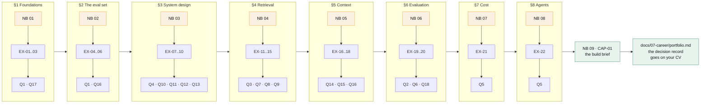

# Curriculum

How the eight deck sections, the ten notebooks, the exercises and the interview questions map
onto each other — and how to run this as a cohort.

## The map

## Section detail

| § | Notebook | Core idea | The number it teaches | Exercises | Interview |
|---|---|---|---|---|---|
| 1 | 01 | The pipeline is a recall budget spent on precision | Recall@N is a **ceiling**; Recall@k is a delivery | EX-01–03 | Q1, Q17 |
| 2 | 02 | One record, three evaluations | Full-chain recall, not average evidence recall | EX-04–06 | Q1, Q16 |
| 3 | 03 | Index-time and query-time are two systems with two SLAs | Storage × and index cost sit *next to* recall | EX-07–10 | Q4, Q10–13 |
| 4 | 04 | Staging: cheap-wide then expensive-narrow | ANN recall is a tunable, measured against flat | EX-11–15 | Q3, Q7–9 |
| 5 | 05 | The context window is the one budget with a hard wall | Marginal full-chain recall per 1k tokens | EX-16–18 | Q14–16 |
| 6 | 06 | An end-to-end score never says *which* stage moved | Cohen's κ, and the noise band | EX-19–20 | Q2, Q6, Q18 |
| 7 | 07 | Cost is a design constraint, not an afterthought | Cost per answered query, to the cent | EX-21 | Q5 |
| 8 | 08 | The sufficiency check is the whole design | Evidence retention | EX-22 | Q5 |
| — | 09 | Harness first, then one change at a time | The decision record | CAP-01 | all |

## Running it as a cohort

### Two-day intensive (the format this was built for)

| | Morning | Afternoon |
|---|---|---|
| **Day 1** | §1–2 · notebooks 01–02 · EX-01, EX-06 in pairs | §3–4 · notebooks 03–04 · EX-07 or EX-12 |
| **Day 2** | §5–6 · notebooks 05–06 · EX-16, EX-19 (needs pairs) | §7–8 + capstone kickoff · notebooks 07–09 |

**Between the days:** post one Q&A discussion and one design review. The overnight thread is
where the second day's questions come from.

### Eight-week part-time cohort

One section per week, plus a capstone fortnight.

- **Monday:** faculty posts the reading assignment as an issue (`type: reading`, `cohort`).
  Students answer the questions as comments — those answers become the seminar agenda.
- **Wednesday:** 90-minute session walking the notebook live, stopping at every measurement.
- **Thursday–Sunday:** the week's exercise, submitted as a branch + exercise issue.
- **Following Monday:** two students present in Show & Tell before the new reading drops.

Weeks 9–10 are CAP-01, presented as a design review.

### Facilitation notes

**Stop at every negative result.** The three findings that contradict expectation (§Three
results in the README) are where the learning is. A room that only sees confirmations learns
to expect confirmations.

**Make someone defend a number out loud.** "Your full-chain recall went up 4 points — is that a
result?" is the most useful question a facilitator can ask, and the answer should be a
question back about the noise band.

**Run the fault-isolation tree live**, on a failure the room picks, before you explain it. The
tree makes sense in about ninety seconds when it is producing a verdict on something real, and
takes twenty minutes to explain in the abstract.

**Do not skip the honesty inventory** in notebook 00. Every cohort has someone who will later
quote a number from these notebooks in a client meeting, and that table is what stops them.

## Prerequisites

**Required:** Python (comfortable reading and modifying), basic probability, the idea of
cosine similarity. You do **not** need transformer internals, GPU experience, or a background
in information retrieval.

**Useful but not assumed:** SQL, having shipped something with an LLM in it, having been on
call for anything.

## What "done" looks like

A student has finished this curriculum when they can, without notes:

1. Draw the four-plane architecture and say what each plane owns.
2. Take a bad answer and attribute it to a stage with a trace.
3. Say what Recall@N bounds and why a reranker cannot exceed it.
4. Explain why post-filtering an ACL does not satisfy "not influenced by".
5. Price one grounded answer to the cent and name the three biggest levers.
6. Say what a noise band is and refuse to call a smaller delta a result.
7. Produce a decision record that names what they rejected and why.

Six of those seven are about judgement rather than technique. That is deliberate.
