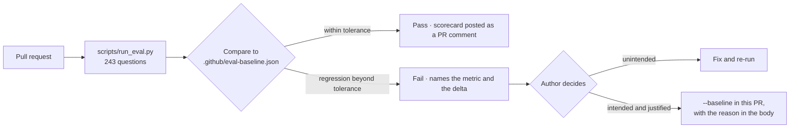

# The release gate

CI blocks a merge on a metric regression. This is the mechanism that turns the protocol from a
document into something that holds.

## How it works



## The tolerances

```python
TOLERANCE = {"evidence_recall": 0.02, "full_chain_recall": 0.03, "answer_correct": 0.03}
```

They are not arbitrary. Each is roughly the width of the paired-bootstrap noise band for that
metric at n = 243, so the gate trips on movement that is unlikely to be sampling noise and
tolerates movement that is.

Tightening a tolerance below the noise band produces a gate that fails randomly, which is worse
than no gate — a flaky gate gets disabled, and then nothing is checked at all.

## Moving a baseline honestly

Sometimes a number *should* move. The gate is not there to freeze quality, it is there to make
a change deliberate.

```bash
python scripts/run_eval.py --baseline
```

The rules around it:

1. **In the same PR as the change that moved it.** A baseline moved separately is a baseline
   moved silently.
2. **With the reason in the PR body**, including the interval. "Reranker now uses semantic pair
   features; evidence recall 0.7645 → 0.7891, [+0.008, +0.041], holds on frozen."
3. **Never to make a failing gate pass.** If you cannot explain the movement, you do not
   understand your change yet.

A downward baseline move is legitimate and should be stated plainly — a deliberate trade of
recall for latency, say — with the thing you bought named.

## What the gate cannot catch

Worth being explicit, because a green gate is persuasive.

- **A change to the eval set itself.** The gate compares against a baseline computed on the
  current set. Change both and it passes happily. This is why the protocol forbids changing them
  in one commit — a rule, not a check.
- **Overfitting to the dev slice.** Twenty PRs each clearing the gate on dev can still be
  collectively overfitted. Only the frozen slice catches that, and only once.
- **A metric improving while the product degrades.** Evidence recall can rise while full-chain
  falls. This is why both are gated.
- **Anything not measured.** Latency, cost and abstention rate are reported but not gated,
  because a gate on an unstable metric is a gate that gets disabled.

## Reading a failure

```
gate
  ok     evidence_recall        0.7645 → 0.7691  (+0.0046)
  FAIL   full_chain_recall      0.4686 → 0.4301  (-0.0385)   tolerance 0.03
  ok     answer_correct         0.4115 → 0.4102  (-0.0013)
```

This exact pattern — per-piece up, per-question down — is the signature of a change that fills
the window with more of the evidence you already had. It is the most common way a retrieval
"improvement" makes the product worse, and it is precisely why both are gated.
