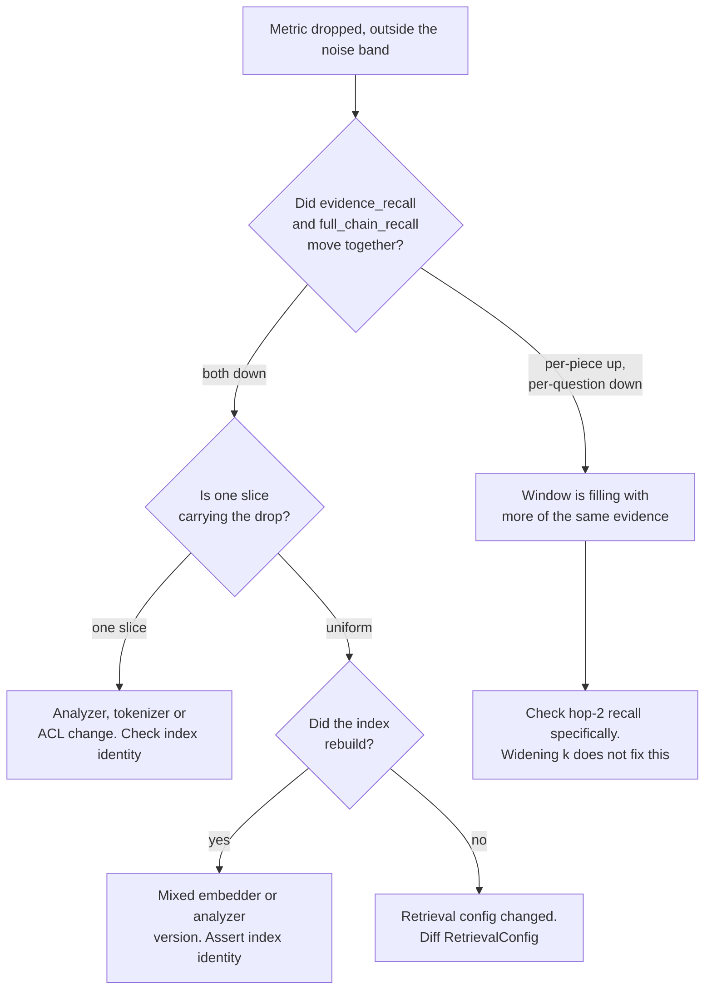

# A retrieval metric dropped

**Symptom:** `evidence_recall` or `full_chain_recall` fell between two runs and nobody
deliberately changed anything.

## First: is it real?

Before investigating, rule out the two things that look like a regression and are not.

1. **Is it inside the noise band?** Run `metrics.paired_bootstrap` on the two arms. At n = 243,
   a swing of ±0.02 in evidence recall is unremarkable. A "regression" inside the interval is a
   resample, not an event.
2. **Is it the same eval set?** If the eval set changed in the same window, the delta is
   uninterpretable. Check `git log -- .github/eval-baseline.json` and the corpus generator.

If it survives both, it is real. Continue.

## The decision tree



## The four causes, in order of frequency

**1 · A slice collapsed while the average moved a little.** The signature is a 3–6 point
aggregate move. Slice by query class immediately — identifier, temporal, multi-hop, ACL. The
tokenizer incident moved the aggregate 5 points and the identifier slice 47.

**2 · Mixed index versions.** Cosine across two embedding spaces is meaningless *and silent*.
Assert one `embedder_tag` per live index; the test exists for this reason.

**3 · Per-piece up, per-question down.** Not a regression in retrieval — a change that fills the
window with more of the evidence you already had. Check hop-1 and hop-2 recall separately.

**4 · Configuration drift.** `n_candidates`, `k`, `alpha`, `rerank` — diff the `RetrievalConfig`
between the two runs before assuming anything subtler.

## Rollback

The index is versioned behind an alias, so rollback is a pointer swap:

```python
idx.set_alias("live", "v_previous")
```

Do this **before** debugging if users are affected. A reverted system you are investigating beats
a broken system you are investigating.

## What to write down

- Which hypothesis you tested first, and whether it was right.
- How long the wrong hypotheses cost.
- Whether an existing test *could* have caught it, and if not, the test that would have.

The tokenizer incident's note says: found by a user, not monitoring, because the aggregate never
moved enough to alert. That sentence is why slice-level alerting exists.
