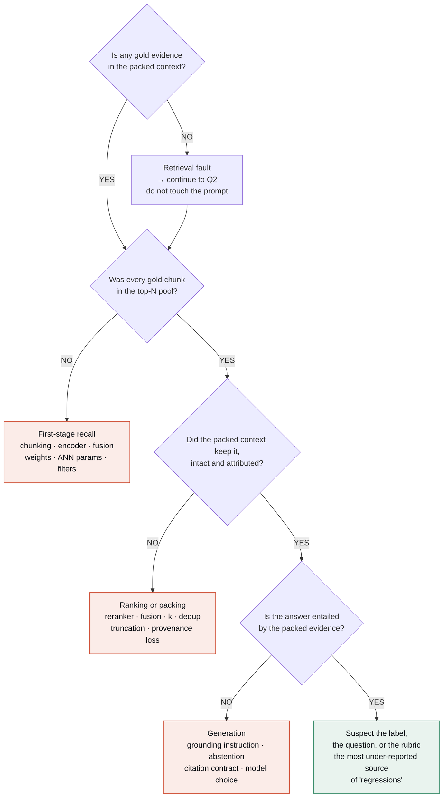

# Runbook

What to check, in what order, when something is wrong. Written as if you are on call for a
retrieval system at 2am — because the ordering is the transferable part, not the specifics.

## Triage: which stage owns this?

Run the fault-isolation procedure before touching any configuration. Four questions, in order:



```python
# notebook 01 §1.6 has this as a runnable function
from nanorag import catalog
verdict = catalog.FAULT_ISOLATION.explain(ctx)   # ctx built from the trace
```

## Symptom → first check

| Symptom | Check first | Then | Notebook |
|---|---|---|---|
| Recall dropped after an encoder change | **Mixed-version index** (`mixed_version_check`) | Prefix asymmetry → normalisation → dimension truncation → context-length truncation → ANN params → *only then* model quality | 04 §4.7 |
| Recall dropped after a chunking change | `avgdl` moved, so **every BM25 score silently re-tuned** | Unresolvable gold spans — a chunking choice can make a label unscoreable | 03 §3.3 |
| Identifiers stopped matching | **The analyzer.** Default `unicode61` splits `ERR_CONN_RESET` into three common tokens | Query escaping in `fts_query` | 04 §4.3 |
| ANN benchmark fine, users report misses | The benchmark ran **without production filters** | Compare ANN against *flat* search, not against ANN's own top-N | 04 §4.6 |
| One tenant got worse, average improved | Slice every metric by tenant | Find the mechanism: identifier-heavy corpus + fusion shift, or short docs + `avgdl` | 06 §6.4 |
| Answers confident and wrong on new terms | Evidence Recall@N — faithfulness will look *fine* because the model is loyal to bad evidence | First-stage retrieval | 06 §6.2 |
| Two-part questions answered halfway | Full-chain recall, not average evidence recall | k, packing, decomposition | 01 §1.3 |
| Cache hit rate collapsed overnight | **Something changed at the front of the prompt** | Timestamp, request id, unsorted JSON schema, per-request A/B variant | 07 §7.2 |
| Agent cost tripled, quality flat | Turn efficiency, then cumulative evidence recall | If cumulative rose but retention did not, you are finding evidence and discarding it | 08 §8.6 |
| Judge scores jumped, nothing shipped | **Judge drift.** Re-score the calibration set against the pinned rubric | Check rubric version, model version, temperature | 06 §6.3 |

## Common false alarms

| Looks like | Usually is |
|---|---|
| "The notebook gives different numbers than the README" | A stale kernel holding an old `nanorag`. Restart and Run All. |
| "My delta disappeared" | It was inside the noise band. Check `paired_bootstrap` before assuming a regression. |
| "Retrieval broke for one persona" | Working as designed — pre-filtering scopes the candidate pool. Compare against the `counsel` persona. |
| "The eval gate failed on my docs PR" | It should not run on docs. Check the `paths:` filter in the workflow. |

## Operational checks worth automating

These are in `tests/` and CI, and are worth copying into any real system:

```python
index.mixed_version_check("v1")        # vectors from two encoders in one index
metrics.resolve_gold(q, chunks)[1]     # gold spans no chunk can satisfy → label rot
assert_persona_isolation(...)          # no persona receives out-of-scope evidence
metrics.paired_bootstrap(a, b, key)    # is this delta a result or noise?
```

## Escalation

| Situation | Who decides |
|---|---|
| Frozen-slice metric dropped beyond tolerance | Nobody ships. Fix or revert. |
| Average improved, a named segment regressed | That segment's owner, explicitly, with the number and a remediation date |
| Cost or p95 outside envelope | Whoever owns the budget — not the engineer who wrote the change |
| Gate override | Allowed, logged, with a name on it. A gate nobody can override gets disabled. |
