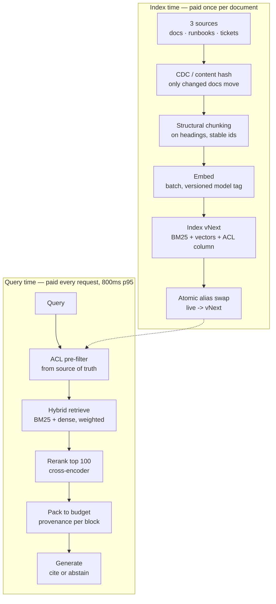

# Systems design

The 45-minute whiteboard round, reconstructed. One scenario carried end to end with the
interviewer's probe sequence and the clock, then four shorter scenarios with the specific
constraint each is built to surface.

A design round is not a knowledge test. The interviewer has a list of four or five probes and
is measuring **how you behave when the requirements are deliberately incomplete** — which they
always are, because that is the job.

---

## S1 · The full round: "Design search for our support knowledge base"

This is the most common RAG design prompt in circulation. It is also a trap, because the
prompt as given is unanswerable and the first thing being scored is whether you notice.

### Minute 0–5 · The requirements you must extract

**✗** Starts drawing boxes. The single most common failure, and usually terminal — everything
after it is a design for a problem nobody stated.

**★** Asks, and writes the answers on the board where they stay visible:

> "Before I draw anything — six questions, and I'll note which answers would change the design
> most.
>
> 1. **Corpus size and shape?** 10k articles and 10M behave differently. And is it one corpus or
>    several — public docs, internal runbooks, ticket history?
> 2. **Who reads it?** End customers, or support agents? That changes the latency budget, the
>    tolerance for a wrong answer, and whether abstention is acceptable or embarrassing.
> 3. **How fresh?** If a policy changes at 9am, when must search reflect it — minutes, or is
>    overnight fine? This is the single biggest cost driver and people rarely have a real answer.
> 4. **Permissions?** If everyone sees everything, I save a large amount of complexity. If not,
>    it shapes the index rather than being bolted on.
> 5. **What does failure cost?** A wrong refund policy is a regulatory problem. A wrong
>    troubleshooting step is an annoyance. That decides whether I need abstention and citation.
> 6. **What exists today?** If there's an Elasticsearch cluster with three years of click logs,
>    that's the most valuable asset in the room and I'd be foolish to greenfield past it."

An interviewer will usually answer three and deflect three. The deflected ones are the ones you
must state assumptions for, out loud, and write down.

**Typical answers given:** ~200k articles across three sources; support agents, not customers;
freshness within an hour for policy, overnight for the rest; ACLs by product line; wrong answers
on billing are a compliance issue; existing Elasticsearch with click logs.

### Minute 5–20 · The design

Draw index-time and query-time as separate timelines. Interviewers consistently report that
candidates who conflate them lose the thread when freshness comes up.

Talk through it with the budget attached, because the numbers are what make it a design rather
than a diagram:

> "Retrieval ~40ms, rerank the top 100 ~120ms, generation 400–600ms. Generation is 70% of the
> budget, so when someone asks for it to be faster I already know the lever is output tokens or
> model size, not the vector store. That is worth knowing before anyone spends a quarter
> optimising the retrieval."

### Minute 20–35 · The probes

The interviewer now attacks. Four standard probes, and what a strong answer does with each.

#### Probe 1 — *"A policy article changes at 9am. Walk me through what has to happen."*

They are testing whether "freshness within an hour" was a phrase you repeated or a requirement
you designed for.

> "Full rebuild can't hit an hour at 200k documents, so there are two paths and I'd build both.
>
> **Incremental**, for the hourly SLA: CDC or a content-hash poll detects the change, re-chunk
> that document only, re-embed those chunks, upsert. This needs **stable chunk ids** — content
> addressed, `doc_id:ordinal:hash` — otherwise an update is a delete-then-insert that orphans
> rows, and the orphans stay retrievable. That is the detail that makes incremental indexing
> actually work, and it has to be in the id scheme from day one.
>
> **Full rebuild**, nightly, blue/green with an atomic alias swap. It is the recovery path when
> the incremental one drifts, and it will drift.
>
> The failure I'd instrument: a **mixed-version index**, where some chunks are embedded with
> model v1 and some with v2. Cosine similarity across two embedding spaces is meaningless but it
> is also silent — you get plausible numbers and degraded results with no error anywhere. So the
> embedder tag goes in the index version, and there is a check that fails loudly if a live index
> contains more than one."

#### Probe 2 — *"Half your agents can't see billing documents."*

Covered in depth at [retrieval.md R7](retrieval.md#r7--the-multi-tenant-question). The design-round
addition is the operational half:

> "Pre-filter, not post-filter, for the k-collapse and score-leak reasons. The design-level point
> is **where the permission is evaluated**: at query time against the source of truth, not baked
> in at ingest. Permissions change far more often than documents, and an index that caches them
> serves a revoked user their old access until the next reindex. That is an audit finding, not a
> latency optimisation."

#### Probe 3 — *"How do you know it's working?"*

Where most candidates thin out. They have designed a system and not a way to know it works.

> "Three layers, because they answer different questions.
>
> **Offline**, gating releases: a labelled eval set — and I'd build it from *real query logs*,
> not imagined questions, because an eval set that doesn't match production traffic gives you a
> number that improves while users get angrier. Recall and nDCG, but also full-chain recall for
> multi-part questions; the gap between per-piece and per-question recall is where multi-hop
> failures hide. Every change ships with a paired bootstrap interval, and a delta inside the
> noise band is reported as inside the noise band.
>
> **Online**: click-through at rank, reformulation rate — a reformulation is a labelled failure
> the user handed you free — abandonment, and for agents, the escalation rate.
>
> **Guardrails**, always slice-level: p95 latency, cost per query, abstention rate. Abstention is
> the one people forget. If it drifts up, either the corpus lost coverage or the model got
> shy, and those need opposite responses.
>
> The rule I'd put on the team: any change that could move a number ships with the number."

#### Probe 4 — *"Now do it for ten times the corpus and a tenth of the budget."*

Tests whether you can prioritise under a real constraint rather than list optimisations.

> "I'd want to know which of the two hurts first, because they push in opposite directions.
>
> On cost, the honest first move is to **drop the cross-encoder for most queries** and route it:
> run it only where the first-stage score gap is small, which is where reranking actually changes
> the outcome. That is most of the rerank cost gone for a small quality loss I would measure
> rather than assume.
>
> Then prompt caching. The corpus-independent prefix — system prompt, instructions, few-shot —
> gets cached, which requires byte-identical prefixes, which means **ordering context blocks by
> volatility**. Anything that changes per query goes last. That is a design decision, not a
> tuning one, and retrofitting it is painful.
>
> On 10× corpus: quantise the vectors, PQ at 8–16× with a recall cost I'd plot rather than guess.
> Check whether the tail is cold — most support corpora have a long tail nobody reads, and it can
> live on disk behind a smaller hot index.
>
> What I would **not** do first is shard. It adds a fan-out and a merge to every query and it is
> the hardest thing on this list to reverse."

### Minute 35–45 · Your questions

Scored, whether or not anyone says so. Good ones:

- "What does your current eval set look like, and how was it built?" — tells you whether the team
  measures or ships on vibes.
- "When something regresses in production, how do you find out?"
- "What's the last retrieval change that didn't work, and how did you know?"

That last one is the best question you can ask a retrieval team. A team that can answer it
crisply has a measurement culture. A team that cannot has not been paying attention.

---

## S2 · "Design an eval set for a client who has none"

**Style:** deployment engineering, forward-deployed roles, consulting-shaped panels.

The constraint that makes it hard: **you cannot ask the client for 500 labelled questions.**
They do not have them, they will not produce them, and asking makes you look naive about how
engagements work.

The ★ shape:

> "Three sources, cheapest first.
>
> **Logs**, if any exist. Sample real queries, stratify by class so the tail isn't drowned by the
> head, and label 150–200. That is two days of one person and it is the highest-value artefact in
> the whole engagement.
>
> **Manufacture from the corpus.** Take documents, generate questions whose answers are in them —
> the gold evidence is then true by construction, so there's no annotation-error floor under the
> numbers. The trap is that generated questions reuse the document's own wording, so lexical
> retrieval wins trivially and the number is meaningless. Paraphrase, use descriptor references
> instead of names, and add glossary documents that bridge vocabulary registers.
>
> **Adversarial, built deliberately.** Multi-hop chains, near-duplicate distractors, and
> unanswerable questions — the last is essential and always skipped. If you never test whether
> the system declines to answer, you have not measured the failure that actually costs the client
> money.
>
> Then hold back 15% frozen, and I mean frozen: touched once, at the end. Tuning against it even
> once invalidates it for everyone, and the temptation is constant."

The follow-up is *"how do you know your synthetic set is any good?"* — and the answer is that
you check it discriminates: if every configuration scores the same, the set is too easy and is
measuring nothing.

---

## S3 · "The client wants an agent. Talk me out of it, or don't."

Tests whether you can push back on a stated requirement without being obstructive.

> "I'd want to know what they've seen that made them ask, because usually there's a real failure
> underneath and 'agent' is the word attached to it.
>
> The case **for**: if their questions are genuinely multi-hop, a single retrieval cannot serve
> them, and no amount of tuning fixes it. You cannot retrieve hop-2 evidence with a query that
> lacks hop-2's vocabulary — that is a structural limit, not a quality one. We measure a
> per-piece recall of 0.76 against a per-question recall of 0.47 on exactly this, and the gap is
> the argument.
>
> The case **against**: an agent multiplies your cost by the number of steps and your latency by
> the same, and it fails in ways that are much harder to debug because the failure is a *path*
> rather than a result. And it needs stop conditions that actually stop.
>
> What I'd propose: measure the multi-hop fraction of their real traffic first. If it's 5%, route
> those and leave the rest single-shot — they get the benefit at 5% of the cost. If it's 40%, the
> agent is the right architecture and now we have the number that justifies the budget.
>
> Either way I'd score the agent on its **trace**, not just its answer. Whether it retained the
> evidence it retrieved, whether each step was justified, whether it stopped when it had enough.
> An agent that reaches the right answer through three wrong turns will not keep doing so."

---

## S4 · "Two weeks, and it has to demo"

The pressure scenario. They are checking whether you know what to cut.

The ★ move is to name what you are **deliberately not building** and why that is safe:

> "Two weeks means one retriever, not a hybrid — BM25 alone, because it's the strong leg on most
> corpora and it needs no embedding pipeline. Structural chunking, no reranker, no agent.
>
> What I would **not** cut, because cutting it makes the demo actively misleading: an eval set,
> even 50 questions, and citations in the output. Without the eval set I cannot tell whether the
> demo is good or lucky. Without citations the demo is a magic trick, and magic tricks set an
> expectation the production system won't meet.
>
> And I'd demo the failure cases on purpose. A demo that only shows successes gets approved and
> then dies in month two when someone finds the first wrong answer. Showing where it declines to
> answer builds more trust than a flawless run, and it is the difference between a pilot that
> survives contact and one that doesn't."

---

## S5 · "It worked in the pilot and is failing in production"

The diagnosis scenario. The interviewer has a specific cause in mind and will confirm or deny
your hypotheses, so the skill is **ordering them by likelihood and cheapness**.

Ask in this order:

1. **Did the corpus change?** Pilot on a curated 5k, production on the real 200k with duplicates,
   drafts, and superseded versions. Near-duplicates are the usual culprit: they fill k with the
   same content and full-chain recall collapses while per-piece recall looks fine.
2. **Did the queries change?** Pilot queries came from the champion who understood the system.
   Production queries come from everyone.
3. **Did permissions arrive?** The pilot ran as an admin. Production runs as restricted users,
   and post-filtering collapses k for exactly the most restricted ones.
4. **Did anything drift?** Index rebuilt with a different embedding model, tokenizer changed,
   analyzer changed. Any of these silently invalidates every document indexed before it.
5. **Is it the same system?** Different config, different k, a rate limiter, a cache with a
   partial key.

> "I'd take twenty failing production queries and run them against the pilot config by hand
> before instrumenting anything. Twenty is usually enough to see which of those five it is, and
> it costs an afternoon instead of a sprint."

---

## What is being scored, across all of these

| Behaviour | Band |
|---|---|
| Draws before asking | ✗ |
| Asks requirements, then designs to them | ○ |
| Separates index-time from query-time, attaches budgets | ● |
| Names failure modes unprompted, including its own design's | ● |
| Proposes the cheap diagnostic before the expensive one | ★ |
| States what it is deliberately not building, and why that is safe | ★ |
| Has a number from something it actually ran | ★ |

The last row is the one you can prepare that nobody else has. Every claim in this file
corresponds to something measurable in this repository. Run it before the interview and you can
say *"we measured that"* instead of *"I'd expect that"* — and those two sentences do not land
the same way.
