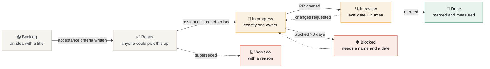

# The delivery board

How work is tracked here, and why it is set up the way it is. This is the JIRA-shaped half of
the playground: a board with real columns, real fields, and automation that keeps it honest.

**Board:** [Advanced RAG — Delivery](../../projects) (Projects v2)

## Columns and what each one means

| Column | Entry condition | The rule people break |
|---|---|---|
| **Backlog** | Anything. An idea with a title is enough. | — |
| **Ready** | **Acceptance criteria are written down.** | "Improve retrieval" is not acceptance criteria. "Full-chain recall on the comparison slice rises ≥5 points at unchanged k, and holds on the frozen slice" is. |
| **In progress** | Assigned to exactly one person, branch exists. | Two people, or nobody, on the same card. If it is genuinely shared, split it. |
| **In review** | PR open, CI green, eval scorecard posted. | Opening a PR without the measurement table. The template asks for it because a reviewer cannot supply it. |
| **Blocked** | Names **who** unblocks it and **by when**. | "Blocked" with no name is a card nobody will ever move. |
| **Done** | Merged, and the delta recorded. | Closing without recording whether the change actually moved the number. |
| **Won't do** | A reason, in one sentence. | Silently deleting cards, which destroys the record of what was considered. |

## Custom fields

| Field | Type | Values | Why it exists |
|---|---|---|---|
| **Phase** | Single select | `P0 Harness` · `P1 Baseline` · `P2 Retrieval` · `P3 Context` · `P4 Evaluation` · `P5 Cost` · `P6 Agentic` · `P7 Hardening` | Maps every card to a delivery phase, so "what are we in the middle of" has an answer |
| **Effort** | Single select | `S <1d` · `M 2–3d` · `L ~1w` · `XL cohort` | Estimated *before* work starts; compare against reality in retro |
| **Cohort** | Single select | `C1` · `C2` · `faculty` · `open` | Separates student work from platform work on the same board |
| **Risk** | Single select | `low` · `medium` · `high` | High-risk cards get a design review before they leave Ready |
| **Needs eval** | Checkbox | — | Set automatically for anything touching `raglab/`; the eval gate will run |
| **Metric moved** | Text | e.g. `full-chain +0.05 [+0.01,+0.09]` | Filled in when the card reaches Done. **This is the field that makes the board worth keeping.** |

## Views

| View | Filter | Used for |
|---|---|---|
| **Board** | all open | The daily standup view |
| **By phase** | grouped by Phase | "Where are we in the delivery?" |
| **Cohort** | `Cohort` = a free-text group label | What each cohort or squad is working on |
| **Needs review** | column = In review | The reviewer's queue |
| **Blocked** | column = Blocked | Read this one first in a standup |
| **Shipped with numbers** | column = Done, `Metric moved` not empty | The retro view — and the one to screenshot for a CV |
| **Good first issues** | label `good first issue` | Where a new student starts |

## Automation

Three GitHub Actions keep the board honest so nobody has to remember to update it:

| Trigger | What happens | Workflow |
|---|---|---|
| Issue or PR opened | Added to the board, lands in Backlog; a comment explains the entry conditions | `project-automation.yml` |
| PR opened touching `raglab/` | `needs: eval-numbers` label applied; eval gate runs and posts a scorecard | `labeler.yml`, `eval-regression.yml` |
| PR merged | Card moves to Done | built-in Projects workflow |
| No activity for 45 days | Marked stale, then closed, so the board reflects reality | `stale.yml` |

**Exercise issues are exempt from stale** — a student who takes six weeks is still a student.

## Labels

Labels are three orthogonal axes. A well-formed issue has one from each of the first two.

| Axis | Labels |
|---|---|
| **Type** | `type: bug` · `type: exercise` · `type: extension` · `type: reading` · `type: docs` · `type: chore` · `type: discussion-followup` |
| **Area** | `area: retrieval` · `area: evaluation` · `area: agent` · `area: cost` · `area: notebooks` · `area: toolkit` · `area: docs` · `area: ci` · `area: bedrock` |
| **Status / meta** | `status: triage` · `status: needs-review` · `status: blocked` · `status: stale` · `good first issue` · `help wanted` · `cohort` · `needs: eval-numbers` · `dependencies` |

## The one habit worth stealing

Every card that reaches **Done** has its **Metric moved** field filled in — including the ones
where the honest entry is `inside the noise band`.

A board that only records wins is a board that teaches people to only report wins. The
retro view, filtered to Done, is a record of what was actually true, and after a couple of
months it becomes the most useful artefact in the repository.
