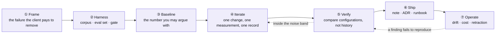

# The lifecycle this project follows

**Board:** *Project Lifecycle — the shape this project follows* (Projects v2, seeded by
`scripts/setup_github.py --only boards`)

This is not a process document. It is the lifecycle this repository *actually ran*, read off
its own artefacts — the ADRs, the measurement notes, the eval gate, the retraction — and laid
out as a board so that the next project of this shape can be run against it rather than from
memory. Every item on the board names the file in this repository that embodies it.

## The phases

| Phase | The question it answers | The artefact that proves you did it | Where this repository did it |
|---|---|---|---|
| **① Frame** | What failure is the client paying to remove, and what would they see if it were gone? | A one-paragraph PRD line with the observable | `docs/00-orientation/`, the seeded design reviews |
| **② Harness** | Can anything be measured before anything is built? | A corpus, a labelled set with a frozen slice, a gate | `raglab/corpus.py`, `.github/eval-baseline.json`, `eval-regression.yml` |
| **③ Baseline** | What does the simplest thing score, with intervals? | The committed baseline and its command | `python scripts/run_eval.py`, ADR-0002 |
| **④ Iterate** | One change. What moved, by how much, and what did it cost? | A PR with a scorecard, an ADR if a seam was chosen | ADR-0003 … 0013, `docs/03-exercises/` |
| **⑤ Verify** | Does the finding survive comparison against *alternatives*, not just against yesterday? | A measurement note with the command and the intervals | `docs/09-research/measurements/`, `run_eval.py --compare` |
| **⑥ Ship** | Could somebody who was not in the room reproduce this? | Note, ADR, runbook, the number with its configuration | P1's measurement note, `docs/05-operations/` |
| **⑦ Operate** | What drifted, what did it cost, and what turned out to be wrong? | Cost dashboard, judge drift check, **a retraction** | ADR-0012, ADR-0015, `tests/test_measurements.py` |

The dotted arrows are the point. **Verify → Iterate** when a change is inside the noise band:
that is not a small win, it is not a difference, and the record says so. **Operate → Verify**
when a published finding fails to reproduce: this repository ran that arrow twice in one week,
and both retractions are more useful teaching material than the findings were.

## What the eval gate cannot do, and why phase ⑤ exists

The release gate compares one configuration against its own history. It is structurally unable
to notice that a *different* configuration would have been better, which is how "equal-weight
RRF loses to BM25 alone" stood for months with a green gate the whole time. Phase ⑤ is a
separate act — `--compare` rather than `run_eval.py` — and it has its own artefact because
nothing in phase ④ produces it as a by-product.

## Where the named frameworks fit

Several published lifecycles describe AI-assisted delivery. This board does not adopt any of
them wholesale; it maps onto the parts of each that this project demonstrably needed.

| Framework | What it emphasises | Where it shows up here |
|---|---|---|
| **AI-DLC** (AWS) | Short *inception → construction → operations* loops; the AI proposes, a human approves; units of work small enough to reason about | Phases ①–② are inception; ④ runs as construction bolts of one change each; ⑦ is operations with the retraction loop explicit |
| **BMAD-METHOD** | Named agent roles (analyst, PM, architect, dev, QA) producing artefacts — a PRD, an architecture document, stories — before code | The PRD line in ①, the ADRs in ④, the peer-review-owed rule in the exercise workflow. The role separation is carried by *artefacts* rather than by agents |
| **Agentic / AI-driven PDLC** (generic) | Gates between phases that a human holds; the agent executes inside a phase, never across one | The `decide` mode in the simulator: no code until a decision with a falsifier is committed. The eval gate on every PR |

The honest summary: every one of these frameworks says *put the decision before the build and
the measurement before the claim*. This repository's contribution is a graded, re-runnable
version of both rules, and a public record of what happened when it broke them.

> **On the mapping.** The rows above describe what each framework emphasises at the level a
> practitioner would recognise. They do not quote phase names or ceremonies from those
> frameworks' own documentation, which changes, and they are not an endorsement. If your
> organisation runs one of them, the board's *artefact* column is the thing to line up against
> your process — the artefacts are what survive a change of method.

## Using the board

Each phase is a column; each item is a practice with the artefact that proves it and the file
here that embodies it. For a new project of this shape:

1. Copy the board. Delete nothing — mark a practice **Skipped** with a reason instead, which is
   the same rule the delivery board uses for *Won't do*.
2. Move an item to **Done** only when its artefact exists and is linked.
3. The first retro question is always the same: *which item did we mark Done without the
   artefact?* That item is where the next retraction is hiding.
