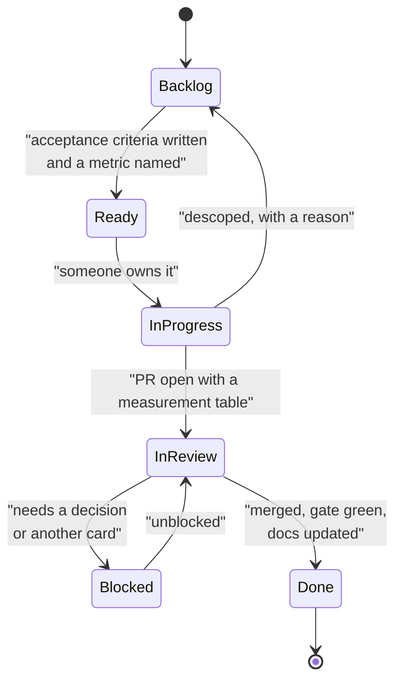

# Delivery phases

Eight phases, P0–P7. They map to milestones on GitHub, to the `Phase` field on the board, and to
the commit history — `git log --grep="P3"` returns the work that built the context layer.

A phase is not a time box. It is a set of **exit criteria**, and a phase ends when they are met
rather than when a fortnight elapses.

| Phase | Name | Exit criteria | Artefacts |
|---|---|---|---|
| **P0** | Harness | The whole thing runs end to end on a fresh machine with no API key, in under 10 s. Tests and lint pass in CI | `raglab/bootstrap.py`, CI, Makefile |
| **P1** | Baseline | An untuned baseline is declared **before** any numbers are seen, and reproduces to 4 decimals | `run_eval.py`, `eval-baseline.json`, notebook `01` |
| **P2** | Retrieval | BM25, dense, ANN and fusion all implemented and measured against each other with intervals. ANN recall verified against exact search | `retrieve.py`, `store.py`, notebook `04` |
| **P3** | Context | Packing respects a hard token cap. Every packed block carries provenance so a citation resolves | `context.py`, notebook `05` |
| **P4** | Evaluation | Judge calibrated against human labels with κ reported alongside marginals. Frozen slice established and untouched | `judge.py`, `metrics.py`, notebook `06` |
| **P5** | Cost | Four token categories tracked separately. Cache behaviour measured, not assumed | `costs.py`, notebook `07` |
| **P6** | Agentic | Loop with stop conditions that stop. Traces scored on evidence retention, not only on the answer | `agent.py`, `trace.py`, notebook `08` |
| **P7** | Hardening | ACL pre-filter, index versioning with atomic alias swap, mixed-version detection, incremental path | `store.py`, notebook `09` |

## Why this order

Two orderings are deliberate and both are the opposite of what teams usually do.

**Evaluation before retrieval improvements (P1 before P2).** A team that tunes a retriever
before it can measure one learns to trust a number it has not earned. The baseline is declared
in P1, before anyone has seen which configuration wins, because a baseline chosen after the fact
is just the second-best result.

**Cost before agents (P5 before P6).** An agent multiplies cost by the number of steps. Building
one before you can measure per-query cost means discovering the bill after the architecture is
committed.

## Movement rules

A card moves because a stated criterion is met, not because someone feels it has progressed.

**Backlog → Ready** is the gate people skip. A card without acceptance criteria and a named
metric is not ready; it is a wish. Writing the criterion *before* the work is what makes the
result falsifiable.

**InReview → Done** requires the eval gate green, and if a number moved deliberately, the
baseline moved in the same PR with the reason in the body.

## Phase health

Judged on three questions, asked at the retro:

1. **Did anything leave a phase without meeting its exit criteria?** If yes, the criteria were
   wrong or the phase was not real.
2. **How many cards moved backwards?** Some is healthy — it means Ready is being enforced. None
   usually means the gate is not being applied.
3. **What did we learn that changed a later phase?** A plan that survives eight phases untouched
   was not a plan, it was a schedule.
