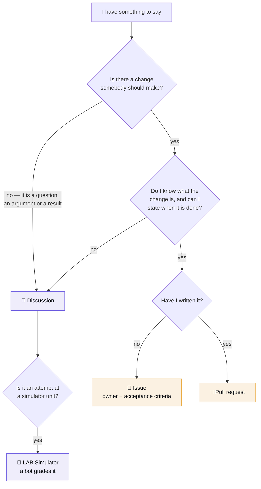
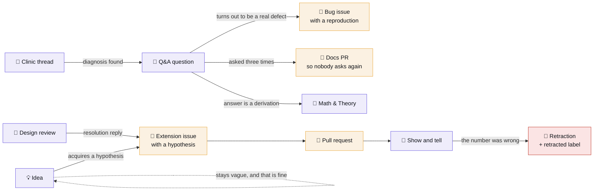

# Discussions guide

Discussions are the internal-Stack-Overflow half of this playground. Issues are *tracked work
with an owner*; Discussions are *everything else* — and the difference matters, because a
question filed as an issue either sits open forever or gets closed without being searchable.

This page is the whole surface: which category, which label, which title, when a thread should
become something else, what the bots do to a thread, and what GitHub will not let you automate.

**Contents**

- [Which surface](#which-surface) · the four-way routing decision
- [The categories](#the-categories) · all fourteen, and what each is for
- [Titles](#titles-the-highest-leverage-thing-on-the-page)
- [Labels](#labels)
- [Asking](#asking-a-question-people-can-answer) · [Answering](#answering-well) · [Marking an answer](#marking-an-answer)
- [The twenty-four plays](#the-twenty-four-plays) · every use of this tab we have found
- [Lifecycle](#lifecycle-what-happens-to-a-thread-after-it-is-answered)
- [Moderation](#moderation)
- [The bots](#the-bots)
- [Search recipes](#search-recipes)
- [For faculty](#for-faculty)
- [What GitHub will not let you automate](#what-github-will-not-let-you-automate)

---

## Which surface

Four surfaces, and picking wrong is the most common way a good contribution gets lost.

The test for an issue is **acceptance criteria you could hand to somebody else**. "Retrieval
feels slow" is a discussion. "P50 retrieval latency exceeds 400 ms at N=200; bring it under 250
without moving `evidence_recall` outside the noise band" is an issue.

The test for a discussion is that it can end in **agreement or understanding** rather than in a
diff.

---

## The categories

GitHub creates six when Discussions is enabled; this repository adds eight in `CATEGORIES` in
[`scripts/seed_content.py`](../../scripts/seed_content.py) — fourteen, assuming none of the
defaults were removed. Thirteen of them carry seeded threads. **Polls** is the exception, and
not by oversight: no API creates a poll, so there is nothing to seed.

The emoji below are the ones the API actually reports rather than the ones the code asks for,
so the table matches what you see in the sidebar. They differ because a category's emoji and
description are set by hand at creation time and no API can change them afterwards — see
[adding a category](#adding-a-category).

**Answerable** means the category has the Q&A format and a reply can be marked as *the* answer.
That is not cosmetic — see [Marking an answer](#marking-an-answer).

| | Category | Answerable | Post here when | Not here |
|---|---|---|---|---|
| 📣 | **Announcements** | no | A schedule, a release, a breaking change, a retraction | Questions *about* the announcement → **Q&A** |
| 💬 | **General** | no | A claim about how this forum or this pathway works | Anything carrying a measurement → **Q&A** or **Show and tell** |
| 🙏 | **Q&A** | **yes** | "Why does X behave this way?" — a question you can state in one line | A failure you cannot describe yet → **Debugging Clinic** |
| 🐞 | **Debugging Clinic** | **yes** | A failure you cannot explain. Symptom first, then what you have ruled out | Install and environment trouble → **Q&A** |
| 🔎 | **Design Reviews** | no | An architecture you want attacked *before* you build it | Something you already built → **Show and tell** |
| 🙌 | **Show and tell** | no | A finished thing, a capstone, and especially a negative result | Work in progress → **Design Reviews** |
| ✳️ | **Exercises & Submissions** | **yes** | Every exercise runs here. Approach → submission → peer review | Anything not tied to an `EX-NN` brief |
| 🔬 | **LAB Simulator** | **yes** | An attempt at a unit or a drill. A bot grades it, labels the thread, and says what to work on | Questions about the simulator itself → **Q&A** |
| 📖 | **Math & Theory** | **yes** | A derivation, a proof, the question behind the formula | "Which k should I use" → **Q&A** |
| ⁉️ | **Interview Prep** | **yes** | Practising an answer and getting it critiqued | Anything under NDA. Ever |
| 📚 | **Reading Club** | no | The argument about an assigned paper | The assignment itself → **issue** |
| 📢 | **Weekly Standup & Retro** | no | One thread per week, opened by maintainers | Your individual update → a reply on that week's thread |
| 💡 | **Ideas** | no | A half-formed extension | An idea that has acquired a hypothesis → **extension issue** |
| 🗳 | **Polls** | no | Scheduling, topic prioritisation, reading order | A technical decision. A decision made by poll has no owner |

The seeder **skips** a thread whose category does not exist rather than misfiling it, so if
either of the last two was removed at some point, the threads written for it simply wait. The
seed log says which.

### The distinctions people actually get wrong

**Q&A vs Debugging Clinic.** Q&A is for a question you can *state*. The Clinic is for a failure
you can only *describe*: something is wrong, here is what it looks like, here are the four
things it is not. Clinic threads are long on purpose and the diagnosis is the artefact. If you
find yourself writing "I don't even know what to ask", that is the Clinic.

**Design Reviews vs Show and tell.** Tense. Design Reviews is future tense and its purpose is to
attract objections; Show and tell is past tense and its purpose is to transfer a finding. Posting
a finished design in Design Reviews wastes everyone's objection budget on something you have
already paid for.

**Show and tell vs Ideas.** Show and tell requires a *result*, including a negative one. Ideas
requires nothing. An idea graduates when it acquires a hypothesis and a way to be wrong.

**Math & Theory vs Q&A.** If the answer is a derivation, it is Math & Theory. If the answer is a
number or a file path, it is Q&A. `Why is there a +0.5 in the BM25 IDF?` is Math & Theory;
`what k does the baseline use?` is Q&A, and honestly is a docs gap.

---

### The forms

Nine of the fourteen categories open with a form rather than an empty box, because the order of
the fields is itself the teaching. `.github/DISCUSSION_TEMPLATE/<slug>.yml`, one per category:

| Form | The field that is doing the work |
|---|---|
| [q-a](../../.github/DISCUSSION_TEMPLATE/q-a.yml) | *What you have already tried* — it separates a question from a request, and usually contains the answer |
| [debugging-clinic](../../.github/DISCUSSION_TEMPLATE/debugging-clinic.yml) | *What you have already ruled out* — stops four people offering the same first guess |
| [design-reviews](../../.github/DISCUSSION_TEMPLATE/design-reviews.yml) | What your own design costs |
| [show-and-tell](../../.github/DISCUSSION_TEMPLATE/show-and-tell.yml) | The result, including a negative one |
| [exercises-submissions](../../.github/DISCUSSION_TEMPLATE/exercises-submissions.yml) | *The approach, and what you expect to happen* — a separate field so it cannot be written after the result |
| [lab-simulator](../../.github/DISCUSSION_TEMPLATE/lab-simulator.yml) | Approach before code, then the file the bot grades |
| [math-theory](../../.github/DISCUSSION_TEMPLATE/math-theory.yml) | *What decision hangs on it* — algebra with nothing downstream belongs in a notebook |
| [interview-prep](../../.github/DISCUSSION_TEMPLATE/interview-prep.yml) | *What you actually said*, not the improved version |
| [reading-club](../../.github/DISCUSSION_TEMPLATE/reading-club.yml) | The one claim you are taking seriously, and how it would be tested here |

The file's name must be the **category slug** — `q-a`, `math-theory`, `exercises-submissions`.
Get it wrong and GitHub ignores the form silently: the category simply opens with an empty box,
which is indistinguishable from having no form at all. `tests/test_workflows.py` checks it.

Announcements, General, Ideas, Polls and Weekly Standup have no form, deliberately: the first
four are open-ended by nature and the fifth is written by maintainers to a fixed shape already.

## Titles: the highest-leverage thing on the page

**A good title is a sentence someone would search for**, and it says what happened rather than
what area it is in.

| ✗ | ✓ |
|---|---|
| `help with retrieval` | `Why does Recall@N go up but full-chain recall stay flat?` |
| `question about fusion` | `RRF or weighted fusion — and what actually decided it on this corpus` |
| `bug?` | `ANN recall is 0.00 at ef=64. Not degraded — zero. Where do I even start?` |
| `cache issue` | `Prompt cache hit rate is 4%. The prefix looks identical to me.` |

Three rules that fall out of that:

1. **Put the surprise in the title.** "Not degraded — zero" is the whole reason someone opens it.
2. **Name the number if you have one.** A title with `0.00` or `4%` in it is findable by the next
   person who sees `0.00` or `4%`.
3. **Do not encode metadata in the title.** `[worked example]`, `[URGENT]`, `[P2]` and
   `[answered]` all belong in labels, where they can be filtered. Eight titles in this repository
   carried `[worked example]` before the labels existed; they were renamed and the marker moved to
   the `worked example` label. If you are reaching for a bracket, you want a label.

Exercise and simulator threads are the one exception, because their prefix *is* an identifier:
`EX-07 · …`, `R2 · …`. Those match a brief in the repository and the bots key off them.

---

## Labels

Labels are shared with issues, so one query spans both surfaces. There are three families plus
four discussion-specific ones.

| Family | Labels | Applied by |
|---|---|---|
| **Area** | `area: retrieval` · `area: evaluation` · `area: notebooks` · `area: toolkit` · `area: cost` · `area: agent` · `area: ci` · `area: docs` · `area: bedrock` | Anyone. Add the one that would help someone browsing |
| **Status** | `status: needs-review` · `status: blocked` · `status: stale` · `status: triage` | Maintainers. The stale bot applies `status: stale` to issues only |
| **Type** | `type: exercise` · `type: reading` · `type: discussion-followup` · `negative-result` · `cohort` | Anyone |
| **Discussion-only** | `worked example` · `mechanism` · `retracted` · `first-week` | Maintainers, via `THREAD_LABELS` in `seed_content.py` |

The four discussion-specific ones carry meaning worth stating exactly:

- **`worked example`** — written by faculty to model the shape of a good thread, not asked by a
  real student. It replaces the `[worked example]` title marker. If you are looking for what real
  people asked, filter this *out*.
- **`mechanism`** — the thread explains *why* something happens, not just what to do. These are
  the ones worth reading end-to-end even when the question is not yours.
- **`retracted`** — the thread taught something we later measured to be wrong. It is kept, not
  deleted, with a banner at the top pointing at the correction. Deleting a wrong thread deletes
  the evidence that it was believed, which is the part with teaching value.
- **`first-week`** — safe to read on day one. No prerequisites, nothing that assumes you have run
  the eval.

**`cohort`** sits in the type family and means *about running the programme* rather than about
the system: a standup, a retro, a scheduling question, a thread about how to talk to a client.
Filter it out when you want the technical forum and nothing else.

**`negative-result` is not a failure label.** It marks a change that was measured and rejected,
and it earns full credit. Four of this repository's most-cited findings carry it.

---

## Asking a question people can answer

The [Q&A template](../../.github/DISCUSSION_TEMPLATE/q-a.yml) has four fields, and the second one
is the important one.

1. **The question in one line.** If you cannot, you have two questions. Post two threads.
2. **What you have already tried.** This is the field that separates a question from a request.
   It also, more often than not, contains the answer — writing it out is why.
3. **The numbers or the traceback.** Evidence beats adjectives. "Recall seems low" is not
   answerable; "Evidence Recall@8 is 0.61 on the temporal slice, 0.79 elsewhere" is.
4. **Where.** Notebook and section, or file and line.

**One more thing that is not on the form and should be:** say what you expected. "I expected the
reranker to move full-chain recall and it moved evidence recall instead" tells an answerer which
model of the system to correct. Without it they can only tell you what the code does, which you
can already read.

---

## Answering well

- **Answer the question that was asked**, then say what you would have asked instead. Reversing
  those two is how a thread becomes a lecture.
- **Link the cell, not the concept.** "Notebook 01 §1.3 measures this" is a better answer than a
  paragraph, because the asker can then vary it and watch the number move.
- **If you are guessing, say so.** "I think it is X, but I have not measured it" is a useful
  answer. Confident wrong answers are how a forum dies, and they are the single failure this
  repository has the most direct evidence of — see the `retracted` label.
- **Give the mechanism, not just the fix.** A fix answers one thread. A mechanism answers the
  next four, which is why `mechanism` is a label.
- **A correction is a contribution.** If a thread's accepted answer is wrong, reply with the
  measurement. Do not open a new thread; the wrong answer is what people find.

---

## Marking an answer

Only the six answerable categories can carry one: Q&A, Debugging Clinic, Exercises &
Submissions, LAB Simulator, Math & Theory, Interview Prep.

**Mark it.** An unanswered-looking thread gets asked again next cohort, and the second asking
never gets as good an answer as the first. If your own later reply is the answer, mark that.

In the six non-answerable categories — Announcements, General, Design Reviews, Show and tell,
Reading Club, Weekly Standup, Ideas, Polls — there is no answer to mark and that is deliberate:
a design review that has an official answer has stopped being a review. The **resolution reply**
is the convention instead: a reply that starts `**Resolution.**` and says what was decided and
what would change it back.

---

## The twenty-four plays

Every use of this tab we have found worth having a name for. The first column is the category.

### Learning

| Category | Play | What it looks like |
|---|---|---|
| Q&A | **The one-line question** | A question you can state, evidence attached, answered once, findable forever |
| Debugging Clinic | **Symptom-first triage** | You cannot state the question. You post the symptom and the four things it is not, and the thread converges on a diagnosis |
| Math & Theory | **The derivation request** | "Someone told me the +0.5 is just smoothing" → the actual derivation, in LaTeX |
| Exercises | **Approach before code** | State what you will do and what you expect, *before* writing it. The most transferable habit here |
| LAB Simulator | **Post and get graded** | A bot runs `python -m labsim check` on a clean checkout and replies with the named checks that failed, what each is guarding against, and what is unlocked |
| LAB Simulator | **Predict, then look** | An `answer` drill: commit to a number before opening the measurement note. The distance is the lesson |
| LAB Simulator | **The weekday-evening drill** | `label:drill label:"difficulty: easy" -label:cleared` — fifteen minutes, one idea, and the next one unlocks |
| Reading Club | **Does the paper survive our corpus?** | Take a published claim and test it here. "Lost in the Middle — does the U-curve survive?" |
| Interview Prep | **Critique my answer** | Post the answer you actually gave, get it taken apart. Nothing under NDA |

### Building

| Category | Play | What it looks like |
|---|---|---|
| Design Reviews | **Pre-mortem** | Post the design and ask for the objection now. Include your constraints and what your own design costs |
| Design Reviews | **The RFC** | A change big enough that agreement must precede the branch. Ends in a resolution reply, then an issue |
| Design Reviews | **Where RAG is the wrong answer** | Scope a real use case and conclude against building it. Rarer and more valuable than the opposite |
| Ideas | **The half-formed idea** | No hypothesis yet. Stays here until it acquires one |
| Show and tell | **The negative result** | "Contextual chunking cost 2.4× storage and did not clear the band." Full credit |
| Show and tell | **The capstone** | The finished thing, with the interval, the cost, and what you would do differently |
| Q&A | **The docs-gap detector** | A question asked three times is not a question, it is a missing page. Open a docs PR and link all three |

### Running the place

| Category | Play | What it looks like |
|---|---|---|
| Announcements | **The retraction** | We published a number, it was wrong, here is the correction and the structural reason it survived |
| Announcements | **Breaking change with a migration** | What broke, when, and the exact command that fixes a checkout |
| Weekly Standup | **What moved, what is blocked, what we got wrong** | One thread per week, third column mandatory |
| Weekly Standup | **The retro that names a process, not a person** | "The eval gate cannot compare configurations" is actionable. "Nobody checked" is not |
| Polls | **Scheduling and ordering only** | Session times, reading order, topic priority |
| General | **The meta thread** | A claim about how this place works. Kept separate from claims about how the system behaves |
| General | **Office hours** | A thread opened before a session, questions collected as replies, answered live and then written back into the thread |
| Q&A | **Onboarding pairing** | "Starting week one, anyone else?" — the `first-week` label exists so these are findable |

**The play that is not here:** announcing a decision in a category nobody watches. If a decision
changes what people should do, it goes in Announcements *and* gets linked from the thread where
it was argued.

---

## Lifecycle: what happens to a thread after it is answered

**The rule:** a discussion becomes an issue when it acquires an *owner and acceptance criteria*.
Until then it is a conversation, and conversations belong here.

**The most valuable conversion is the docs one.** A Q&A thread that has been answered three times
is a documentation gap. Open a docs PR, link the thread in it, and label the thread
`type: discussion-followup` so the trail survives.

**The hardest one is the retraction.** When a thread taught something that later measurement
contradicts, the thread stays. It gets a banner at the top pointing at the correction, the
`retracted` label, and — if it has an accepted answer that is now wrong — the answer is unmarked.
This repository has done this once, for a fusion finding that stood for months and was quoted in
about twenty places. Deleting it would have deleted the evidence that it was believed.

---

## Moderation

| Situation | Do this | Not this |
|---|---|---|
| Duplicate thread | Reply with the link, then **close as duplicate**. GitHub keeps it searchable | Delete it. The duplicate's wording is how the next person will search |
| Wrong category | **Transfer** it (⋯ → Transfer discussion). Titles and replies survive | Ask the author to repost |
| Thread has gone off-topic | Reply naming the new topic, open a thread for it, link both | Let it drift. A 40-reply thread with three subjects is unsearchable |
| Answer is wrong | Reply with the measurement, unmark the answer, mark the correction | Edit the wrong answer. The edit hides that it was believed |
| Thread is now misleading because the repo changed | Banner at the top, `retracted` label, link forward | Delete |
| Heat | Lock **with a reason**, and say in the thread why | Lock silently |
| Someone posts client data | Delete the comment immediately, then tell them why | Ask them to edit it. Edit history is public |
| Thread answered, no further replies expected | Leave it open | Lock. A locked thread cannot receive next year's correction |

**Closing vs locking.** Closing marks a thread resolved and leaves it writable. Locking stops
replies. Almost every case wants closing; locking is for heat and for spam.

---

## The bots

Three automations touch this tab. Knowing which one is replying to you matters when it is wrong.

| Bot | Trigger | What it does |
|---|---|---|
| **Simulator grader** | A post or comment in **LAB Simulator** | Runs `python -m labsim check` on a clean checkout, replies with the named checks that failed and what to work on, and labels the thread. Comment commands: `/check` `/hint` `/why` `/solution` `/status` `/progress` `/help` |
| **Hands-on board** | Monday 08:41 UTC | One draft item per learner on *L.A.B. Simulator — Hands-on*: attempts, clears, retries, hints, open units, stage. Sorted by login, no score |
| **Pulse board** | Daily 07:17 UTC | One draft item per thread that moved on *Discussions — Pulse*: heat, comments this week, people, needs-an-answer; plus a weekly item listing the content that changed |
| **Weekly digest** | Monday 08:17 UTC | Tallies which *check* caught people most often. Deliberately not a leaderboard |
| **Seeder** | Every push to `main` | Creates any seeded thread that is missing, renames threads whose canonical title changed, applies `THREAD_LABELS`, marks accepted answers. Skips anything that already exists |

**Nothing ages a discussion out.** `actions/stale` supports issues and pull requests only, so the
45-day rule that applies to issues does not apply here. A thread stays until somebody decides it
is wrong, and that is on purpose: a two-year-old Q&A thread is an asset, whereas a two-year-old
open issue is a lie about what somebody is working on.

The grader's security shape is worth knowing because it constrains what it can do for you: the
job that runs your Python has **no permissions, no secrets and a 12-minute cap**, and a separate
job that runs none of your code posts the reply. So the grader cannot read your other files,
cannot push, and cannot tell you anything the checks did not produce. See
[`lab-simulator/DISCUSSIONS.md`](../../lab-simulator/DISCUSSIONS.md).

**Commands are ignored inside code fences**, so quoting a file that contains `/check` does not set
the bot off.

---

## Search recipes

GitHub's discussion search is better than it looks. These are worth keeping.

| Want | Query |
|---|---|
| Real questions, not worked examples | `is:open -label:"worked example"` |
| Everything that explains a mechanism | `label:mechanism` |
| Safe to read in week one | `label:first-week` |
| Answered questions in one category | `category:Q&A is:answered` |
| Questions nobody has answered | `category:Q&A is:unanswered` |
| Things we measured and rejected | `label:negative-result` |
| Claims we later retracted | `label:retracted` |
| A number you saw somewhere | `0.4686` — numbers in titles and bodies are indexed |
| Threads that became work | `label:"type: discussion-followup"` |

**Search before posting.** In a healthy cohort three of the ten most-viewed threads are
duplicates that got merged, and every one of them cost somebody an answer they had already given.

---

## For faculty

- **Seeded threads are worked examples**, and every one carries a footer saying so plus the
  `worked example` label. They exist so the first cohort has a standard to write against rather
  than an empty forum. The named participants are documented in [personas.md](personas.md).
- **Answer in public, always.** A DM answer helps one person; the same answer in Q&A helps every
  future cohort. If someone asks in a DM, ask them to post it, and answer there.
- **Do not close a thread as "read the docs".** If the docs answered it, they were not findable,
  and that is a docs issue with your name on it.
- **Open the standup thread before you have anything to put in it.** An empty week-N thread gets
  replies; a thread that appears on Friday with a summary already written does not.
- **Seed the wrong turn, not just the right answer.** A thread where somebody was wrong, a check
  caught it, and they came back with the fix is the most useful object in this repository. A
  thread where the first reply is correct teaches nothing about how to get there.
- **Polls are for scheduling.** A technical decision made by poll is a decision with no owner.

### Adding a category

**No GitHub API creates a discussion category** — not REST, not GraphQL. It is a manual step:

> Settings → Discussions → Categories → **New category**

Then add it to `CATEGORIES` in `scripts/seed_content.py` so the seeder knows the format and so
this table can be regenerated. The seeder **skips** threads whose category does not exist rather
than misfiling them, so the order does not matter.

Two things the API also cannot set, and which therefore have to be pasted by hand at creation
time: the **description** and the **emoji**. The eight categories this repository adds currently
have empty descriptions on GitHub; the intended text for each is the third element of its
`CATEGORIES` tuple.

---

## What GitHub will not let you automate

Recorded here because each one cost an afternoon to discover.

| Wanted | Reality |
|---|---|
| Create a category | No API at all. Manual, once, per category |
| Set a category description or emoji | Same. Manual |
| Create a poll discussion | No API. Polls are UI-only |
| Edit a discussion body you did not author | `updateDiscussion` is refused for the Actions token. The workaround is to post a comment instead — which is what the retraction banner does |
| List categories from REST | `/repos/{o}/{r}/discussions/categories` is 404. Categories come back nested inside each discussion, or from GraphQL |
| Create 40 threads quickly | Secondary rate limit at roughly 80 content-creating requests per minute, with no headers and no retry-after — only a 403 message. The seeder backs off and retries |

## Etiquette

- Post code as text in a fenced block, not as a screenshot. Screenshots are not searchable and
  cannot be copied into a reply.
- Redact anything from a real client. This repository is public; the corpus in it is synthetic
  for exactly that reason.
- Quote the number *and its configuration*. `0.7645` means nothing without the k, the fusion
  weights and the corpus. A figure from here that reaches a slide without its configuration will
  eventually be wrong on that slide.
- Negative results are welcome and are **not** failures. "I tried HyDE and it did not clear the
  noise band, here is why I think that is" is one of the more useful things you can post.
