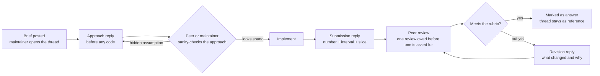

# How exercises run through Discussions

Exercises are not a document you read alone and a solution file you never open. Each one is a
**thread**, and the thread is the deliverable — the approach, the argument, the wrong turn and
the correction are worth more than the diff.

## The loop



## The five stages

### 1 · Brief

The maintainer opens a thread in **Exercises & Submissions** titled `EX-NN · <name>`. It
carries the setup, the task, the acceptance test, and — deliberately — **the trap**: the
plausible approach that fails, named in advance so that falling into it is a choice rather
than an accident.

### 2 · Approach, before code

Reply with what you intend to do and what you expect to happen, **before** you write it. Three
or four sentences:

> I think the cause is X. I'm going to change Y and measure Z on the descriptor slice. I expect
> evidence recall to move by roughly W; if it moves the other way, my model of X is wrong.

This is the single most-transferable habit in the whole curriculum. Stating the expected
direction and size converts your work from "I tried something and looked at the output" into an
experiment that can fail informatively. It is also exactly what a senior interviewer is
listening for, which is not a coincidence.

### 3 · Submission

Reply with the result. The template the seeded examples all follow:

```markdown
**Approach.** One paragraph. What you changed and why that was the thing to change.

**Result.**
| Metric | Before | After | Δ | 95% CI |
|---|---|---|---|---|
| evidence_recall | 0.7645 | 0.7790 | +0.0145 | [+0.0048, +0.0254] |

Slice: <which one>. Frozen slice: <touched / not touched>.

**Cost.** Latency, tokens, storage, or a second system to maintain. Every change has one.

**What surprised me.** The part that did not go how you expected.

**What I'd do next.** Or: why I stopped.
```

A submission without an interval gets one comment — *"what's the interval?"* — and nothing
else, until it has one.

### 4 · Peer review

**You owe one review before you ask for one.** Reviews follow the same order the maintainers
use on PRs:

1. Is the measurement present, with intervals, and honest about deltas inside the noise band?
2. Is it one change? A submission that alters chunking *and* reranking cannot attribute either.
3. Is the cost named?
4. Was the frozen slice respected? Tuning against it, even once, invalidates it for everyone.

Review the work, not the person. Most people posting are learning in public, which takes more
courage than posting something finished.

### 5 · Resolution

The maintainer marks an answer. It is not necessarily the highest-scoring submission — it is
the one that is most **useful to read next year**, which is often the one that failed
interestingly and explained why.

## Grading

| Band | What it looks like |
|---|---|
| **Exemplary** | Correct, measured with intervals, cost named, and it surfaced something the brief did not anticipate |
| **Full credit** | Correct and properly measured. Or: a clean negative result with a mechanism and the condition under which the expected result would return |
| **Partial** | Right direction, measurement incomplete — no interval, no slice, or two changes at once |
| **Not yet** | A claim without a number, or a number without provenance |

**A negative result is full credit.** This is not a consolation prize. Three of the most
valuable findings in this repository are negative — equal-weight RRF losing to BM25 alone,
comparison starvation failing to reproduce, and no retrieval-score threshold separating
answerable from unanswerable questions at better than F1 0.38. Each is worth more than a
marginal win because each changes what you would build next.

## Why Discussions and not Issues or PRs

| Surface | Used for | Why not exercises |
|---|---|---|
| **Discussions** | Exercises, questions, design debate | Threaded, answerable, searchable, and no state machine to satisfy — an unresolved question is a normal state |
| **Issues** | Tracked work with acceptance criteria | An issue that stays open for a term is noise on the board |
| **Pull requests** | Changes to this repository | An exercise submission is not a change to this repository, and reviewing 30 of them as PRs buries the actual work |

The exception: an exercise that produces something genuinely worth merging — a new extension
behind an existing seam, a fix to a real defect — graduates to a PR, and the thread links to
it. That path is deliberate and it is how several of the closed issues here originally arrived.

## For maintainers

- Post the brief at least a day before the session that needs it.
- Answer the approach replies **first**. Catching a wrong assumption at stage 2 saves a week;
  catching it at stage 4 wastes one.
- Do not answer a question that a peer is about to answer better. Wait.
- Mark answers promptly. An unmarked thread reads as unresolved and stops attracting readers.
- When you are wrong, say so in the thread rather than editing the post. The correction is the
  teaching material.
