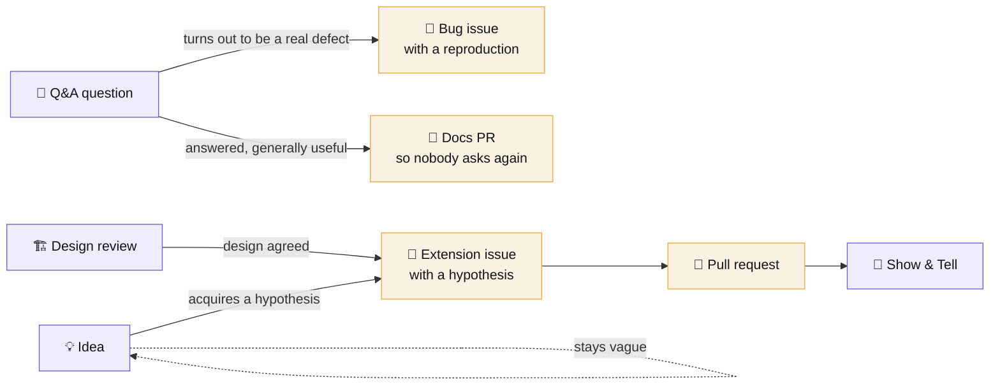

# Discussions guide

Discussions are the internal-Stack-Overflow half of this playground. Issues are *tracked work
with an owner*; Discussions are *everything else* — and the difference matters, because a
question filed as an issue either sits open forever or gets closed without being searchable.

## The categories

| Category | Format | Use it for | Do not use it for |
|---|---|---|---|
| 📣 **Announcements** | Announcement | Cohort schedules, releases, breaking changes | Questions |
| 🙋 **Q&A** | Question / answer | "Why does X?", "How do I Y?", errors, confusion | Bug reports with a reproduction (→ issue) |
| 🏗 **Design Reviews** | Open-ended | An architecture you want challenged **before** you build it | Finished work (→ Show & Tell) |
| 🎤 **Show & Tell** | Open-ended | Capstones, decision records, surprising results | Work in progress |
| 📚 **Reading Club** | Open-ended | Discussion of an assigned paper | The assignment itself (→ issue) |
| 💡 **Ideas** | Open-ended | Half-formed extension ideas | Ideas with a hypothesis (→ extension issue) |
| 🗳 **Polls** | Poll | Session scheduling, topic prioritisation | Technical decisions — those need a design review |
| 🎯 **Interview Prep** | Q&A | Practising an answer and getting it critiqued | Real interview questions under NDA |

## Asking a question people can answer

The [Q&A template](../.github/DISCUSSION_TEMPLATE/q-a.yml) has four fields, and the second one
is the important one.

1. **The question in one line.** If you cannot, you have two questions.
2. **What you have already tried.** This is the field that separates a question from a request.
   It also, more often than not, contains the answer — writing it out is why.
3. **The numbers or the traceback.** Evidence beats adjectives. "Recall seems low" is not
   answerable; "Evidence Recall@8 is 0.61 on the temporal slice, 0.79 elsewhere" is.
4. **Where.** Notebook and section.

**A good title is a sentence someone would search for.**
`Why does Recall@N go up but full-chain recall stay flat?`
not `help with retrieval`

## Answering well

- **Answer the question that was asked**, then say what you would have asked instead.
- **Link the notebook cell.** "Notebook 01 §1.3 measures this" is a better answer than a
  paragraph, because the asker can then vary it.
- **Mark the answer.** An unanswered-looking thread gets asked again next cohort.
- **If you are guessing, say so.** "I think it is X, but I have not measured it" is a useful
  answer. Confident wrong answers are how a forum dies.

## Converting between surfaces

**The rule:** a discussion becomes an issue when it acquires an *owner and acceptance
criteria*. Until then it is a conversation, and conversations belong here.

The most valuable conversion is the second one: **a Q&A thread that has been answered three
times is a documentation gap.** Open a docs PR and link the thread in it.

## For faculty

- **Seeded threads are labelled as such.** Several worked examples in Q&A and Design Reviews
  were written by faculty to model the shape of a good question and a good answer. They are
  marked `[worked example]` in the title so nobody mistakes them for a real student's
  question.
- **Answer in public, always.** A DM answer helps one student; the same answer in Q&A helps
  every future cohort. If someone asks in a DM, ask them to post it and answer there.
- **Do not close a thread as "read the docs".** If the docs answered it, they were not
  findable, and that is a docs issue.
- **Use polls for scheduling only.** A technical decision made by poll is a decision with no
  owner.

## Etiquette

- Search before posting. Three of the top ten most-viewed threads in a healthy cohort are
  duplicates that got merged.
- Post code as text in a fenced block, not as a screenshot. Screenshots are not searchable and
  cannot be copied into a reply.
- Redact anything from a real client. This repository is public; the corpus in it is
  synthetic for exactly this reason.
- Negative results are welcome in Show & Tell and are **not** failures. "I tried HyDE and it
  did not clear the noise band, here is why I think that is" is one of the more useful things
  you can post.
