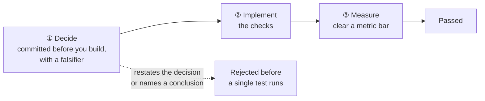

# L.A.B. Simulator

A graded, progressive hands-on lab. Every concept in this repository becomes a unit you can
work, and the units form a pathway rather than a list.

```bash
python -m labsim next          # what to do now
python -m labsim brief R1      # read it
python -m labsim start R1      # scaffold an attempt
python -m labsim check R1      # grade it
```

---

## Why this exists, and what it does differently

Practice sites for this material have converged on one shape: a problem statement, a starter
function with a `TODO`, and hidden tests. That shape teaches syntax well and judgement not at
all, for three reasons that are worth naming because they drove every design decision here.

**You cannot be wrong interestingly.** Tests pass or fail. Retrieval does not fail that way — it
fails through *plausible* choices that are worse, and a binary test cannot express "your answer
is reasonable and it costs you eight points of recall".

**Nothing produces a number.** Formatting a citation block is checkable without a corpus. Almost
everything that matters is not.

**A list is not a pathway.** If problem 7 does not need problem 3, the ordering is decoration.

So a unit here has three gates instead of one.



The first gate is the one nothing else has. If a unit ships a decision template, the grader
reads it **before** running anything, and rejects a falsifier that names the conclusion rather
than an observation. *"I would change this if it turned out to be wrong"* is true of every
decision ever made, and it is the shape most first attempts take.

The third gate is the one this repository is uniquely able to offer: a real corpus, a real
harness, and real metrics, so a bar can be `evidence_recall ≥ 0.78` rather than `assert True`.

## The five modes

| Mode | | What you do | Why it exists |
|---|---|---|---|
| `implement` | ⌨ | Fill the gap | The floor. Necessary, and not sufficient |
| `diagnose` | 🔍 | A working system is subtly broken. Find it, name the failure point, fix it | Most real work is this, and almost no practice material simulates it |
| `decide` | ⚖ | No code. Commit a decision with its falsifier | Trains the order: decide, then build. Deciding afterwards is rationalising |
| `measure` | 📐 | Implement, then clear a metric bar | Passing tests is not passing. A reranker that returns its input unchanged passes every structural test ever written for a reranker |
| `ship` | 📦 | Produce the artefact you would hand over | An ADR-lite, a measurement table, a dissection |

`decide` and `ship` are what carry the delivery lifecycle. They are never announced as such —
you meet a PRD line, an ADR-lite and a measurement table because the unit needs one, which is
how the habit forms rather than the vocabulary.

## L.A.B.

The three modes of the Academy's pedagogy map onto the unit itself:

| | In a unit |
|---|---|
| **Learn** | The brief. The situation, the mental model, an architecture diagram, and what breaks when it is done carelessly |
| **Apply** | The decision and the implementation, graded |
| **Build** | The artefact that survives the unit and gets reused by a later one |

## The pathway

Units are gated by prerequisites, and the prerequisites are real: a later unit reuses what an
earlier one built. The pathway is *derived* from those prerequisites rather than declared, so it
cannot drift from what the units actually say.

```bash
python -m labsim progress
```

```
  wave 1  ░░   0/2   F1, R1
  wave 2  ░░░  0/3   C1, E1, R2
  wave 3  ░    0/1   R3
  wave 4  ░    0/1   P1
```

Everything in a wave is genuinely parallel. Presenting them as a queue would invent an order that
does not exist.

### What is here now

| | Unit | Mode | | Difficulty | What it is really about |
|---|---|---|---|---|---|
| **F1** | Chunk so the answer survives the cut | `implement` | ⌨ | easy | Overlap is a length budget, not a tuning knob — and the guarantee is about *spans*, so the check is too |
| **R1** | Make a citation resolve | `implement` | ⌨ | easy | A citation that a human cannot follow is decoration. One line carries the unit |
| **E1** | Build the two recalls that disagree by thirty points | `implement` | ⌨ | medium | Why `gold_map` is `dict[str, set[str]]`, and why a metric normalised against its own output cannot go down |
| **R2** | Decide whether to fuse at all | `decide` | ⚖ | medium | No code. The deck says fuse; the measurement says the fused system is inside the noise band of one of its own legs |
| **C1** | Find the five characters that cost two thirds of the bill | `diagnose` | 🔍 | hard | A correct feature, a passing test, and a bill three times the estimate. Two bars, because one cannot tell a fix from a workaround |
| **R3** | Build the rule you rejected, and the measurement that rejected it | `measure` | 📐 | hard | The real corpus, the real reranker, and the one-line diagnostic that settles a month of argument |
| **P1** | Write the measurement note that survives you leaving | `ship` | 📦 | medium | The grader re-runs the measurement and checks your numbers match. That is the unit |

Seven units, all five modes, four tracks. The pathway is short on purpose: each unit is finished
— brief, checks, a worked answer the grader accepts and decoys it rejects, and a solution note
about what we got wrong first — rather than a stub with a `TODO` in it.

### The delivery lifecycle, without the vocabulary

`R2 → R3 → P1` is a decision record, then a measurement, then a note somebody else can re-run.
Nobody is told they are doing PDLC. Each artefact exists because a specific thing goes wrong
without it:

- **no decision record** → the reasoning is written after the code, so it is rationalisation, and
  the habit is invisible in the diff
- **no measurement** → "it feels better" ships
- **no note** → the result decays into folklore, which is not hypothetical here:
  [ADR-0015](../docs/01-architecture/adr/0015-correct-the-fusion-finding.md) is a finding this
  repository published, quoted in about twenty places, and had to retract

Naming the process prevents none of those. Having the artefacts does.

### Tracks

| Track | Covers | Anchored in |
|---|---|---|
| `foundations` | The recall budget, chunk identity, what a baseline is for | Notebooks `00`–`01` |
| `retrieval` | BM25 internals, dense, ANN navigability, fusion, reranking | Notebook `04`, ADR-0005, ADR-0010 |
| `context` | Token budgets, provenance, position, volatility ordering | Notebook `05`, ADR-0012 |
| `evaluation` | Metric design, judges, significance, the release gate | Notebooks `06`, ADR-0008 |
| `cost` | Token categories, cache economics, latency budgets | Notebook `07` |
| `agentic` | Loops, stop conditions, trace scoring | Notebook `08` |
| `delivery` | PRD lines, ADR-lites, dissections, handover | The templates and scenarios |

## Adding a unit

A unit is a directory. There is no central list to edit, which means two people can add units in
the same week without a merge conflict.

```
units/R1-citation-provenance/
├── unit.yaml                 id, track, difficulty, mode, prereqs, bars
├── BRIEF.md                  situation · mental model · diagram · the trap · hints
├── starter.py                the gap, with TODOs
├── decision.template.yaml    only for units that gate on a decision
├── check.py                  the checks, and any metrics it reports
├── SOLUTION.md               how we did it, and what we got wrong first
└── reference/
    ├── pass/                 a worked answer the grader must ACCEPT
    ├── fail-cites-the-document/
    │   ├── solution.py       a wrong answer that looks right
    │   └── expect.yaml       which check has to catch it
    └── fail-forgets-no-results/ …
```

### Why every unit ships decoys

A check that has never rejected anything is not evidence that it works. It is a function that
returns `True`, and you cannot tell those apart by reading it.

So `validate` refuses a unit with no `reference/pass` and no `reference/fail-*`, and CI runs
both directions on every change:

```bash
python -m labsim selftest          # or: selftest R1 R2
```

```
  ok       R1/fail-cites-the-document         rejected, by the intended check
  ok       R1/fail-forgets-no-results         rejected, by the intended check
  ok       R1/fail-leaks-the-internal-id      rejected, by the intended check
  ok       R1/pass                            accepted
```

The decoys carry more weight than the reference answer. `fail-cites-the-document` is a citation
packer whose markers point at the *document* rather than the passage — formatted perfectly,
ordered correctly, and useless to anyone trying to verify a claim. It is the commonest wrong
answer and it is invisible in a demo. If it ever starts passing, R1 has quietly become a
string-formatting exercise and nothing else in the repository would notice.

`expect.yaml` names the check that must do the rejecting, because a decoy rejected for the wrong
reason is a green tick hiding a broken check.

```bash
python -m labsim validate
```

catches a missing brief, a prerequisite that does not exist, a duplicate id, a `measure` unit
with no bar, and prerequisite **cycles** — which nothing else reports and which mean nobody can
start.

### The bar in a brief

Every brief carries four things, and a unit missing any of them is a puzzle rather than a lesson:

1. **The situation** — why anyone would do this, in Client Zero's terms
2. **The mental model** — with a diagram, before any code
3. **What breaks when it is done carelessly** — the plausible wrong answers and their cost
4. **Hints in order**, behind `<details>`, so the reader chooses when to spend one

## Grading in CI

Open a pull request with anything under `lab-simulator/attempts/` and
[`.github/workflows/lab-simulator.yml`](../.github/workflows/lab-simulator.yml) grades it and
posts the result as a comment — the named checks that failed, the grader's own output, and what
the unit unlocked if it cleared.

It runs `python -m labsim check` on a clean checkout. Deliberately the same code path you ran
locally, so the comment and your terminal cannot disagree; a grader that only exists in CI is a
grader nobody can debug.

```bash
# exactly what the Action does
git diff --name-only origin/main... | python -m labsim ci --paths -
```

Three things about it are worth stating, because each was a decision:

**A failed attempt does not fail the build.** A red tick on somebody's third try at a hard unit
is information, not a gate. The grading step carries `continue-on-error` and says so in the
comment.

**A pull request that edits an attempt *and* the checks that grade it is not graded.** Not an
accusation — people fix typos in briefs while solving them. It is that a result produced by
checks the same commit edited means nothing, and a green tick that means nothing is worse than
a red one. Split it in two and both halves are useful.

**A unit with a metric bar is graded against the real harness on the real corpus**, not a
fixture. That is what makes this a lab rather than a quiz, and it is why the bar cannot be
gamed by special-casing a test: the number comes from the same code that produces the numbers
in the top-level README.

The `integrity` job is the other half — it runs `validate` and `selftest`, so a change that
weakens a check fails the build even though nothing "broke".

## Local progress

`attempts/progress.json`, in the repository rather than a hidden dotfile, because on this
pathway a completed unit is a commit and progress belongs beside the work.

Your attempts live in `attempts/<UNIT>/` and are yours to commit. Nothing is gitignored — a
pull request is how you get graded, and how somebody can read what you tried.
