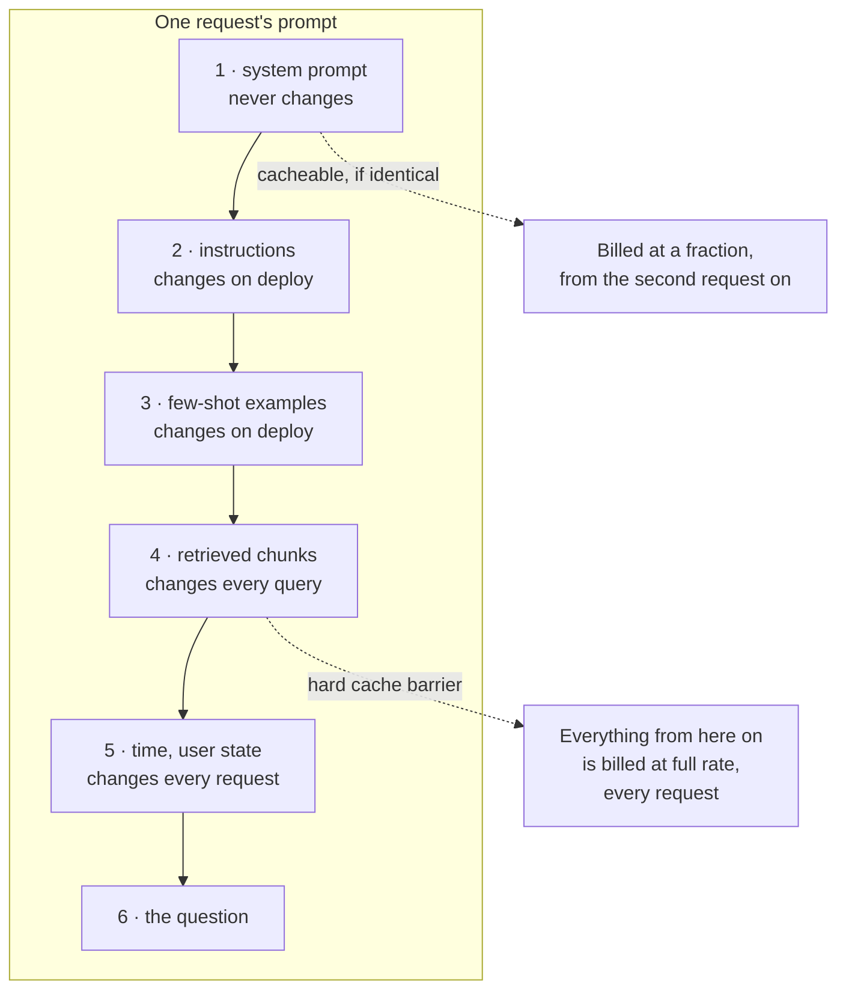

# C1 · Find the five characters that cost two thirds of the bill

**Track** cost · **Mode** diagnose · **Difficulty** hard · **~40 min**
**Prerequisites** R1
**Bars** `cache_hit_rate ≥ 0.6500` · `prefix_tokens_billed ≤ 260`

---

## The situation

Client Zero's incident assistant went to production six weeks ago. It works. Retrieval quality is
where the evaluation said it would be, latency is inside budget, no errors in the logs, every
test green.

The bill is **three times** what the model was costed at.

Finance has asked for an explanation by Thursday. Nobody has changed the model, the token limits,
or the traffic forecast. The system is doing exactly what it was built to do.

Somewhere in `solution.py` is an assembler that builds the prompt for each request. Your job is
to find why it costs what it costs, say what the failure point is, and fix it.

## Why this is a diagnose unit

Because this is what the work is actually like, and almost no practice material simulates it.

There is no failing test to make pass. There is no stack trace. The feature that causes the
problem was added deliberately, for a good reason, works correctly, and has its own passing test.
The only symptom is a number on a different team's dashboard, six weeks later.

Finding it requires knowing what to *look* at, which is a different skill from knowing what to
write — and the reason `diagnose` is a mode here rather than a difficulty rating.

## The mental model

Prompt caching reuses an already-processed prefix and bills it at a fraction of the input rate.
The requirement is that the prefix is **byte-identical**. Not semantically equivalent. Not
structurally the same. Identical.

The consequence that makes this an architecture question rather than a formatting preference:
**a single volatile byte anywhere in the prefix invalidates everything after it.** Not the block
it is in. Everything after it. So one changing character in block 1 makes blocks 1, 2 and 3
uncacheable, and the prompt is billed in full on every request forever.

### Volatility is relative to the cache key

A field that changes between tenants but never within one is stable *per tenant* and volatile
globally. If the cache is keyed per tenant, it belongs **before** the barrier. If it is not, it
belongs after. This distinction is where most real arguments about this live, and it decides one
of the four blocks in the code you are given.

## What to do

`labsim start C1` gives you `solution.py`: a working prompt assembler, its blocks, and the cache
simulator the grader uses. Two things to produce, in this order.

**1 · A diagnosis, in `DIAGNOSIS`.** A module-level string. Name the **failure point** — which
block, which field, and why it has the effect it has. Three sentences is plenty. The grader
checks that it names a specific block and field rather than describing the symptom, because
"the cache is not hitting" is the observation you started with.

**2 · A fix, in `assemble()`.** Clear both bars.

## The trap

There are two fixes and only one of them is a fix.

The **symptom fix** removes the volatile field. The cache hits, the bar goes green, and you have
deleted a feature that exists because users ask "as of when?" — a question the system can no
longer answer. Somebody will add it back in four months, in the same place, and nothing will stop
them.

The **cause fix** moves it. Same feature, same behaviour, different position relative to the
barrier, and the ordering rule that put it there is now written down.

The second bar exists to tell these apart. Read what it measures before you decide you have
finished.

## What breaks when this is done carelessly

| The shortcut | What you see | What it costs |
|---|---|---|
| Delete the volatile field | Cache hit rate jumps to 100% | You removed a feature to fix a cost bug. It comes back in four months, in the same position |
| Move only the obvious one | Hit rate improves, does not clear | There is more than one volatile field, and one of them looks stable until you ask what the cache is keyed on |
| Move a stable block after the barrier "to be safe" | Bars go green | Every cacheable token you push past the barrier is billed at full rate forever. The second bar measures exactly this |
| Sort blocks alphabetically, or by size | Deterministic, looks tidy | Determinism is not the property that matters. Byte-identity of a *prefix* is |

## Hints, in order

Hint 1 — where to look first

Do not read the assembler. Run it twice on different questions and diff the two prompts. The
first byte position at which they differ is where your cacheable prefix ends, and everything
after it is billed at full rate on every request.

Hint 2 — there is more than one

When you have found the first one and moved it, diff again. The second is harder because it is
volatile for a reason that only becomes visible once you ask what the cache key is.

Hint 3 — what the second bar is protecting

`prefix_tokens_billed` is the mean number of full-rate input tokens per request. Deleting the
volatile field makes the hit rate perfect and leaves this unchanged, because the tokens were
never the problem. Moving stable blocks past the barrier makes the hit rate perfect and makes
this *worse*.

The pair of bars only both clear when the volatile things are after the barrier and the stable
things are before it, which is the actual rule.

Hint 4 — the tenant field

`tenant_id` changes between requests in the trace, so a naive diff flags it. Look at
`CACHE_KEY_INCLUDES` in the simulator before you move it. If the cache is already partitioned by
tenant, that field is *stable within its own cache* and belongs before the barrier — and moving
it costs you every token in its block, forever.

## What this unlocks

The cost track proper: token categories, the cache economics that decide most of a bill, and the
latency budget. [ADR-0012](../../../docs/01-architecture/adr/0012-prompt-block-ordering.md) is
the decision record this unit is a rehearsal for, including the measured 4% → 71% and the
two-thirds cost reduction it bought.
