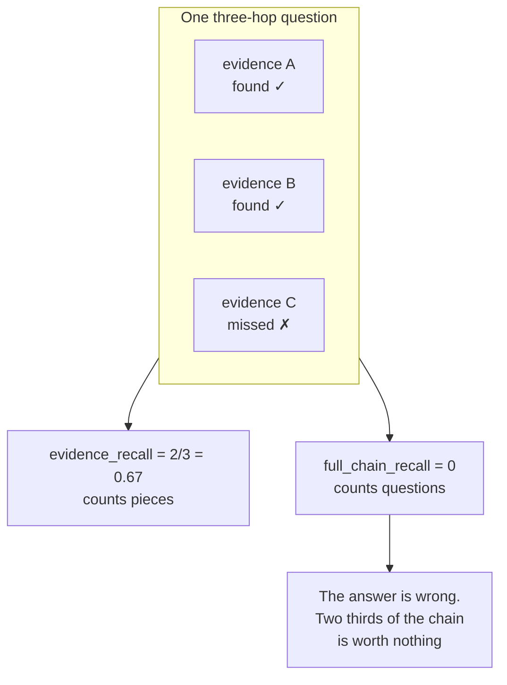

# E1 · Build the two recalls that disagree by thirty points

**Track** evaluation · **Mode** implement · **Difficulty** medium · **~40 min**
**Prerequisites** F1, R1

---

## The situation

The retrieval numbers on Client Zero:

```
evidence_recall@8     0.7645
full_chain_recall@8   0.4686
answer_correct        0.4115
```

Three numbers from one run. The first is what goes in the deck. The third is what the customer
experiences. The gap between them is thirty-five points and it is not noise, not a bug, and not
fixable by improving the retriever.

Whichever of these you report, somebody will make a decision with it. So the unit is: build all
three definitions yourself, and be able to say in one sentence what each one is measuring.

## The mental model

A question has **evidence**. Multi-hop questions have several pieces, and the pieces are not
interchangeable — you need the one saying *Tessera was acquired by Halden* **and** the one saying
*Halden runs on ap-southeast-2* to answer *"which region does Tessera's data live in now?"*.



**Evidence recall** counts pieces of evidence. It is micro-averaged, it degrades gracefully, and
it is the right metric for *diagnosing the retriever*.

**Full-chain recall** counts questions where **every** piece was found. It is all-or-nothing per
question, and it is the right metric for *predicting whether the answer will be right*, because
a chain missing a link produces a wrong answer with full confidence.

Reporting only the first is the most common way a RAG evaluation flatters itself.

## The arithmetic worth doing before you write code

If retrieval succeeded on each piece of evidence independently with probability `p = 0.7645`, a
question with `h` hops would fully resolve with probability `p^h`. Client Zero's 207 answerable
questions split:

| Hops | Questions | `p^h` |
|---|---|---|
| 1 | 128 | 0.7645 |
| 2 | 61 | 0.5845 |
| 3+ | 18 | 0.4469 |

Weighted, that predicts **0.6838**. Measured full-chain recall is **0.4686**.

Independence over-predicts by 21 points, so the pieces are **not** independent — and they fail
*together*. That is a specific, actionable claim: the misses concentrate in questions, not
scatter across them. Which means there is structure to find, and a per-question fix exists, and
buying uniformly better retrieval is the wrong purchase.

Notice that you cannot reach any of that from `evidence_recall` alone. The gap is the finding.

## What to build

Three functions. `gold_map` maps each **piece of evidence** to the set of chunk ids that would
satisfy it — several chunks can satisfy the same piece, and that is the whole reason the shape is
`dict[str, set[str]]` and not a flat set.

```python
evidence_recall_at_k(retrieved_ids, gold_map, k=None) -> float | None
full_chain_recall(retrieved_ids, gold_map, k=None)    -> float | None
ndcg_at_k(retrieved_ids, gold_map, k=10)              -> float | None
```

`None` when `gold_map` is empty. A question with no gold evidence is unanswerable, and scoring it
zero silently punishes the system for correctly having nothing — which is how an abstention
feature gets killed by its own dashboard.

**nDCG here is graded and de-duplicated.** Each distinct piece of evidence is worth 1, and it can
only be earned once. Three chunks that all satisfy hop A score the same as one. That is
deliberate: the naive version rewards a retriever for returning near-duplicates, which is exactly
the failure a multi-hop system cannot afford.

Use `DCG = Σ 1/log₂(i+1)` with `i` starting at 1, and normalise against the **ideal** ranking —
all gold pieces in the first positions, capped at `k` — not against the ranking you were handed.

## What breaks when this is done carelessly

| The shortcut | Why it looks right | What it hides |
|---|---|---|
| Flatten `gold_map` to a set of chunk ids | Simpler signature | Two chunks satisfying the *same* hop now count as two hits. A retriever returning near-duplicates scores like one that found both hops |
| `full_chain_recall` averages the per-piece rate | "It is a recall, so average it" | It becomes evidence recall with extra steps. The all-or-nothing is the point |
| IDCG over the retrieved list | Passes on easy cases | Normalises the ranking against itself, so nDCG hits 1.0 whenever the retriever finds anything. A retriever that returns one gold chunk and seven distractors scores perfectly |
| Score `None` gold as 0.0 | "Missing means missed" | Every unanswerable question drags the mean down, so abstaining correctly looks like failing |

Row three is the one to sit with. Self-normalising nDCG is a metric that cannot go down, and it
takes about a quarter to notice.

## Hints, in order

<details><summary>Hint 1 — what `k` slices</summary>

`k` truncates the *retrieved* list, never the gold map. `retrieved_ids[:k]` once, at the top,
then work with a set — the order does not matter for recall, only for nDCG.
</details>

<details><summary>Hint 2 — the one-liner for full-chain</summary>

`all(cids & got for cids in gold_map.values())`. Ampersand, not `in`: a piece of evidence is
satisfied by *any* chunk in its set.
</details>

<details><summary>Hint 3 — the de-duplication in nDCG</summary>

Walk the retrieved list in rank order. For each chunk, find the first gold piece it satisfies
that you have not already credited, credit it, and stop. A `seen` set of gold-piece indices, and
a `break`.
</details>

<details><summary>Hint 4 — the ideal DCG</summary>

`sum(1/log2(i+1) for i in range(1, min(len(gold_map), k) + 1))`. `min` matters: with 12 pieces of
evidence and `k = 8`, a perfect retriever can only earn 8 of them, and dividing by all 12 makes
a perfect run score 0.7.
</details>

## What this unlocks

**R3** implements the fusion rule you chose in R2 and puts it against a bar measured with these
exact functions. **D1** hands you a reranker that scores well on one of these metrics and badly
on another, and asks you to work out which one is lying.
