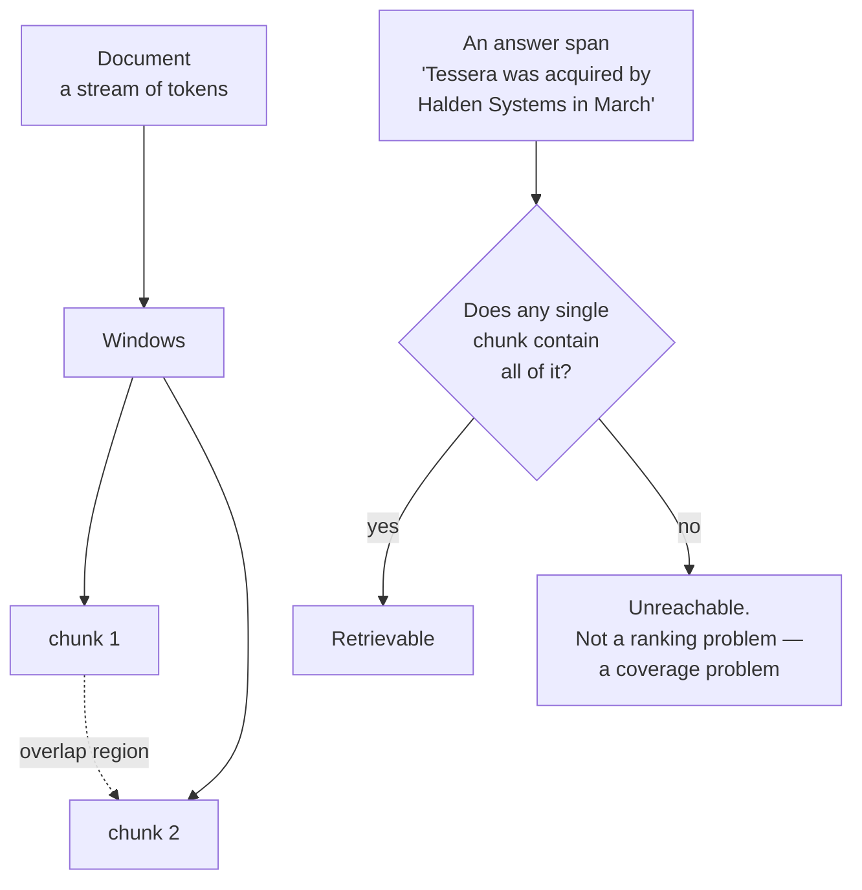

# F1 · Chunk so the answer survives the cut

**Track** foundations · **Mode** implement · **Difficulty** easy · **~30 min**
**Prerequisites** none — this is one of the two places the pathway starts

---

## The situation

Client Zero's incident corpus is 180 documents of postmortems, runbooks and Slack exports. Before
anything can retrieve, something has to decide where the documents get cut.

Somebody on the team will describe this as "a config thing". It is the single decision that sets
the **ceiling** on everything downstream. A fact that lives across a chunk boundary is not in any
chunk. It is therefore not in the index, not in the candidate set, not in the reranker's input,
and not in the model's context. Your recall for that fact is zero and it stays zero no matter how
good the retriever is.

There is no error message for this. The system returns confident, well-cited answers to
everything else, and one class of question just quietly never works.

## The mental model

Two numbers, and they do different jobs.

**Window size** trades recall against precision. Bigger windows contain more answers whole and
dilute the signal in each one: a 2,000-token chunk about seventeen topics matches every query
about any of them, badly. Smaller windows are sharper and cut more things in half.

**Overlap** is the one people get wrong, because it looks like a tuning knob and it is a
**guarantee**. An overlap of `v` tokens guarantees that any span of length `≤ v` is wholly
contained in at least one window. Not "usually". Every one — that is what the sliding window
buys you, and it is the only thing it buys you.

So the question is never "what overlap feels right". It is: *how long is the longest thing I need
to keep intact?* On Client Zero, an incident's cause–effect sentence pair runs to about 60 tokens.
That is where 64 comes from, and if somebody had asked "how long is the answer" first, the number
would never have been argued about.

## What to build

`chunk(text, size_tokens, overlap_tokens) -> list[str]`

A token here is a whitespace-separated word. That is a rough proxy and it is stated rather than
hidden — real tokenisers give ~1.3 tokens per word for English prose, and the shape of the
argument does not change.

The windows must:

1. **cover the whole document** — every word appears in at least one chunk, in order, including
   the last one
2. **respect the size cap** — no chunk longer than `size_tokens`
3. **overlap by `overlap_tokens`** between consecutive chunks
4. **contain every short span whole** — for any span of at most `overlap_tokens` words that
   appears in the document, at least one chunk contains it entirely

The fourth is the one that matters, and the first three are how you get it.

Edge cases the checks care about, because production hits all three in the first week: a document
shorter than one window; `overlap_tokens = 0`; and `overlap_tokens >= size_tokens`, which is a
configuration error that will loop forever if you let it, and should raise instead.

## What breaks when this is done carelessly

| The shortcut | What you see | What it costs |
|---|---|---|
| Stride `= size`, no overlap | Chunks look perfect. Sizes are even. | Every fact spanning a boundary is unreachable. Roughly `span_length / size` of them |
| `range(0, len(words) - size, stride)` | Almost right | The tail is dropped. The end of every document — usually the resolution section of a postmortem — is not in the index |
| Overlap counted in characters | Passes casual inspection | The guarantee is stated in tokens and enforced in characters. It holds for short words and silently fails for technical prose, which is exactly where the identifiers live |
| Splitting on a fixed character count | Fast | Cuts inside words, and now `Tessera` is `Tess` + `era` and BM25 matches neither |

The second row is the one that gets shipped. It is the difference between `range(0, n, stride)`
and `range(0, n - size, stride)`, it looks tidier, and its symptom — questions about the *end* of
documents doing badly — is easy to blame on the retriever for a month.

## Hints, in order

Hint 1 — the stride

Consecutive windows start `size - overlap` apart. That expression is the whole algorithm. Notice
what it does when `overlap >= size`, and what that means for your loop.

Hint 2 — the tail

Ask what happens to the last few words when `len(words)` is not a multiple of the stride. Then
write down the condition under which your loop emits a final window, and check it against a
document of 5 words with `size=4`.

Hint 3 — why the property is stated over spans and not over sizes

A test that asserts chunk sizes tests your arithmetic. The promise of a sliding window is about
*spans*, so the check is: take every window of `overlap_tokens` consecutive words in the
document, and confirm some chunk contains it whole. A no-overlap chunker passes every size
assertion and fails this one — which is precisely the bug.

## What this unlocks

**E1** builds the metric that would have caught this: evidence recall, and the difference between
recall per *piece of evidence* and recall per *question*. Chunking sets the ceiling; E1 is how you
find out where the ceiling is.
