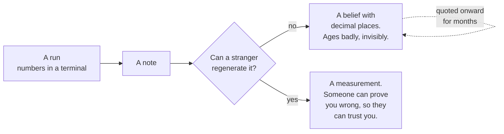

# P1 · Write the measurement note that survives you leaving

**Track** delivery · **Mode** ship · **Difficulty** medium · **~40 min**
**Prerequisites** R3 · **Artefact** a measurement note · **You will write no code**

---

## The situation

You have R3's run. Two numbers, a mechanism, and a decision that follows from them.

In four months you will not be on this engagement. Somebody will ask *"why aren't we running
hybrid retrieval?"* and the honest answer — *"we measured it"* — is worth nothing unless the
measurement is somewhere they can find it, re-run it, and disagree with it.

That is the artefact this unit produces. It is not documentation of what you did. It is the
thing that makes your conclusion **contestable**, which is the only property that makes it worth
trusting.

## Why this is a graded unit and not a template you copy

Because there is a specific way write-ups rot, and this repository has a first-hand example.

For months this codebase published the finding *"equal-weight RRF loses to BM25 alone"*. It was
wrong. It was quoted in about twenty places, taught in a session, seeded into a discussion
thread, and repeated by students in interviews. What let it survive was not carelessness about
the number — it was that **re-running the comparison required reading three files and writing a
script**, so nobody did.

The fix was one line: `python scripts/run_eval.py --compare`. The whole retraction
([ADR-0015](../../../docs/01-architecture/adr/0015-correct-the-fusion-finding.md)) turns on that
sentence, and it generalises:

> A claim you cannot re-run in one command is a claim nobody will re-run.

So the grader here does something no other unit does. It **re-runs your measurement and checks
that the numbers in your note match.** Not the format. The numbers.

## The mental model

The difference between the two branches is not rigour or effort. It is whether the command is in
the document.

## Where this sits in the delivery lifecycle

You have now produced, without anyone calling them that, three of the four artefacts an FDE
engagement runs on:

| Unit | Artefact | The question it answers |
|---|---|---|
| R2 | a **decision record** | why did we choose this, and what would change it? |
| R3 | a **measurement** | what actually happened when we ran it? |
| **P1** | a **measurement note** | how does somebody else verify that, after we have gone? |
| P2 | an **acceptance criterion** | what does "done" mean, in a number? |

Each one exists because a specific thing goes wrong without it. The decision record exists
because reasoning written after the code is rationalisation. The measurement exists because
"it feels better" is not a result. The note exists because a result nobody can re-run decays into
folklore — and that is not a hypothetical here, it is what happened.

## What to write

`labsim start P1` scaffolds `measurement.md`. Five sections, and the grader checks each for
something specific rather than for its heading.

**Header.** A date, and a **command**. The command must be one line, must be a real command in
this repository, and must be the one that produces the numbers below. `python -m labsim check R3`
is the honest answer here; so is a `scripts/run_eval.py` invocation if you built your note around
that instead.

**The table.** Your numbers from R3. At least `evidence_recall` and `failure_overlap`, to four
decimal places. The grader re-runs the measurement and compares.

**What the intervals say.** Which comparisons cleared the noise band and which did not. If you
are quoting a difference, quote the interval on it; if you did not compute one, say that instead
of implying it. *"The list of comparisons that did not clear is usually more useful than the list
that did"* is a sentence worth earning the right to write.

**What it means.** The mechanism. Not "RRF scored 0.7709" — *why*, in terms that let a reader
predict the answer on a corpus neither of you has measured. R3's answer is the failure overlap:
96.8% nested, so there is almost nothing for fusion to add.

**What this does not say.** The condition. Every number here is conditional on this corpus, this
encoder and this question mix. Name what would have to change for the answer to flip. A negative
result without this is an anecdote, and a positive one without it is worse.

## What breaks when this is done carelessly

| The shortcut | Why it happens | What it costs |
|---|---|---|
| Numbers typed from memory | The run was yesterday and you are writing it up today | The note and the code drift. This is the mechanism of the ADR-0015 failure, exactly |
| Means with no intervals | The table looks cleaner | Every reader treats a 0.004 gap and a 0.06 gap as the same kind of fact, because you presented them as one |
| "Run the eval suite" instead of a command | The real command has flags you would have to look up | Nobody runs it. Six months later the claim is folklore and the mechanism story has been improved in the retelling |
| No condition section | It feels like hedging | The finding gets quoted on a corpus where it is false, by someone who trusted you |

## Hints, in order

Hint 1 — where the numbers come from

`python -m labsim check R3 --json` prints the graded result as JSON, including the metrics. That
is the run, and pasting from it is the correct amount of effort.

Hint 2 — what counts as a command

One line, in a fenced block or backticks, that a person with this repository cloned and nothing
else installed can paste. If it needs a flag, the flag is in the line.

Hint 3 — the condition section is the hard one

Ask: *what is the smallest change to the world that makes this conclusion wrong?* For R3 there
are two good answers, and both are specific — a dense encoder whose failures are not nested
inside BM25's, or a question mix where the identifier slice stops being small.

## What this unlocks

**P2** writes the acceptance criterion — the number, the slice and the noise band that define
"done" before anybody starts building. It is the same discipline pointed forwards instead of
backwards.
