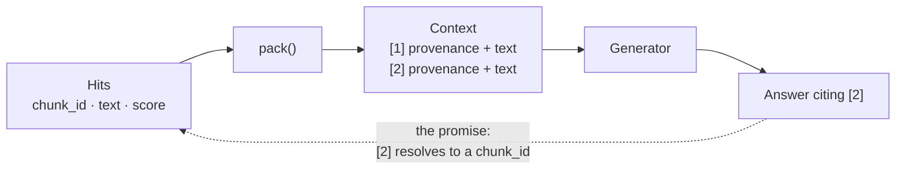

# R1 · Make a citation resolve

**Track** retrieval · **Mode** implement · **Difficulty** easy · **~25 min**

---

## The situation

Client Zero's on-call engineers will read answers at 3am, during an incident, and act on them.
An answer they cannot check is worse than no answer, because it carries the authority of a
system without the accountability of one.

So the generator must cite. Which means the thing you hand the generator must carry, for every
passage, enough to find it again.

## The mental model

A context block is not a concatenation of text. It is a **numbered evidence bundle**, and the
number is a promise: *"claim [2] came from here, and you can go and look."*

The dotted line is the whole exercise. If it does not hold, everything upstream of it — recall,
reranking, fusion — is unauditable.

## What breaks when it is done carelessly

| Careless choice | What it costs |
|---|---|
| Marker derived from the chunk's rank in some *earlier* list | Renumbering upstream silently repoints every citation |
| `source_id` printed in the text the model sees | The model quotes the internal id at the user |
| Marker with no mapping kept | Nothing can resolve `[2]` afterwards. The audit is a guess |
| Provenance after the passage | The model reads the text first and often attaches the wrong marker |

That third row is a real failure mode with a boring cause: the mapping was in a local variable
and nobody returned it.

## Your task

Implement `pack_context(hits)` in `solution.py`.

Given hits — each an object with `chunk_id`, `text`, `doc_id`, `ordinal` and `score` — return a
`PackedContext` carrying:

- `text` — the assembled block the generator will read
- `markers` — a mapping from marker number to `chunk_id`

Rules:

1. Markers are `[1]`, `[2]`, … in the order the hits are given.
2. Each block is **provenance line first, then the passage.**
3. The provenance line carries the marker, the `doc_id`, the ordinal and the score to two
   decimals. It does **not** carry the `chunk_id` — that is internal.
4. Blocks are separated by a blank line.
5. `markers` maps `1 -> chunk_id`, `2 -> chunk_id`, … so any citation resolves.

## What the checks verify

Ordinary shape checks — and one that matters more: for a random hit list, **every marker in the
assembled text resolves through `markers` to a `chunk_id` that was actually in the input.** That
is the promise, tested.

## Hints, in order

Hint 1 — what the marker number is, and what it is not

`enumerate(hits, start=1)`. The marker is a position in **this** bundle, not a rank from
upstream — reuse an upstream rank and renumbering anywhere earlier silently repoints every
citation, with nothing to detect it.

Hint 2 — the line the unit is about

Everything else in this function is formatting. Exactly one line is what makes a citation
*resolvable*, and if you deleted it the assembled text would look identical and every shape
check would still pass. Which line is it, and who would notice it was gone?

Hint 3 — why the check uses random inputs

A test comparing your output to an expected string tests your formatting choices. The graded
property is stated over randomised hit lists: *every marker appearing in the text resolves,
through `markers`, to a chunk_id that was in the input.* Write it so that sentence is true by
construction rather than true for the example in front of you.

## Before you start

Read `raglab/context.py` in this repository. It solves the same problem, and reading it after
you have written yours is worth more than reading it before.
