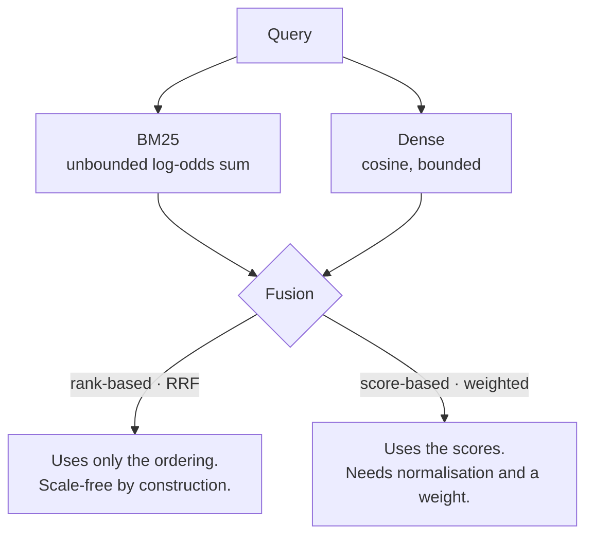

# R2 · Choose a fusion rule, and say what would make you wrong

**Track** retrieval · **Mode** decide · **Difficulty** medium · **~30 min**
**Artefact** an ADR-lite · **You will not write code in this unit**

---

## Why a unit with no code

Because the failure this teaches is not a coding failure.

An engineer who writes the decision *after* the implementation has learned to rationalise. The
reasoning arrives already knowing the answer, so it cannot be wrong, so it teaches nothing — and
the habit is invisible in the diff afterwards. The only way to train the other order is to make
the decision a graded artefact that must exist first.

The grader checks that your decision is filled in **and** that your falsifier is an observation
rather than the decision restated. That second check exists because "I would change this if it
turned out to be the wrong choice" is the shape most first attempts take, and it is not a
falsifier.

## The mental model

Fusion combines two ranked lists. There are two families, and they differ in what they *refuse*
to use.

**RRF** scores `Σ 1/(k + rank)`, conventionally `k = 60`. It discards the scores deliberately,
because a BM25 score and a cosine are not on a common scale, not monotonically related, and
distributed differently per query.

**Weighted** scores `(1−α)·norm(bm25) + α·norm(dense)`. It keeps the scores and pays for that
with a normalisation choice and a tuned α.

## The evidence you have

Measured on Client Zero, 243 questions, evidence recall@8, paired bootstrap:

| Configuration | Evidence recall@8 |
|---|---|
| BM25 alone | 0.7645 |
| Dense alone | materially below BM25 |
| Equal-weight RRF | **below BM25 at every k** |

The dense leg here is LSA — a truncated SVD over TF-IDF, not a modern sentence embedder.

## The decision

Fill `decision.yaml` in your attempt directory. Four fields:

| Field | What it has to contain |
|---|---|
| `decision` | The rule you would ship, specifically. "Weighted, α ≈ 0.2" not "hybrid" |
| `why` | Why the alternative **loses** — not why yours wins. Those are different sentences |
| `rejected` | What you did not choose, and the condition under which it would have been right |
| `would_change_if` | The observation that would make you wrong. Something you could *see* |

## The trap

The evidence above makes one answer look obvious, and reaching it without the mechanism is the
trap. "RRF lost, so use weighted" is a fact about one table. It does not tell you what to do on
the next corpus, which is the only reason to learn this.

Ask yourself *why* equal weight lost. If your `why` does not survive being asked "so what happens
when both legs are strong?", it is a summary of the table rather than a reason.

## Hints, in order

Hint 1 — what kind of object is RRF?

It is a **voting rule**. Each system casts a ranked ballot, and the fused score counts votes.
Now ask what a voting rule assumes about its voters.

Hint 2 — what does k=60 control, exactly?

At `k = 0`, rank 1 scores twice rank 2. At `k = 60`, the gap between ranks 1 and 2 is about 2%.
So `k` dampens how much a single system's **top hit** counts. Notice what it does *not* control.

Hint 3 — the sentence you are looking for

Scale-invariance is what lets RRF work without normalisation. It is also what discards the one
signal that would have told you the legs are unequal. The virtue and the failure are the same
mechanism — and that is what makes this a condition rather than a rule.

## What comes next

**R3** implements what you decide here, and measures it against a bar. If your decision is wrong,
R3 is where you find out — which is the correct order for that to happen.
