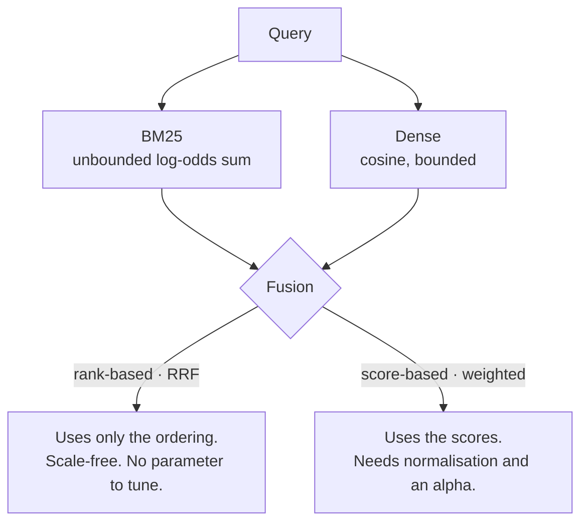

# R2 · Decide whether to fuse at all, and say what would make you wrong

**Track** retrieval · **Mode** decide · **Difficulty** medium · **~30 min**
**Artefact** an ADR-lite · **You will not write code in this unit**

---

## Why a unit with no code

Because the failure this teaches is not a coding failure.

An engineer who writes the decision *after* the implementation has learned to rationalise. The
reasoning arrives already knowing the answer, so it cannot be wrong, so it teaches nothing — and
the habit is invisible in the diff afterwards. The only way to train the other order is to make
the decision a graded artefact that must exist first.

The grader checks that your decision is filled in **and** that your falsifier is an observation
rather than the decision restated. That second check exists because "I would change this if it
turned out to be the wrong choice" is the shape most first attempts take, and it is not a
falsifier.

## The mental model

Fusion combines two ranked lists. There are two families, and they differ in what they *refuse*
to use.



**RRF** scores `Σ 1/(k + rank)`, conventionally `k = 60`. It discards the scores deliberately,
because a BM25 score and a cosine are not on a common scale, not monotonically related, and
distributed differently per query.

**Weighted** scores `(1−α)·norm(bm25) + α·norm(dense)`. It keeps the scores and pays for that
with a normalisation choice and a tuned α — a constant fitted on your eval set, which has to be
refitted when the corpus moves.

Before either, there is a prior question the folk rule skips: **fusion only pays when the legs
fail on different queries.** Two retrievers that succeed and fail together carry one signal
between them, and combining one signal with itself produces one signal.

## The evidence you have

Measured on Client Zero. 243 questions, 207 answerable, `k = 8` after the cross-encoder, paired
bootstrap over questions. Reproduce it with `python scripts/run_eval.py --fusion <rule>`.

| Configuration | Evidence recall@8 | nDCG@8 | Answer correct |
|---|---|---|---|
| BM25 alone | 0.7118 | 0.3639 | **0.4156** |
| Dense (LSA) alone | 0.7733 | **0.6055** | 0.3992 |
| Equal-weight RRF | 0.7742 | 0.5302 | 0.4033 |
| Weighted α = 0.2 | 0.7645 | 0.4767 | 0.4115 |
| Weighted α = 0.5 | **0.7790** | 0.5967 | 0.3992 |

α is the **dense** weight, so α = 0.2 means a fifth dense and four fifths lexical.

The comparisons that are not inside the noise band:

```
bm25  -> rrf    evidence_recall  +0.0624  ci(+0.0407, +0.0857)   real
bm25  -> dense  evidence_recall  +0.0616  ci(+0.0382, +0.0870)   real
dense -> rrf    ndcg             -0.0753  ci(-0.1061, -0.0462)   regression
rrf   -> w0.2   ndcg             -0.0535  ci(-0.0776, -0.0295)   regression
w0.2  -> w0.5   evidence_recall  +0.0145  ci(+0.0048, +0.0254)   real
```

And the comparisons that **are** inside the noise band, which is the more interesting list:

```
dense -> rrf    evidence_recall  +0.0008  ci(-0.0101, +0.0109)   inside the noise band
rrf   -> w0.5   evidence_recall  +0.0048  ci(-0.0024, +0.0145)   inside the noise band
every pair      answer_correct                                   inside the noise band
```

The dense leg here is LSA — a truncated SVD over TF-IDF, not a modern sentence embedder. It is a
fifty-year-old method and on this corpus it is the **stronger** of the two legs.

## The decision

Fill `decision.yaml` in your attempt directory. Four fields:

| Field | What it has to contain |
|---|---|
| `decision` | What you would ship, specifically. "Dense alone" or "RRF, k=60" or "weighted, α≈0.5" — not "hybrid" |
| `why` | Why the alternative **loses** — not why yours wins. Those are different sentences |
| `rejected` | What you did not choose, and the condition under which it would have been right |
| `would_change_if` | The observation that would make you wrong. Something you could *see* |

## The trap

There are two, and the second one is the unit.

**The first** is reaching for hybrid because the decision matrix says hybrid. The matrix is a
prior. You have a measurement, and the measurement says fusion does not separate from the better
single leg — `dense -> rrf` is `+0.0008` on evidence recall with an interval straddling zero, and
on nDCG the *unfused dense leg wins outright*. Shipping fusion here means shipping a second
index, a second pipeline, a fusion rule and a tuning job to buy a difference you cannot measure.

**The second** is reading the table as a ranking and picking the top row. Look at the last
column. Evidence recall moves from 0.7118 to 0.7790 across these configurations — a solid, real,
9.4% relative improvement — and `answer_correct` does not move at all. Every pairwise comparison
on it is inside the noise band, and the numerically best answers come from the numerically
**worst** retriever.

If your `why` does not survive being asked *"so which of these numbers does the customer feel?"*,
it is a summary of the table rather than a reason.

## Hints, in order

<details><summary>Hint 1 — what kind of object is RRF?</summary>

It is a **voting rule**. Each system casts a ranked ballot and the fused score counts votes.
Now ask what a voting rule assumes about its voters, and check that assumption against the table.
</details>

<details><summary>Hint 2 — what does k=60 control, exactly?</summary>

At `k = 0`, rank 1 scores twice rank 2. At `k = 60`, the gap between ranks 1 and 2 is about 2%.
So `k` dampens how much a single system's **top hit** counts. Notice what it does *not* control,
and notice that it does it to both legs at once.
</details>

<details><summary>Hint 3 — when does fusion actually pay?</summary>

When the legs fail on **different queries**. The aggregate table cannot tell you that — two
retrievers at 0.71 and 0.77 might be failing on disjoint sets (fusion is worth a lot) or nested
ones (fusion is worth nothing). The measurement that answers it is the per-query overlap of
failures, and nobody ran it before choosing.

That is a finding about the *evaluation*, not about fusion, and it is the more valuable half.
</details>

<details><summary>Hint 4 — the sentence you are looking for</summary>

A difference inside the noise band is not a small difference. It is not a difference. Treating
`+0.0008 ci(-0.0101, +0.0109)` as "slightly better" is the single most common way a team ships
complexity it cannot justify — and the complexity is permanent while the 0.0008 was never there.
</details>

## What comes next

**R3** implements whichever rule you chose and puts it against a bar on the real corpus. If your
decision was wrong, R3 is where you find out — which is the correct order for that to happen.
