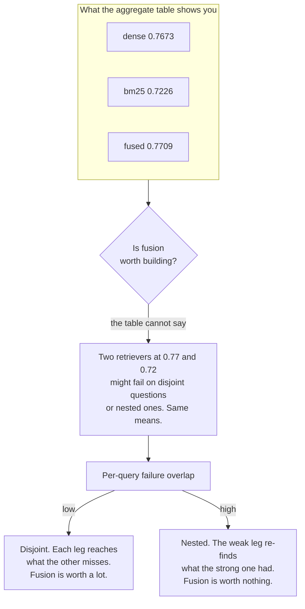

# R3 · Build the rule you rejected, and the measurement that rejected it

**Track** retrieval · **Mode** measure · **Difficulty** hard · **~45 min**
**Prerequisites** R2, E1 · **Artefact** a measurement
**Bars** `evidence_recall ≥ 0.7700` · `failure_overlap ≥ 0.9000`

---

## The situation

In R2 you committed a decision about fusion. Whatever you chose, this unit builds the fusion
path — and there are two reasons, only one of which is obvious.

**The obvious one.** "We are not shipping it" is a defensible decision and it is only defensible
from someone who could have shipped it. A recommendation against a thing you cannot build is a
preference.

**The real one.** In R2's hints there was a measurement nobody in the story ran, on either side
of the argument:

> the per-query overlap of the two legs' failures. Disjoint failures, fusion is worth a lot.
> Nested failures, worth nothing.

You are going to run it. It takes one line of set arithmetic and about seven seconds, and it
answers in advance the question the whole fusion debate was circling. That asymmetry — a
month of argument settled by a line of code nobody wrote — is the most transferable thing in
this track.

## The mental model



Two retrievers with identical aggregate scores can be in completely different situations, and
the mean cannot distinguish them. This is the same failure as reporting evidence recall without
full-chain recall in E1: an average over questions destroys the structure *within* questions,
and the structure is the finding.

## What to build

### 1 · `rrf(legs, k=60)`

$$\text{RRF}(d) = \sum_{r \in \text{legs}} \frac{1}{k + \text{rank}_r(d)}$$

Each leg is a list of hits, best first. A hit has `.chunk_id`, `.score`, `.rank`, `.text`,
`.doc_id`. Return the fused list, best first, one entry per `chunk_id`, each entry being one of
the input hit objects.

Four things the checks pin down, and each of them is a real bug someone has shipped:

- **Ranks start at 1.** `enumerate(leg, start=1)`. Starting at 0 makes the top hit score `1/k`
  and the second `1/(k+1)`, which inverts the intended gap at the only place it matters.
- **Use the position in the leg, not `hit.rank`.** An upstream filter can leave gaps in
  `hit.rank`, and a fusion rule that trusts a field it did not compute inherits every upstream
  change silently.
- **The union survives.** A chunk in exactly one leg still scores. Dropping it makes RRF an
  intersection, which is a different and much worse algorithm.
- **Deduplicate by `chunk_id`, summing.** A chunk in both legs gets one entry with both terms
  added. That summation *is* the voting.

### 2 · `failure_overlap(dense_misses, lexical_misses)`

Both arguments are sets of question ids. Return

$$P(\text{lexical also misses} \mid \text{dense misses}) = \frac{|D \cap L|}{|D|}$$

A **conditional probability**, not a Jaccard index. They are different numbers and only one of
them answers the question, which is why one of the graded decoys computes the other.

Return `0.0` when `dense_misses` is empty — a retriever that misses nothing has no failures to
overlap, and dividing by zero to say so is not an improvement.

## The bars

```
evidence_recall  ≥ 0.7700     your fused ranking, reranked, k=8, on 207 answerable questions
failure_overlap  ≥ 0.9000     the diagnostic, computed on the same run
```

The second bar is unusual and deliberate. It is not rewarding a high overlap — it is checking
that you computed **the quantity that answers the question**. The true value is `0.9684`. The
Jaccard index of the same two sets is `0.8762`. The bar sits between them, so a plausible wrong
formula fails on a real number rather than on a style check.

Nothing here needs a network or a key. The whole run is about seven seconds.

## What breaks when this is done carelessly

| The shortcut | What you see | What it costs |
|---|---|---|
| `enumerate(leg)` without `start=1` | Numbers barely move — both legs shift together | Nothing, on a two-leg fusion of equal length. Then someone adds a third leg of different length and the bug becomes visible as an unexplained regression six weeks later |
| Fuse only the chunks present in both legs | Precision looks great | You built an intersection. Every chunk that only one retriever found — which is the entire reason for two retrievers — is gone |
| Take `hit.rank` from the leg | Works today | The pre-filter starts dropping ACL-excluded chunks and leaves gaps in `rank`. Fusion scores shift and nothing in the diff explains it |
| Jaccard for the overlap | A plausible number, 0.876 | It answers "how similar are the two failure sets", which nobody asked. The question is "if dense missed it, is bm25 any help?" — and that is conditional |

## Hints, in order

<details><summary>Hint 1 — the shape of the accumulator</summary>

`agg: dict[str, float]` for scores, and `keep: dict[str, Hit]` so you can return real hit
objects at the end. Two dicts, one pass per leg.
</details>

<details><summary>Hint 2 — why `k = 60` and what it is not for</summary>

At `k = 0` rank 1 scores twice rank 2. At `k = 60` the gap is about 2%, so agreement *across*
systems outranks confidence *within* one. It dampens a single voter's first preference. It has no
opinion about how credible a voter is, which is the thing R2 was actually about.
</details>

<details><summary>Hint 3 — what counts as a miss</summary>

A question is a miss for a leg when that leg's top-8, after reranking, does not contain all its
gold evidence — `evidence_recall_at_k < 1.0`, the function you wrote in E1. Not "scored zero":
partial recall on a three-hop question is still a failure of that question.
</details>

<details><summary>Hint 4 — read the number you get</summary>

You will get `0.9684`. Before moving on, say what it means in a sentence, out loud. Then look at
the fused evidence recall (`0.7709`) against the dense leg alone (`0.7673`) and check whether the
two facts are consistent. They are, and the consistency is the lesson.
</details>

## What this unlocks

**P1** turns this run into the artefact you would actually hand over: a measurement note with the
command that regenerates it. That is not paperwork. A claim you cannot re-run in one command is
the exact failure mode that let a wrong fusion finding stand in this repository for months.
